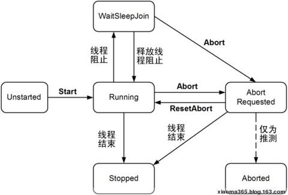

### 前言

使用多线程技术来保证UI线程可响应、提高服务器吞吐量、提升程序处理速度，设置任务优先级进行调度。

多线程技术只是多个线程在操作系统分配的不同时间片里执行，在线程数量超出用于处理它们的处理器数量的情况下，操作系统将定期为每个线程调度一个时间片来控制处理器，以此来模拟同时并发。

#### CPU

1. 多核心处理器（CPU）

   指在一块处理器（CPU）中含有多个处理单元，每一个处理单元它就相当于一个单核处理器（CPU）。因此，多核处理器的功能就相当于多台单核处理器电脑联机作战。

2. 超线程处理器（CPU）

   指在一块CPU中，用虚拟的方法将一个物理核心模拟成多个核心（一般情况是一个单物理核心，模拟成二个核心，也即所谓的二线程。只有当线程数比物理核心数多才能叫超线程。如四核四线程并不是超线程，而四核八线程才能叫超线程）。

3. 优缺点：
   1. 从理论上说，多核心比超线程具有更高运算能力。但多核心也有一个明显的缺点，那就是多核心的使用效率比超线程处理器（CPU）低。因为，多核心在处理数据时，它们相互“合作”的并不是很完美，常常某个核心需要等待其他核心的计算数据，从而耽误时间。另外，由于目前多核心都是采用共享缓存，这更使多核心的CPU运算速度减慢不少（因为：CPU读取Cache时是以行为单位读取的，如果两个硬件线程的两块不同内存位于同一Cache行里，那么当两个硬件线程同时在对各自的内存进行写操作时，将会造成两个硬件线程写同一Cache行的问题，它会引起竞争）。
   2. 超线程是用虚拟的方法将一个物理核心虚拟成多个核心，它能够最大限度地利用现有的核心资源，具有较高性价比。

**CPU的两种竞争策略**

Unix系统使用的是时间片算法，而Windows则属于抢占式的。

1. 在时间片算法中，所有的进程排成一个队列。操作系统按照他们的顺序，给每个进程分配一段时间，即该进程允许运行的时间。如果在时间片结束时进程还在运行，则CPU将被剥夺并分配给另一个进程。如果进程在时间片结束前阻塞或结束，则CPU当即进行切换。调度程序所要做的就是维护一张就绪进程列表，当进程用完它的时间片后，它被移到队列的末尾。

2. 所谓抢占式操作系统，就是说如果一个进程得到了 CPU 时间，除非它自己放弃使用 CPU ，否则将完全霸占 CPU 。因此可以看出，在抢占式操作系统中，操作系统假设所有的进程都是“人品很好”的，会主动退出 CPU 。在抢占式操作系统中，假设有若干进程，操作系统会根据他们的优先级、饥饿时间（已经多长时间没有使用过 CPU 了），给他们算出一个总的优先级来。操作系统就会把 CPU 交给总优先级最高的这个进程。当进程执行完毕或者自己主动挂起后，操作系统就会重新计算一次所有进程的总优先级，然后再挑一个优先级最高的把 CPU 控制权交给他

#### 操作系统

操作系统对多核处理器的支持主要体现在调度和中断上：

1. 对任务的分配进行优化。使同一应用程序的任务尽量在同一个核上执行。

2. 对任务的共享数据优化。由于多核处理器（Chip Multi-Processor，CMP）体系结构共享缓存（目前），可以考虑改变任务在内存中的数据分布，使任务在执行时尽量增加缓存的命中率。

3. 对任务的负载均衡优化。当任务在调度时，出现了负载不均衡，考虑将较忙处理器中与其他任务最不相关的任务迁移，以达到数据的冲突最小。
4. 多任务处理的操作系统可以创建多个进程中的多个线程同时执行的效果。它通过以下方式实现这一点：在需要处理器时间的线程之间分割可用处理器时间，并轮流为每个线程分配处理器时间片。

#### 进程和线程

1. 进程

   进程是应用程序的执行实例，每个进程是由私有的虚拟地址空间、代码、数据和其它各种系统资源组成，进程在运行过程中创建的资源随着进程的终止而被销毁，所使用的系统资源在进程终止时被释放或关闭。

2. 线程

   线程是进程内部的一个执行单元，是CPU的基础调度单元。系统创建好进程后，实际上就启动执行了该进程的主执行线程。主执行线程终止了，进程也就随之终止。

   每个线程都维护异常处理程序、调度优先级和线程上下文。（线程上下文，当前执行的线程在其时间片结束时被挂起，而另一个线程继续运行。当系统从一个线程切换到另一个线程时，它将保存被抢先的线程的线程上下文，并重新加载线程队列中下一个线程的已保存线程上下文）

3. 关系

   操作系统使用进程将它们正在执行的不同应用程序分开，.NET Framework 将操作系统进程进一步细分为System.AppDomain （应用程序域）的轻量托管子进程。

   进程的入口点创建的第一个线程被称为主线程。.Net控制台程序使用Main()方法作为程序入口点。当调用该方法时，会自动创建主线程。仅包含一个主线程的进程是线程安全的，这是由于在某个特定时刻只有一个线程访问程序中的数据。
   
   主线程可以产生次线程（也称为工作者线程，worker thread）。每一个线程（无论主线程还是次线程）都是进程中的一个独立执行单元，它们能够同时访问那些共享数据。
   
   在一个单位时间（即一个时间片）内，单CPU只能根据线程优先级执行一个线程。当一个线程的时间片用完的时候，它会被挂起，以便执行其他线程。对于线程来说，它们需要在挂起前记住发生了什么，它们把这些情况写到线程本地存储中（Thread Local Storage，TLS），并且它们还要获得一个独立的调用栈（call stack）。
   

#### .Net应用程序域

实际上，.Net可执行程序承载在进程的一个逻辑分区中，称为应用程序域（AppDomain）。

一个进程可以包含多个应用程序域，每一个应用程序域中承载一个.Net可执行程序。

每一个程序域都和该进程（或其它进程）中其它的程序域完全彻底隔离开。如果不使用分布式编程协议（如WCF），运行在某个应用程序域中的应用程序将无法访问其它应用程序域中的任何数据（无论是全局变量还是静态变量）

#### 对象上下文

应用程序域是承载.Net程序集的进程的逻辑分区。应用程序域也可以进一步被划分成多个上下文边界。即，.Net上下文为单独的应用程序域提供了一种方式，该方式能为一个给定对象建立“特定的家”。

和一个进程定义了默认的应用程序域一样，每个应用程序域都有一个默认的上下文。这个默认的上下文（由于它总是应用程序创建的第一个上下文，所以有时称为上下文0，即context0）用于组合那些对上下文没有具体的或唯一性需求的.Net对象。大多数.Net对象都会被加载打上下文0中。如果CLR判断一个新创建的对象有特殊需求，一个新的上下文边界将会在承载它的应用程序域中被创建。

举例来说，如果定义一个需要自动线程安全（使用[Synchronization]特性）的C#类型，CLR将会在分配期间创建“上下文同步”。如果一个已分配的对象从一个同步的上下文转移到一个非同步的上下文，对象将突然不再是线程安全的并且极有可能变成大块的坏数据，而大量线程还在试图与这个（现在已是线程不稳定的）引用对象交互。


#### 总结

- 一个.Net进程可以承载多个应用程序域。每一个应用程序域可以承载多个相关的.Net程序集，并且可由CLR独立地加载或卸载应用程序域。
- 一个给定的应用程序域中包含一个或多个上下文。使用上下文，CLR能够将“有特殊需求的”对象放置到一个逻辑容器中，确保该对象的运行时需要能够被满足。

### 线程

#### 属性

1) CurrentContext         获取线程正在其中执行的当前上下文。主要用于线程内部存储数据。

2) ExecutionContext       获取一个System.Threading.ExecutionContext对象，该对象包含有关当前线程的各种上下文的信息。主要用于线程间数据共享。

3) IsThreadPoolThread     获取一个值，该值指示线程是否属于托管线程池。

4) ManagedThreadId      获取一个整数，表示此托管线程的唯一标识符。

5) IsBackground           获取或设置一个值，该值指示某个线程是否为后台线程。

6) IsAlive     判断此线程是否还存活。经测试**只有 Unstarted、Stopped 返回false；其他线程状态都返回true**。

####  创建线程

```C#
public Thread(ParameterizedThreadStart start);
public Thread(ThreadStart start);
public Thread(ParameterizedThreadStart start, int maxStackSize);
public Thread(ThreadStart start, int maxStackSize);
```

向线程传递参数，可以通过ThreadStart或者lambda表达式来向一个线程传递参数，需要注意的是，由lambda表达式带来的闭包问题. (局部变量必须重新赋值给新变量)。

#### 示例

```C#
// 包装异步方法的委托，回调函数
public delegate void ExampleCallback(int lineCount);
// 帮助器类
public class ThreadWithState
{
    private string boilerplate;
    private int value;
    private ExampleCallback callback;
  
    public ThreadWithState(string text, int number,
        ExampleCallback callbackDelegate)
 
    {
        boilerplate = text;
        value = number;
        callback = callbackDelegate;
    }
 
    public void ThreadProc()
    {
        Console.WriteLine(boilerplate, value);
        // 异步执行完时调用回调
        if (callback != null)
            callback(1);
    }
}
  
    // 异步调用
    // 将需传递给异步执行方法数据及委托传递给帮助器类
    ThreadWithState tws = new ThreadWithState(
       "This report displays the number {0}.",
       42,
       new ExampleCallback(ResultCallback)
    );
    Thread t = new Thread(new ThreadStart(tws.ThreadProc));
    t.Start();
```

#### 优先级调度

使用Thread.Priority属性获取或设置任何线程的优先级。

优先级：Lowest <BelowNormal< Normal <AboveNormal< Highest

每个线程都具有分配给它的线程优先级。在公共语言运行库中创建的线程最初分配的优先级为ThreadPriority.Normal。在运行库外创建的线程会保留它们在进入托管环境之前所具有的优先级。

线程是根据其优先级而调度执行的。所有线程都是由操作系统分配处理器时间片的，如果具有相同优先级的多个线程都可用，则计划程序将遍历处于该优先级的线程，并为每个线程提供一个“固定的时间片”来执行，执行完“固定的时间片”后就切换线程，若当前任务还未执行完，则必须等待下一次的调度。

**低优先级的线程并不是被阻塞直到较高优先级的线程完成，低优先级的线程只是在相同时间间隔被CPU调度的次数相对较少。**

重要提示：

​     最好是降低一个线程的优先级，而不是提升另一个线程的优先级。如果线程要执行一个**长时间运行**的计算限制任务，比如编译代码、拼写检查、电子表格重新计算等，一般应降低该线程的优先级。如果线程要快速响应某个事件，然后**运行非常短暂的时间**，再恢复为等待状态，则应提高该线程的优先级。高优先级线程在其生命中的大多数时间里都应处于等待状态，这样才不至于影响系统的总体响应能力。

#### 单元状态

```C#
public enum ApartmentState
{
    // System.Threading.Thread 将创建并进入一个单线程单元。
    STA = 0,
    // System.Threading.Thread 将创建并进入一个多线程单元。
    MTA = 1,
    // 尚未设置 System.Threading.Thread.ApartmentState 属性。
    Unknown = 2,
}
```

如果在启动线程之前未设置单元状态，则该线程被初始化为默认多线程单元 (MTA)。（终结器线程和由ThreadPool控制的所有线程都是 MTA）

要将主应用程序线程的单元状态设置为ApartmentState.STA的唯一方法是将STAThreadAttribute属性应用到入口点方法。（eg：Main()方法）

#### 生命周期的状态

线程可以同时处于多个状态中。例如，如果某个线程在 Monitor.Wait 调用被阻止，并且另一个线程对同一个线程调用 Abort，则该线程将同时处于 WaitSleepJoin 和 AbortRequested 状态。在这种情况下，一旦该线程从对 Wait 的调用返回或该线程中断，它就会收到 ThreadAbortException

```C#
public enum ThreadState
{
    //线程已启动，它未被阻塞，并且没有挂起的 ThreadAbortException。
    Running = 0,
    // 正在请求线程停止。 这仅用于内部。
    StopRequested = 1,
    // 正在请求线程挂起。
    SuspendRequested = 2,
    // 线程正作为后台线程执行（相对于前台线程而言）。 此状态可以通过设置 Thread.IsBackground 属性来控制。
    Background = 4,
    // 尚未对线程调用 Thread.Start() 方法。
    Unstarted = 8,
    // 线程已停止。
    Stopped = 16,
    // 线程已被阻止。 这可能是因为：
    //调用 Thread.Sleep(System.Int32) 或 Thread.Join()、
    //请求锁定（例如通过调用Monitor.Enter(System.Object) 
    //或 Monitor.Wait(System.Object,System.Int32,System.Boolean)）
    //或等待线程同步对象（例如Threading.ManualResetEvent）。
    WaitSleepJoin = 32,
    // 线程已挂起。
    Suspended = 64,
    // 已对线程调用了 Thread.Abort(System.Object) 方法，但线程尚未收到试图终止它的挂起的ThreadAbortException。
    AbortRequested = 128,
    // 线程状态包括 ThreadState.AbortRequested 并且该线程现在已死，但其状态尚未更改为 ThreadState.Stopped。
    Aborted = 256,
}
```

#### 操作方法

| 操作                                                 | 所得到的新状态         |
| ---------------------------------------------------- | ---------------------- |
| 调用 Thread 类的构造函数。                           | Unstarted              |
| 另一个线程调用 Thread.Start。                        | Unstarted              |
| 线程响应 Thread.Start 并开始运行。                   | Running                |
| 线程调用 Thread.Sleep。                              | WaitSleepJoin          |
| 线程对另一个对象调用 Monitor.Wait。                  | WaitSleepJoin          |
| 线程对另一个线程调用 Thread.Join。                   | WaitSleepJoin          |
| 另一个线程调用 Thread.Suspend。                      | SuspendRequested       |
| 线程返回到托管代码时，线程响应 Thread.Suspend 请求。 | Suspended              |
| 另一个线程调用 Thread.Resume。                       | Running                |
| 另一个线程调用 Thread.Abort。                        | AbortRequested         |
| 线程返回到托管代码时，线程响应 Thread.Abort。        | Aborted ，然后 Stopped |



**线程销毁及取消销毁**:

```C#
Thread t = new Thread(() =>
      {
          try
          {
              Console.WriteLine("1.try内部，调用Abort前。");
              // ……等待其他线程调用该线程的Abort()
              Thread.Sleep(1000);
              Console.WriteLine("try内部，调用Abort后。");
          }
          catch (ThreadAbortException abortEx)
          {
              Console.WriteLine("3.catch:" + abortEx.GetType());
              // 在catch中调用了ResetAbort，则try块外面的代码依旧执行，即：线程没有终止.
              Thread.ResetAbort();
              Console.WriteLine("4.catch：调用ResetAbort()。");
          }
          finally
          {
              Console.WriteLine("5.finally");
              // 在finally中调用Thread.ResetAbort()不能取消线程的销毁
              // Thread.ResetAbort();
          }
          Console.WriteLine("6.try外面，调用Abort后。");
      }
 
 // 其他线程调用该线程的Abort()
 t.Abort(); 
 Console.WriteLine("2.主线程，调用Abort。");
```

调用Abort()方法会给线程注入ThreadAbortException异常，该异常会导致程序崩溃，且该方法不一定总是能终止线程，目标线程可以通过处理该异常并调用Thread.ResetAbort()方法来拒绝被终止，因此不推荐使用Abort()方法来终止线程，理想的方式是通过CancellationToken来实现线程终止。

1. Sleep()方法使当前线程放弃剩余时间片，立即挂起(阻塞)并且在指定时间内不被调度。**直到其他运行线程调用 Interrupt ()中断处于WaitSleepJoin线程状态的线程，或调用Abort()中止线程。**
2. Join()，在线程A中调用线程B的Join()实例方法。在继续执行标准的 COM 和 SendMessage 消息泵处理期间，线程A将被阻塞，直到线程B终止为止。

3. Interrupt()，中断处于WaitSleepJoin线程状态的线程。如果此线程当前未阻塞在等待、休眠或联接状态中，则下次开始阻塞时它将被中断并引发ThreadInterruptedException异常。

4. Suspend()与Resume()来挂起和唤醒线程，这两方法已过时，因为容易发生死锁。调用suspend()的时候，目标线程会停下来，但却仍然持有在这之前获得的锁定。此时，其他任何线程都不能访问锁定的资源，除非被”挂起”的线程恢复运行。对任何线程来说，如果它们想恢复目标线程，同时又试图使用任何一个锁定的资源，就会造成死锁。所以不应该使用suspend()。

Thread.Sleep()方法的三个特殊参数， -1, 0, 1 毫秒。

- -1，当前线程将永远休眠（此参数其实没有意义，虽然Windows不再调度该线程，但它还是占用着内存）。
- 0，当前线程放弃了剩余的时间片，促使Windows发生上下文切换。当然此时Windows有可能还会继续运行当前休眠的线程（没有相同和更高优先级的线程需要运行的时候）
- 1，Sleep(0), 是不允许线程优先级较低的线程运行的， 而 Sleep(1) 会强制发生一次上下文切换。

#### 原子操作

1) Thread.MemoryBarrier()、

   按如下方式同步内存存取：执行当前线程的处理器在对指令重新排序时，不能采用先执行 Thread.MemoryBarrier()调用之后的内存存取，再执行 Thread.MemoryBarrier() 调用之前的内存存取的方式。

2) Thread.VolatileRead()+Thread.VolatileWrite()  （内部使用MemoryBarrier()内存屏障）

   a)     VolatileRead()      读取字段值。无论处理器的数目或处理器缓存的状态如何，该值都是由计算机的任何处理器写入的最新值。

   b)     VolatileWrite ()     立即向字段写入一个值，以使该值对计算机中的所有处理器都可见。

3) 关键字Volatile：

   为了简化编程，C#编译器提供了volatile关键字。确保JIT编译器对易失字段都以易失读取或者易失写入的方法执行，不用显示调用Thread的VolatileRead()和VolatileWrite()。

#### 线程本地存储区

线程使用托管线程本地存储区 (TLS，Thread-Local Storage)和线程相关的静态字段来存储线程特定的数据，托管 TLS 中的数据都是线程和应用程序域组合所独有的，其他任何线程（即使是子线程）都无法获取这些数据。

```C#
/// <summary>
/// 数据槽  的使用示例
/// </summary>
private static void TLS4DataSlot()
{
    LocalDataStoreSlot slot = Thread.AllocateNamedDataSlot("Name");
    Console.WriteLine(String.Format("ID为{0}的线程，命名为\"Name\"的数据槽，开始设置数据。", Thread.CurrentThread.ManagedThreadId));
    Thread.SetData(slot, "小丽");
    Console.WriteLine(String.Format("ID为{0}的线程，命名为\"Name\"的数据槽，数据是\"{1}\"。", Thread.CurrentThread.ManagedThreadId, Thread.GetData(slot)));
 
    Thread newThread = new Thread(
        () =>
        {
            LocalDataStoreSlot storeSlot = Thread.GetNamedDataSlot("Name");
            Console.WriteLine(String.Format("ID为{0}的线程，命名为\"Name\"的数据槽，在新线程为其设置数据 前 为\"{1}\"。", Thread.CurrentThread.ManagedThreadId, Thread.GetData(storeSlot)));
            Console.WriteLine(String.Format("ID为{0}的线程，命名为\"Name\"的数据槽，开始设置数据。", Thread.CurrentThread.ManagedThreadId));
            Thread.SetData(storeSlot, "小红");
            Console.WriteLine(String.Format("ID为{0}的线程，命名为\"Name\"的数据槽，在新线程为其设置数据 后 为\"{1}\"。", Thread.CurrentThread.ManagedThreadId, Thread.GetData(storeSlot)));
 
         // 命名数据槽中分配的数据必须用 FreeNamedDataSlot() 释放。未命名的数据槽数据随线程的销毁而释放
            Thread.FreeNamedDataSlot("Name");
        }
    );
    newThread.Start();
    newThread.Join();
 
    Console.WriteLine(String.Format("执行完新线程后，ID为{0}的线程，命名为\"Name\"的数据槽，在新线程为其设置数据 后 为\"{1}\"。", Thread.CurrentThread.ManagedThreadId, Thread.GetData(slot)));
}
```

命名槽可能很方便，因为您可以在需要它时通过将其名称传递给 GetNamedDataSlot 方法来检索该槽，而不是维护对未命名槽的引用。但是，如果另一个组件使用相同的名称来命名其线程相关的存储区，并且有一个线程同时执行来自您的组件和该组件的代码，则这两个组件可能会破坏彼此的数据。（本方案假定这两个组件在同一应用程序域内运行，并且它们并不用于共享相同数据。）

为了获得更好的性能，请改用以 System.ThreadStaticAttribute特性标记的线程相关的静态字段。

某类型的字段【总是某个线程和应用程序域组合】所独有的（即不是共享的），则使用ThreadStaticAttribute修饰静态字段(static)。

```C#
// 不应依赖于类构造函数来初始化线程相关的静态字段[ThreadStatic]
[ThreadStatic]
static string name = String.Empty;
/// <summary>
/// 线程相关静态字段  的使用示例
/// </summary>
private static void TLS4StaticField()
{
    Console.WriteLine(String.Format("ID为{0}的线程，开始为name静态字段设置数据。", Thread.CurrentThread.ManagedThreadId));
    name = "小丽";
    Console.WriteLine(String.Format("ID为{0}的线程，name静态字段数据为\"{1}\"。", Thread.CurrentThread.ManagedThreadId, name));
 
    Thread newThread = new Thread(
        () =>
        {
            Console.WriteLine(String.Format("ID为{0}的线程，为name静态字段设置数据 前 为\"{1}\"。", Thread.CurrentThread.ManagedThreadId, name));
            Console.WriteLine(String.Format("ID为{0}的线程，开始为name静态字段设置数据。", Thread.CurrentThread.ManagedThreadId));
            name = "小红";
            Console.WriteLine(String.Format("ID为{0}的线程，为name静态字段设置数据 后 为\"{1}\"。", Thread.CurrentThread.ManagedThreadId, name));
        }
    );
    newThread.Start();
    newThread.Join();
 
    Console.WriteLine(String.Format("执行完新线程后，ID为{0}的线程，name静态字段数据为\"{1}\"。", Thread.CurrentThread.ManagedThreadId, name));
}
```

#### 线程安全与非线程安全

定义

1. 线程安全就是多线程访问时，采用了加锁机制，当一个线程访问该类的某个数据时，进行保护，其他线程不能进行访问直到该线程读取完，其他线程才可使用。不会出现数据不一致或者数据污染。
2. 线程不安全就是不提供数据访问保护，有可能出现多个线程先后更改数据造成所得到的数据是脏数据。

如：ArrayList是非线程安全的，Vector是线程安全的；HashMap是非线程安全的，HashTable是线程安全的；StringBuilder是非线程安全的，StringBuffer是线程安全的。

区别：线程安全由于要确保数据的一致性，所以对资源的读写使用锁进行了控制，换句话说增加了系统开销。所以在单线程环境中效率比非线程安全的效率要低些，但是如果线程间数据相关，需要保证读写顺序，用线程安全模式。

#### 前台线程和后台线程

前台线程能阻止应用程序的终结。一直到所有的前台线程终止后，CLR才能关闭应用程序（即卸载承载的应用程序域）。

后台线程被CLR认为是程序执行中可做出牺牲的线程，即在任何时候（即使这个线程此时正在执行某项工作）都可能被忽略。因此，如果所有的前台线程终止，当应用程序卸载时，所有的后台线程也会被自动终止。

前台线程和后台线程并不等同于主线程和工作者线程，**默认情况下：通过Thread.Start()方法开启的线程都默认为前台线程**。可以设置IsBackground属性将线程配置为后台线程。

属于托管线程池的线程（即其 IsThreadPoolThread 属性为 true 的线程）是后台线程。从非托管代码进入托管执行环境的所有线程都被标记为后台线程。

#### 工作者线程和I/O线程

对于线程所执行的任务来说，可以将线程任务分为两种类型：工作者（worker）线程和I/0线程。

工作者线程用来完成计算密集的任务，在任务的执行过程中，需要CPU不间断地处理，所以，在工作者线程的执行过程中，CPU和线程的资源是充分利用的。

I/O线程典型的情况是用来完成输入和输出工作，在这种情况下，计算机需要通过I/O设备完成输入和输出任务。在处理过程中，CPU仅仅需要在任务开始的时候，将任务的参数传递给设备，然后启动硬件设备即可。等到任务完成的时候，CPU收到一个通知，一般来说，是一个硬件的中断信号，此时，CPU继续后续的处理工作。

在处理的过程中，CPU是不必完全参与处理过程的，如果正在运行的线程不交出CPU的控制权，那么，线程也只能处于等待状态，在任务完成后才会有事可做，此时，线程会处于等待状态。即使操作系统将当前的CPU调度给其他的线程，此时形成所占用的空间还将被使用，但是并没有CPU在使用这个线程，可能出现线程资源浪费的问题。

如果我们的程序是一个网络服务程序，针对一个网络连接都使用一个线程进行管理，那么，此时将会出现大量的线程在等待网络通信，随着网络连接的不断增加，处于等待状态的线程将会很快消耗尽所有的内存资源。

针对这种情况，我们可以考虑使用少量的线程来管理大量的网络连接，比如说，在启动输入输出处理之后，只使用一个线程监控网络通信的状况，在这种情况下，需要进行网络通信的线程在启动通信开始之后，就已经可以结束了，也就是说，可以被系统回收了。在通信的传输阶段，由于不需要CPU参与，可以没有线程介入。监控线程将负责在信息到达之后，重新启动一个计算密集的线程完成本地的处理工作。这样带来的好处就是将没有线程处于等待状态消耗有限的内存资源。

所以，对于I/O线程来说，可以将输入输出的操作分为三个步骤：**启动、实际输入输出、处理结果**。由于实际的输入输出可由硬件完成，并不需要CPU的参与，而启动和处理结果也并不需要必须在同一个线程上进行。

### 线程池

“池”是一种“以空间换时间”的做法，我们在内存中保存一系列整装待命的对象，供人随时差遣。与系统效率相比，这些对象所占用的内存空间太微不足道了。

#### 对象池

对于对象池的清理通常设计两种方式：

1) 手动清理，即主动调用清理的方法。

2) 自动清理，即通过System.Threading.Timer来实现定时清理。

```C#
public sealed class ObjectPool<T> where T : ICacheObjectProxy<T>
{
    // 最大容量
    private Int32 m_maxPoolCount = 30;
    // 最小容量
    private Int32 m_minPoolCount = 5;
    // 已存容量
    private Int32 m_currentCount;
    // 空闲+被用 对象列表
    private Hashtable m_listObjects;
    // 最大空闲时间
    private int maxIdleTime = 120;
    // 定时清理对象池对象
    private Timer timer = null;
 
    /// <summary>
    /// 创建对象池
    /// </summary>
    /// <param name="maxPoolCount">最小容量</param>
    /// <param name="minPoolCount">最大容量</param>
    /// <param name="create_params">待创建的实际对象的参数</param>
    public ObjectPool(Int32 maxPoolCount, Int32 minPoolCount, Object[] create_params){ }
 
    /// <summary>
    /// 获取一个对象实例
    /// </summary>
    /// <returns>返回内部实际对象，若返回null则线程池已满</returns>
    public T GetOne(){ }
 
    /// <summary>
    /// 释放该对象池
    /// </summary>
    public void Dispose(){ }
 
    /// <summary>
    /// 将对象池中指定的对象重置并设置为空闲状态
    /// </summary>
    public void ReturnOne(T obj){ }
 
    /// <summary>
    /// 手动清理对象池
    /// </summary>
    public void ManualReleaseObject(){ }
 
    /// <summary>
    /// 自动清理对象池（对大于 最小容量 的空闲对象进行释放）
    /// </summary>
    private void AutoReleaseObject(Object obj){ }
}
```

#### 线程池

ThreadPool静态类，为应用程序提供一个由系统管理的辅助线程池，从而使您可以集中精力于应用程序任务而不是线程管理。每个进程都有一个线程池,一个Process中只能有一个实例，它在各个应用程序域（AppDomain）是共享的。

在内部，线程池将自己的线程划分工作者线程(辅助线程)和I/O线程。前者用于执行普通的操作，后者专用于异步IO，比如文件和网络请求。

```C#
public static class ThreadPool
{
    // 将操作系统句柄绑定到System.Threading.ThreadPool。
    public static bool BindHandle(SafeHandle osHandle);
 
    // 检索由ThreadPool.GetMaxThreads(Int32,Int32)方法返回的最大线程池线程数和当前活动线程数之间的差值。
    // 参数workerThreads指工作者线程；参数completionPortThreads指异步 I/O 线程。
    public static void GetAvailableThreads(out int workerThreads
            , out int completionPortThreads);
 
    // 设置和检索可以同时处于活动状态的线程池请求的数目。
    // 所有大于此数目的请求将保持排队状态，直到线程池线程变为可用。
    public static bool SetMaxThreads(int workerThreads, int completionPortThreads);
    public static void GetMaxThreads(out int workerThreads, out int completionPortThreads);
    // 设置和检索线程池在新请求预测中维护的空闲线程数。
    public static bool SetMinThreads(int workerThreads, int completionPortThreads);
    public static void GetMinThreads(out int workerThreads, out int completionPortThreads);
 
    // 将方法排入队列以便执行，并指定包含该方法所用数据的对象。此方法在有线程池线程变得可用时执行。
    public static bool QueueUserWorkItem(WaitCallback callBack, object state);
    // 将重叠的 I/O 操作排队以便执行。如果成功地将此操作排队到 I/O 完成端口，则为 true；否则为 false。
    // 参数overlapped:要排队的System.Threading.NativeOverlapped结构。
    public static bool UnsafeQueueNativeOverlapped(NativeOverlapped* overlapped);
    // 将指定的委托排队到线程池，但不会将调用堆栈传播到工作者线程。
    public static bool UnsafeQueueUserWorkItem(WaitCallback callBack, object state);
 
    // 方法允许我们将回调函数放入线程池中的队列中，当提供的等待事件处理器收到信号或发生超时时，该回调函数将被调用，为线程池中的操作实现超时功能
    // 注册一个等待Threading.WaitHandle的委托，并指定一个 32 位有符号整数来表示超时值（以毫秒为单位）。
    // executeOnlyOnce如果为 true，表示在调用了委托后，线程将不再在waitObject参数上等待；
    // 如果为 false，表示每次完成等待操作后都重置计时器，直到注销等待。
    public static RegisteredWaitHandle RegisterWaitForSingleObject(
            WaitHandle waitObject
            , WaitOrTimerCallback callBack, object state, 
            Int millisecondsTimeOutInterval, bool executeOnlyOnce);
    public static RegisteredWaitHandle UnsafeRegisterWaitForSingleObject(
              WaitHandle waitObject
            , WaitOrTimerCallback callBack
            , object state
            , int millisecondsTimeOutInterval
            , bool executeOnlyOnce);
    ……
}
```

1. 使用GetMaxThreads()和SetMaxThreads()获取和设置最大线程数

2. 使用GetMinThreads()和SetMinThreads()获取和设置最小空闲线程数

3. 通过静态方法GetAvailableThreads()返回的线程池线程的最大数目和当前活动数目之间的差值，即获取线程池中当前可用的线程数目

4. 通过调用 ThreadPool.QueueUserWorkItem 并传递 WaitCallback 委托来使用线程池。也可以通过使用 ThreadPool.RegisterWaitForSingleObject 并传递 WaitHandle（在向其发出信号或超时时，它将引发对由 WaitOrTimerCallback 委托包装的方法的调用）来将与等待操作相关的工作项排队到线程池中。若要取消等待操作（即不再执行WaitOrTimerCallback委托），可调用RegisterWaitForSingleObject()方法返回的RegisteredWaitHandle的 Unregister 方法。

   如果您知道调用方的堆栈与在排队任务执行期间执行的所有安全检查不相关，则还可以使用不安全的方法 ThreadPool.UnsafeQueueUserWorkItem 和 ThreadPool.UnsafeRegisterWaitForSingleObject。QueueUserWorkItem 和 RegisterWaitForSingleObject 都会捕获调用方的堆栈，此堆栈将在线程池线程开始执行任务时合并到线程池线程的堆栈中。如果需要进行安全检查，则必须检查整个堆栈，但它还具有一定的性能开销。使用“不安全的”方法调用并不会提供绝对的安全，但它会提供更好的性能。

5. 在一个内核构造可用时调用一个方法

   让一个线程不确定地等待一个内核对象进入可用状态，这对线程的内存资源来说是一种浪费。ThreadPool.RegisterWaitForSingleObject()为我们提供了一种方式：在一个内核对象变得可用的时候调用一个方法。使用需注意：

   1) WaitOrTimerCallback委托参数，该委托接受一个名为timeOut的Boolean参数。如果 WaitHandle 在指定时间内没有收到信号（即，超时），则为 true，否则为 false。回调方法可以根据timeOut的值来针对性地采取措施。

   2) 名为executeOnlyOnce的Boolean参数。传true则表示线程池线程只执行回调方法一次；若传false则表示内核对象每次收到信号，线程池线程都会执行回调方法。等待一个AutoResetEvent对象时，这个功能尤其有用。

   3) RegisterWaitForSingleObject()方法返回一个RegisteredWaitHandle对象的引用。这个对象标识了线程池正在它上面等待的内核对象。我们可以调用它的Unregister(WaitHandle waitObject)方法取消由RegisterWaitForSingleObject()注册的等待操作(即WaitOrTimerCallback委托不再执行)。Unregister(WaitHandle waitObject)的WaitHandle参数表示成功取消注册的等待操作后线程池会向此对象发出信号(set())，若不想收到此通知可以传递null。

示例

```C#
private static void Example_RegisterWaitForSingleObject()
{
    // 加endWaitHandle的原因：如果执行过快退出方法会导致一些东西被释放，造成排队的任务不能执行，原因还在研究
    AutoResetEvent endWaitHandle = new AutoResetEvent(false);
 
    AutoResetEvent notificWaitHandle = new AutoResetEvent(false);
    AutoResetEvent waitHandle = new AutoResetEvent(false);
    RegisteredWaitHandle registeredWaitHandle = ThreadPool.RegisterWaitForSingleObject(
        waitHandle,
        (Object state, bool timedOut) =>
        {
            if (timedOut)
                Console.WriteLine("RegisterWaitForSingleObject因超时而执行");
            else
                Console.WriteLine("RegisterWaitForSingleObject收到WaitHandle信号");
        },
        null, TimeSpan.FromSeconds(2), true
     );
 
    // 取消等待操作（即不再执行WaitOrTimerCallback委托）
    registeredWaitHandle.Unregister(notificWaitHandle);
 
    // 通知
    ThreadPool.RegisterWaitForSingleObject(
        notificWaitHandle,
        (Object state, bool timedOut) =>
        {
            if (timedOut)
                Console.WriteLine("第一个RegisterWaitForSingleObject没有调用Unregister()");
            else
                Console.WriteLine("第一个RegisterWaitForSingleObject调用了Unregister()");
 
            endWaitHandle.Set();
        },
        null, TimeSpan.FromSeconds(4), true
     );
 
    endWaitHandle.WaitOne();
    
    ThreadPool.QueueUserWorkItem(StartCode,5);
}

private static void StartCode(object i)
{
    Console.WriteLine("开始执行子线程...{0}",i);
    Thread.Sleep(1000);//模拟代码操作
}
```

**问题**：QueueUserWorkItem这个技术存在许多限制。其中最大的问题是没有一个内建的机制让你知道操作在什么时候完成，也没有一个机制在操作完成是获得一个返回值。

#### 最大线程数

CLR允许开发人员设置线程池创建最大线程数。**但实践证明，线程池永远都不应该为池中的线程数设置上限，因为可能发生饥饿或死锁。**

假如队列中有1000个工作项，但这些工作项全都因为一个事件而阻塞（多么可怕的事），等到第1001个工作项发出信号才能解除阻塞。如果设置最大1000个线程，第1001个线程就不会执行，所以1000个线程会一直阻塞，然后你能想到的，用户被迫终止应用程序，并丢失他们的所有未保存的工作。你不能让线程阻塞！

由于存在饥饿和死锁问题，所以CLR团队一直都在稳步的增加线程池默认能拥有的最大线程数。

目前默认值是最大1000个。这可以看成是不限数量，为什么？

　　**一个32位进程最大的2GB的可用地址空间，加载了一组Win32和CLR DLLs，并分配了本地堆和托管堆之后，剩余约1.5GB的地址空间。由于每个线程都要为用户模式栈和线程环境块准备超过1MB的内存，所以在一个32位的进程中，最多能有1360个线程。试图创建更多线程，则会抛出OutMemoryException。**

　　**一个64位进程提供了8TB的地址空间，所以理论上可以创建千百万个线程。但是分配这么多线程，纯属浪费，尤其是当理想线程数等于机器的CPU数的时候。**

ThreadPool类提供了几个静态方法，调用它们可以设置和查询线程池的线程数：**GetMaxThreads，SetMaxThreads，GetMinThreads**和**GetAvailableThreads**。这里建议你，不要调用上述任何方法，限制线程池的线程数，一般只会造成应用程序的性能变得更差，**而不会变得更好**。

如果你认为自己的应用程序需要几百个或者几千个线程，那只表明，你的应用程序的架构和使用线程的方式已出现严重的问题。

#### 管理线程


这是工作者线程的数据结构。**ThreadPool.QueueUserWorkItem方法和Timer类总是会将工作项放到全局队列中。**而工作线程采用一个先入先出（FIFO）算法将工作项从这个队列取出，并处理它们。

由于多个工作者线程可能同时从全局队列中拿走工作项，所以所有工作者线程都竞争一个线程同步锁，以保证两个或多个线程不会获取同一个工作项。同步锁在某些应用程序总可能对伸缩性和性能造成某种程度的限制。

当一个非工作者线程调度一个Task时，Task会添加到全局队列。但是，每个工作者线程都有它自己的本地队列，上图可以看到，工作者线程是主，对应的本地队列是附，当一个工作者线程调度一个Task时，Task会添加到调用线程的本地队列，而不是全局队列。

一个工作者线程准备处理一个工作项时，它总是先检查它的本地队列来查找一个Task。如果存在Task，工作者线程就从它的本地队列中移除Task，并对工作项进行处理。

要注意的是，工作者线程是采用一个“栈”式结构，也就是后入先出（LIFO）算法，将任务从它的本队队列中取出。由于工作者线程是唯一允许访问自己的本地队列头的线程，所以不需要同步锁，而且在队列中添加和删除任务的速度非常快，这个行为的副作用就是，它的执行顺序是相反的，后入的先执行。

还有哦，如果一个工作者线程发现本地队列变空了，那么它就会尝试从另一个工作者线程的本地队列中“偷”一个Task，并获取一个线程同步锁，不过这种情况还是很少发生的。

再是，当所有本地队列都为空了，工作者线程就使用FIFO算法，从全局队列中提取一个工作项，当然也会取得它的锁。

现在所有队列都为空了，工作者线程就会自己进入睡眠状态，等待事情的发生。如果睡眠了时间太长，它会自己醒来，并销毁自身。

线程池会快速创建工作者线程，工作者线程的数量等于ThreadPool的SetMinThreads方法的值（默认是你的电脑CPU数），32位进程最多用32个CPU，64位进程最多可用64个CPU。然后创建工作者线程达到机器CPU数时，线程池会监视工作项的完成速度，如果工作项完成的时间太长，线程池就会创建更多的工作者线程，使工作加速完成。如果工作项的完成速度开始变快了，工作者线程就会被销毁。

#### 计算并发线程数

根据CPU核心数确定线程池并发线程数

估算线程池大小的公式：Nthreads=Ncpu\*Ucpu\*(1+w/c)，

- 其中Ncpu=CPU核心数
- Ucpu=cpu使用率，0~1
- W/C=等待时间与计算时间的比率

分析：

- IO密集型=2Ncpu（可以测试后自己控制大小，2Ncpu一般没问题）（常出现于线程中：数据库数据交互、文件上传下载、网络数据传输等等）

- 计算密集型=Ncpu（常出现于线程中：复杂算法）在拥有N个处理器的系统上，当线程池的大小为N+1时，通常能实现最优的效率。(即使当计算密集型的线程偶尔由于缺失故障或者其他原因而暂停时，这个额外的线程也能确保CPU的时钟周期不会被浪费。) 

  即，计算密集型=Ncpu+1，但是这种做法导致的多一个cpu上下文切换是否值得，这里不考虑。读者可自己考量。

  java中：Ncpu = Runtime.getRuntime().availableProcessors()。

  .net中：Ncpu= Environment.ProcessorCount;

### 执行上下文

线程池最大线程数设置过大可能会造成Windows频繁执行上下文切换，降低程序性能.

#### 上下文定义

上下文切换中的上下文专指“**执行上下文**”。包括:

1. 安全上下文 (安全设置（压缩栈、Thread的Principal属性和Windows身份)
2. 同步上下文(System.Threading.SynchronizationContext)  (宿主设置（System.Threading.HostExcecutingContextManager))
3. 逻辑调用上下文(System.Runtime.Messaging.CallContext)。逻辑调用上下文数据(System.Runtime.Messaging.CallContext的LogicalSetData()和LogicalGetData()方法).

#### 何时执行“上下文切换”:

当一个“时间片”结束时，如果Windows决定再次调度同一个线程，那么Windows不会执行上下文切换。如果Windows调度了一个不同的线程，这时Windows执行线程上下文切换。

每次切换上下文，Windows都会做如下操作：

1、将CPU寄存器中的值保存到当前的线程上下文中。

2、从现有的线程集合中挑选一个线程。

3、将挑选的线程的上下文加载到CPU寄存器中。

上下文切换完成后，CPU会运行所选线程，直到它的时间片到期，然后再次发生上下文切换。Windows大约会30毫秒切换一次线程上下文。

#### “上下文切换”造成的性能影响:

1.  当Windows上下文切换到另一个线程时，CPU将执行一个不同的线程，而之前线程的代码和数据还在CPU的高速缓存中，（高速缓存使CPU不必经常访问RAM，RAM的速度比CPU高速缓存慢得多），当Windows上下文切换到一个新线程时，这个新线程极有可能要执行不同的代码并访问不同的数据，这些代码和数据不在CPU的高速缓存中。因此，CPU必须访问RAM来填充它的高速缓存，以恢复高速执行状态。但是，在其“时间片”执行完后，一次新的线程上下文切换又发生了。
2. 上下文切换所产生的开销不会换来任何内存和性能上的收益。**执行上下文所需的时间取决于CPU架构和速度（即“时间片”的分配）。而填充CPU缓存所需的时间取决于系统运行的应用程序、CPU、缓存的大小以及其他各种因素。**所以，无法为每一次线程上下文切换的时间开销给出一个确定的值，甚至无法给出一个估计的值。唯一确定的是，如果要构建高性能的应用程序和组件，就应该尽可能避免线程上下文切换。
3. 除此之外，执行垃圾回收时，CLR必须挂起(暂停)所有线程，遍历它们的栈来查找根以便对堆中的对象进行标记，再次遍历它们的栈(有的对象在压缩期间发生了移动，所以要更新它们的根)，再恢复所有线程。所以，减少线程的数量也会显著提升垃圾回收器的性能。每次使用一个调试器并遇到一个断点，Windows都会挂起正在调试的应用程序中的所有线程，并在单步执行或运行应用程序时恢复所有线程。因此，你用的线程越多，调试体验也就越差。

#### 执行上下文类详解

Thread的两个上下文，即：

1) CurrentContext    获取线程正在其中执行的当前上下文。主要用于线程内部存储数据。

2) ExecutionContext  获取一个System.Threading.ExecutionContext对象，该对象包含有关当前线程的各种上下文的信息。主要用于线程间数据共享。就是“**执行上下文**”.

```C#
public sealed class ExecutionContext : IDisposable, ISerializable
{
    public void Dispose();
    public void GetObjectData(SerializationInfo info, StreamingContext context);
 
    // 此方法对于将执行上下文从一个线程传播到另一个线程非常有用。
    public ExecutionContext CreateCopy();
    // 从当前线程捕获执行上下文的一个副本。
    public static ExecutionContext Capture();
    // 在当前线程上的指定执行上下文中运行某个方法。
    public static void Run(ExecutionContext executionContext, ContextCallback callback, object state);
 
    // 取消执行上下文在异步线程之间的流动。
    public static AsyncFlowControl SuppressFlow();
    public static bool IsFlowSuppressed();
    // RestoreFlow  撤消以前的 SuppressFlow 方法调用的影响。
    // 此方法由 SuppressFlow 方法返回的 AsyncFlowControl 结构的 Undo 方法调用。
    // 应使用 Undo 方法（而不是 RestoreFlow 方法）恢复执行上下文的流动。
    public static void RestoreFlow();
}
```

ExecutionContext 类提供的功能让用户代码可以在用户定义的异步点之间捕获和传输此上下文。公共语言运行时(CLR)确保在托管进程内运行时定义的异步点之间一致地传输 ExecutionContext。

每当一个线程(初始线程)使用另一个线程(辅助线程)执行任务时，CLR会将前者的执行上下文流向（复制到）辅助线程（注意这个自动流向是单方向的）。这就确保了辅助线程执行的任何操作使用的是相同的安全设置和宿主设置。还确保了初始线程的逻辑调用上下文可以在辅助线程中使用。

但执行上下文的复制会造成一定的性能影响。因为执行上下文中包含大量信息，而收集所有这些信息，再把它们复制到辅助线程，要耗费不少时间。如果辅助线程又采用了更多地辅助线程，还必须创建和初始化更多的执行上下文数据结构。

所以，为了提升应用程序性能，我们可以阻止执行上下文的流动。当然这只有在辅助线程不需要或者不访问上下文信息的时候才能进行阻止。

下面给出一个示例为了演示：

1) 在线程间共享逻辑调用上下文数据（CallContext）。

2) 为了提升性能，阻止\恢复执行上下文的流动。

3) 在当前线程上的指定执行上下文中运行某个方法。

```C#
private static void Example_ExecutionContext()
{
    CallContext.LogicalSetData("Name", "小红");
    Console.WriteLine("主线程中Name为：{0}", CallContext.LogicalGetData("Name"));
 
    // 1)   在线程间共享逻辑调用上下文数据（CallContext）。
    Console.WriteLine("1)在线程间共享逻辑调用上下文数据（CallContext）。");
    ThreadPool.QueueUserWorkItem((Object obj) 
        => Console.WriteLine("ThreadPool线程中Name为：\"{0}\"", CallContext.LogicalGetData("Name")));
    Thread.Sleep(500);
    Console.WriteLine();
  
    // 2)   为了提升性能，取消\恢复执行上下文的流动。
    ThreadPool.UnsafeQueueUserWorkItem((Object obj)
        => Console.WriteLine("ThreadPool线程使用Unsafe异步执行方法来取消执行上下文的流动。Name为：\"{0}\""
        , CallContext.LogicalGetData("Name")), null);
    Console.WriteLine("2)为了提升性能，取消/恢复执行上下文的流动。");
    // 还可以通过使用ThreadPool的UnsafeQueueUserWorkItem 和 UnsafeRegisterWaitForSingleObject来执行委托方法。原因是不安全的线程池操作不会传输压缩堆栈。每当压缩堆栈流动时，托管的主体、同步、区域设置和用户上下文也随之流动。
    AsyncFlowControl flowControl = ExecutionContext.SuppressFlow();
    ThreadPool.QueueUserWorkItem((Object obj) 
        => Console.WriteLine("(取消ExecutionContext流动)ThreadPool线程中Name为：\"{0}\"", CallContext.LogicalGetData("Name")));
    Thread.Sleep(500);
    // 恢复不推荐使用ExecutionContext.RestoreFlow()
    flowControl.Undo();
    ThreadPool.QueueUserWorkItem((Object obj) 
        => Console.WriteLine("(恢复ExecutionContext流动)ThreadPool线程中Name为：\"{0}\"", CallContext.LogicalGetData("Name")));
    Thread.Sleep(500);
    Console.WriteLine();
  
    // 3)   在当前线程上的指定执行上下文中运行某个方法。(通过获取调用上下文数据验证)
    Console.WriteLine("3)在当前线程上的指定执行上下文中运行某个方法。(通过获取调用上下文数据验证)");
    // 获取当前执行上下文的一个副本
    // 若直接使用Thread.CurrentThread.ExecutionContext则会报“无法应用以下上下文: 跨 AppDomains 封送的上下文、不是通过捕获操作获取的上下文或已作为 Set 调用的参数的上下文。”错误。
    // 若使用Thread.CurrentThread.ExecutionContext.CreateCopy()会报“只能复制新近捕获(ExecutionContext.Capture())的上下文”。
    ExecutionContext curExecutionContext = ExecutionContext.Capture();
    ExecutionContext.SuppressFlow();
    ThreadPool.QueueUserWorkItem(
        (Object obj) =>
        {
            ExecutionContext innerExecutionContext = obj as ExecutionContext;
            ExecutionContext.Run(innerExecutionContext, (Object state) 
                => Console.WriteLine("ThreadPool线程中Name为：\"{0}\""<br>                       , CallContext.LogicalGetData("Name")), null);
        }
        , curExecutionContext
     );
}
```

### 思考问题

#### 是否使用线程池

在以下几种情况下，适合于创建并管理自己的线程而不是使用线程池线程：

1. 需要前台线程。**(线程池线程“始终”是后台线程)**

2. 需要使线程具有特定的优先级。**(****线程池线程都是默认优先级，“不建议”进行修改)**

3. 任务会长时间占用线程。由于线程池具有最大线程数限制，因此大量占用线程池线程可能会阻止任务启动。

4. 需要将线程放入单线程单元(STA)。**(所有ThreadPool线程“始终”是多线程单元(MTA)中)**

5. 需要具有与线程关联的稳定标识，或使某一线程专用于某一任务。

#### 判断线程结束

判断多个线程是否都结束的几种方法：

1.  线程计数器，使用原子操作(eg：Volatile、InterLocked)同步这个计数器变量
2. 使用Thread.join方法，join方法只有在线程结束时才继续执行下面的语句。
3.  轮询Thread的IsAlive属性，IsAlive判断此线程是否还存活。经测试只有 Unstarted、Stopped 返回false；其他线程状态都返回true
4.  使用回调函数进行通知
5. 使用同步基元对象

#### 警惕闭包

从本质上说，**闭包是一段可执行的代码块，但是这段代码块额外维护了一块上下文环境（内存），即使上下文环境中的某个局部变量、已经超出了其原本所在的代码块的作用域，闭包也依然可以对其进行访问**。

示例: 局部变量result 的作用域是 GetFunc 方法，但是当 GetFunc 方法执行完毕后，在 Demo2 方法中 调用 匿名委托 Func<int> 时，依然可以访问  result 变量，这就是闭包

```C#
/// <summary>
/// 窥探闭包的本质
/// </summary>
public void Demo2()
{
    var func = GetFunc();

    PrintInfo($"result:{func().ToString()}"); // 输出结果 结果为 12
}

private Func<int> GetFunc()
{
    int result = 10;

    Func<int> func = () =>
    {
        result++;

        return result;
    };

    result++;

    return func;
}
```

IL代码：GetFunc()方法

```C#
.method private hidebysig instance class [mscorlib]System.Func`1<int32> 
        GetFunc() cil managed
{  // 标示分配的堆栈的大小、在该方法执行过程中、堆栈中最多可同时存放3个数据项
  // 代码大小       50 (0x32)
  .maxstack  3  // 声明该方法中需要的四个局部变量，形如： [索引] 类型 名称   // 索引为 0 的类型，是编译器自动生成的类型、该类型有两个成员、一个int result、一个 返回值为 int类型的方法，具体详情稍后再介绍。
  .locals init ([0] class ParallelDemo.Demo.VariableCapturingClass/'<>c__DisplayClass3_0' 'CS$<>8__locals0',
           [1] class [mscorlib]System.Func`1<int32> func,
           [2] int32 V_2,
           [3] class [mscorlib]System.Func`1<int32> V_3)  // new 一个对象、其类型为编译器自动生成的类型、新 new出来的对象的引用 将被push到堆栈上
  IL_0000:  newobj     instance void ParallelDemo.Demo.VariableCapturingClass/'<>c__DisplayClass3_0'::.ctor()  // POP堆栈, 并将POP出的数据赋值给 索引为0的局部变量。 此时堆栈中已经没有数据了
  IL_0005:  stloc.0  // 无意义的操作
  IL_0006:  nop  // 将索引为0的局部变量push到堆栈
  IL_0007:  ldloc.0  // 将整形数字 10 push到堆栈
  IL_0008:  ldc.i4.s   10  // POP 堆栈中的两个数据， 并将第二个数据赋值给 第一个数据（引用）的result字段。 此时堆栈中已经没有数据了 【完成了 result = 10 的赋值操作】
  IL_000a:  stfld      int32 ParallelDemo.Demo.VariableCapturingClass/'<>c__DisplayClass3_0'::result  // 将索引为0的局部变量push到堆栈 
  IL_000f:  ldloc.0  // 将其方法所对应的非托管代码指针 push到堆栈上
  IL_0010:  ldftn      instance int32 ParallelDemo.Demo.VariableCapturingClass/'<>c__DisplayClass3_0'::'<GetFunc>b__0'()  // POP 构造函数所需要的两个参数、 并 new 一个 Func<int> 类型委托， 并将新对象引用push到堆栈
  IL_0016:  newobj     instance void class [mscorlib]System.Func`1<int32>::.ctor(object,
                                                                                 native int)  // POP堆栈， 并将值赋值给索引为1的局部变量  此时堆栈中已经没有数据了 【完成了 new Func<int> 的操作】
  IL_001b:  stloc.1  // 将索引为0的局部变量push到堆栈
  IL_001c:  ldloc.0  // POP堆栈， 并将POP出的数据（引用）的result字段值 push到堆栈
  IL_001d:  ldfld      int32 ParallelDemo.Demo.VariableCapturingClass/'<>c__DisplayClass3_0'::result  // POP堆栈,  并将POP出的数据赋值给 索引为 2的局部变量  此时堆栈中已经没有数据了 
  IL_0022:  stloc.2  // 将索引为0的局部变量push到堆栈
  IL_0023:  ldloc.0  // 将索引为2的局部变量push到堆栈
  IL_0024:  ldloc.2  // 将 数字1push到堆栈
  IL_0025:  ldc.i4.1  // POP两个数据 并求和， 并将结果push到堆栈
  IL_0026:  add  // POP两个数据， 并将第二个数据的值赋值给 第一个数据（引用）的result字段 此时堆栈中已经没有数据了 【完成了 result++ 的操作】
  IL_0027:  stfld      int32 ParallelDemo.Demo.VariableCapturingClass/'<>c__DisplayClass3_0'::result  // 将索引为1的局部变量push到堆栈
  IL_002c:  ldloc.1  // POP堆栈， 并将POP出的数据赋值给 索引为3的局部变量 此时堆栈数据为空 【完成返回值的准备工具】
  IL_002d:  stloc.3  // 跳转代码至 IL_0030
  IL_002e:  br.s       IL_0030  // push索引为3的局部变量到堆栈
  IL_0030:  ldloc.3  // 返回 return
  IL_0031:  ret
} // end of method VariableCapturingClass::GetFunc
```

1、新生成的类型是一个class

2、含有 result字段 ，类型为int32.

3、含有一个 \<GetFunc>b__0的方法， 返回值 为 int32类型

\<GetFunc>b__0 这个方法的IL代码

```C#
.method assembly hidebysig instance int32 
        '<GetFunc>b__0'() cil managed
{
  // 代码大小       28 (0x1c)
  .maxstack  3
  .locals init ([0] int32 V_0,
           [1] int32 V_1)
  IL_0000:  nop  // push this引用到堆栈
  IL_0001:  ldarg.0  // POP堆栈， 并将 POP出的数据（引用）的result字段值 push到堆栈    其他IL代码就不一一解释了， 因为前文都已经介绍过了。
  IL_0002:  ldfld      int32 ParallelDemo.Demo.VariableCapturingClass/'<>c__DisplayClass3_0'::result
  IL_0007:  stloc.0
  IL_0008:  ldarg.0
  IL_0009:  ldloc.0
  IL_000a:  ldc.i4.1
  IL_000b:  add
  IL_000c:  stfld      int32 ParallelDemo.Demo.VariableCapturingClass/'<>c__DisplayClass3_0'::result
  IL_0011:  ldarg.0
  IL_0012:  ldfld      int32 ParallelDemo.Demo.VariableCapturingClass/'<>c__DisplayClass3_0'::result
  IL_0017:  stloc.1
  IL_0018:  br.s       IL_001a
  IL_001a:  ldloc.1
  IL_001b:  ret
} // end of method '<>c__DisplayClass3_0'::'<GetFunc>b__0'
```

\<GetFunc>b__0 这个方法实际就是匿名委托Func\<int> 所指向的方法。 而 闭包所维护的上下文环境 其实就是 result 字段。

多线程闭包例子：

```C#
int total = 0;
List<Task> taskList = new List<Task>();
for (int i = 0; i < 10; i++)
{
    var task = Task.Run(() =>
    {
        System.Threading.Interlocked.Add(ref total, i);
    });

    taskList.Add(task);
}

Task.WaitAll(taskList.ToArray());
PrintInfo(total.ToString()); // 输出结果
```

循环变量 i 是闭包中的上下文环境之一（total也是），由于累加是在Task任务中进行的，Task任务什么时候被执行是由调度器和线程池两个因素决定的，并且task任务被执行的时间点往往会略有延迟，因此 循环变量 i的值 会被累加的过大，因此结果会偏大，所以结果是一个随机数 [45 ~ 100] .