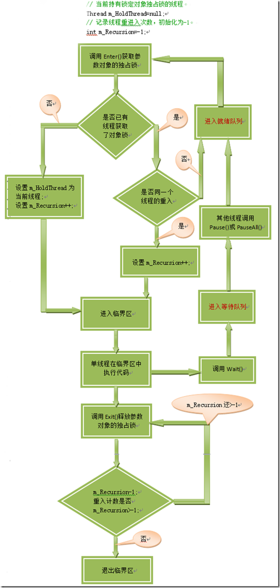
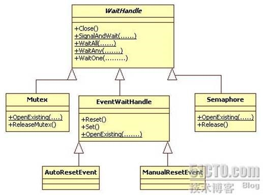

### 同步的问题

在并发环境里，当同时对其共享资源进行访问时，可能造成资源损坏。需要对共享资源进行同步或控制对共享资源的访问。而在相同或不同的应用程序域中未能正确地使访问同步，则会导致出现一些问题：

1.  死锁：当两个线程中的每一个线程都在试图锁定另外一个线程已锁定的资源时，就会发生死锁。其中任何一个线程都不能继续执行。
2. 争用条件：当多个线程同时访问同一数据，每个线程尝试修改数据，并且对共享状态的访问没有同步，从而导致数据被破坏。

需要同步的资源包括：

1) 系统资源（如通信端口）。

2) 多个进程所共享的资源（如文件句柄）。

3) 由多个线程访问的单个应用程序域的资源（如全局、静态和实例字段）。

线程同步锁”可以保护共享数据，但是也会存在一些问题：

1) 实现比较繁琐，而且容易错漏。你必须标识出可能由多个线程访问的所有共享数据。然后，必须为其获取和释放一个线程同步琐，并且保证已经正确为所有共享资源添加了锁定代码。

2) 由于临界区无法并发运行，进入临界区就需要等待，加锁带来效率的降低。

3) 在复杂的情况下，很容易造成死锁，并发实体之间无止境的互相等待。

4) 优先级倒置造成实时系统不能正常工作。优先级低的进程拿到高优先级进程需要的锁，结果是高/低优先级的进程都无法运行，中等优先级的进程可能在狂跑。

5) 当线程池中一个线程被阻塞时，可能造成线程池根据CPU使用情况误判创建更多的线程以便执行其他任务，然而新创建的线程也可能因请求的共享资源而被阻塞，恶性循环，徒增[线程上下文](http://www.cnblogs.com/heyuquan/archive/2012/12/23/2830214.html#context)切换的次数，并且降低了程序的伸缩性。**（这一点很重要）**

### 线程安全

使一个方法线程安全，并不是说它一定要在内部获取一个线程同步锁。一个线程安全的方法意味着在两个线程试图同时访问数据时，数据不会被破坏。如方法参数是值类型，会复制到方法内部，线程之间互不干涉。

### 原子操作

原子操作是不可分割的，在执行完毕之前不会被任何其它任务或事物中断。

在多线程编程环境中指：一个线程在访问某个资源的同时能够保证没有其他线程会在同一时刻访问同一资源。

根据待同步粒度大小来选择合适的同步方式：

#### 易失结构

volatile 关键字指示一个字段可以由多个同时执行的线程修改。JIT编译器确保对易失字段的所有访问都是易失读取和易失写入的方式执行，而不用显示调用Thread的静态VolatileRead()与VolatileWrite()方法。

另外，Volatile关键字告诉C#和JIT编译器不将字段缓存到CPU的寄存器中，确保字段的所有读取操作都在RAM中进行。（这也会降低一些性能）

volatile也带来了一个问题，因为volatile标注的成员不受优化器优化。

eg：m_amount=m_amount+m_amount // m_amount是类中定义的一个volatile字段

通常，要倍增一个整数，只需将它的所有位都左移1位，许多编译器都能检测到上述代码的意图，并执行优化。然而，如果m_amount是volatile字段，就不允许执行这个优化，编译器必须生成代码将m_amount读入一个寄存器，再把它读入另一个寄存器，将两个寄存器加到一起，再将结果写回m_amount字段。未优化的代码肯定会更大，更慢。

C#不支持以传引用的方式将volatile字段传给方法。有时为了利用CPU的寄存器和编译器的优化我们会采用下面两种原子操作。

#### 互锁结构Interlocked 

互锁结构是由 Interlocked 类的静态方法对某个内存位置执行的简单原子操作，即提供同步对多个线程共享的变量的访问的方法。这些原子操作包括添加、递增和递减、交换、依赖于比较的条件交换、内存屏障，以及 32 位平台上的 64 位long值的读取操作。

Interlocked的所有方法都建立了完美的内存栅栏。换言之，调用某个Interlocked方法之前的任何变量写入都在这个Interlocked方法调用之前执行；而这个调用之后的任何变量读取都在这个调用之后读取。

```C#
public static class Interlocked
{
    // 对两个 32|64 位整数进行求和并用和替换第一个整数，上述操作作为一个原子操作完成。返回结果：location1的新值。
    public static int Add(ref int location1, int value);
    public static long Add(ref long location1, long value);
 
    // 以原子操作的形式递增|递减指定变量的值。返回结果：location1的新值。
    public static int Increment(ref int location);
    public static long Increment(ref long location);
    public static int Decrement(ref int location);
    public static long Decrement(ref long location);
 
    // 比较指定的location1和comparand是否相等，如果相等，则将location1值设置为value。返回结果：location1 的原始值。
    public static T CompareExchange<T>(ref T location1, T value, T comparand) where T : class;
    // 以原子操作的形式，将location1的值设置为value，返回结果：location1 的原始值。
    public static T Exchange<T>(ref T location1, T value) where T : class;
 
    // 内存栅栏
    /// 此方法在.NET Framework 4.5 中引入，它是 Thread.MemoryBarrier() 方法的包装。 
    public static void MemoryBarrier();
 
    // 返回一个以原子操作形式加载的 64 位值。location:要加载的 64 位值。
    public static long Read(ref long location);
    ……
}
```

注意：

1) 在使用Add()、Increament()、Decrement()方法时可能出现溢出情况，则遵循规则：

   a)  如果 location=Int32.MaxValue，则 location+1 = Int32.MinValue，location+2=Int32.MinValue+1……。

   b)  如果 location=Int32.MinValue，则 location- 1 =Int32.MaxValue，location- 2 =Int32.MaxValue-1……

2) Read(ref long location) 返回一个以原子操作形式加载的 64 位值。由于 64 位读取操作已经是原子的，因此 64 位系统上不需要 Read 方法。在 32 位系统上，64 位读取操作除非用 Read 执行，否则不是原子的。

3) Exchange 和 CompareExchange 方法具有接受 object 类型的参数的重载。这重载的第一个参数都是 ref object，传递给此参数的变量严格类型化为object，

   ```C#
   int o=2;
   // 不能将第一个参数强制转换为object类型，否则编译报错“ref 或 out 参数必须是可赋值的变量”
   // 这实际是类型强制转换的一个细节，强制转换时编译器会生成一个临时引用，然后把这个临时引用传给一个和转换类型相同的引用，这个临时引用比较特别，它不能被赋值，所以会报“ref 或 out 参数必须是可赋值的变量”。
   Interlocked.Exchange(ref (object)o,new object());
    
   // 编译通过
   objectobj = (object)o;
   Interlocked.Exchange(ref obj, new object());
   ```

4) 示例：

   在大多数计算机上，增加变量操作不是一个原子操作，需要执行下列步骤：

   a)     将实例变量中的值加载到寄存器中。

   b)     增加或减少该值。

   c)     在实例变量中存储该值。

   如果不使用 Increment 和 Decrement，线程可能会在执行完前两个步骤后被抢先。然后由另一个线程执行所有三个步骤。当第一个线程重新开始执行时，它改写实例变量中的值，造成第二个线程执行增减操作的结果丢失。（线程都维护着自己的寄存器）

Thread类为我们提供的VolatileRead()与VolatileWrite()静态方法

### 同步代码块(临界区)

#### Monitor(监视器)

Monitor（监视器）放置多个线程同时执行代码块。Enter 方法允许一个且仅一个线程继续执行后面的语句；其他所有线程都将被阻止，直到执行语句的线程调用 Exit。

Monitor 锁定对象是**引用类型，而非值类型**，该对象用来定义锁的范围。

1. 可以向 Enter 和 Exit 传递值类型，但对于每次调用它都是分别装箱的。因为每次调用都创建一个独立的对象（即，锁定的对象不一样），所以 Enter要保护的代码并没有真正同步。
2. 若传递给 Exit 的被装箱对象不同于传递给 Enter 的被装箱的对象，所以 Monitor 将引发 SynchronizationLockException，并显示以下消息：“从不同步的代码块中调用了对象同步方法。”

Monitor将为每个同步对象来维护以下信息：

1) 对当前持有锁的线程的引用。

2) 对就绪队列的引用。当一个线程尝试着lock一个同步对象的时候，该线程就在就绪队列中排队。一旦没人拥有该同步对象，就绪队列中的线程就可以占有该同步对象。（队列：先进先出）

3) 对等待队列的引用。占有同步对象的线程可以暂时通过Wait()释放对象锁，将其在等待队列中排队。该队列中的线程必须通过Pulse()\PulseAll()方法通知才能进入到就绪队列。（队列：先进先出）

```C#
public static class Monitor
{
    // 确定当前线程是否保留指定对象锁。
    public static bool IsEntered(object obj);
    // 获取指定对象上的排他锁（设置获取锁的结果lockTaken，通过引用传递。 输入必须为 false。 如果已获取锁，则输出为 true；否则输出为 false）
    public static void Enter(object obj);
    public static void Enter(object obj, ref bool lockTaken);        
    // 在指定的一段时间内，尝试获取指定对象上的排他锁. 
    // (设置获取锁的结果lockTaken，通过引用传递。 输入必须为 false。如果已获取锁，则输出为 true；否则输出为 false)
    // System.TimeSpan，表示等待锁所需的时间量。 值为 -1 毫秒表示指定无限期等待。
    public static bool TryEnter(object obj, TimeSpan timeout);
    public static void TryEnter(object obj, TimeSpan timeout, ref bool lockTaken);
 
    // 释放指定对象上的排他锁。
    public static void Exit(object obj);
 
    // 释放对象上的锁并阻止当前线程，直到它重新获取该锁。 System.TimeSpan，表示线程进入就绪队列之前等待的时间量。
    // exitContext标识可以在等待之前退出同步上下文的同步域，随后重新获取该域。
    public static bool Wait(object obj, TimeSpan timeout, bool exitContext);
 
    //  通知等待队列中的线程锁定对象状态的更改。
    public static void Pulse(object obj);
    // 通知所有的等待线程对象状态的更改。
    public static void PulseAll(object obj);
    ……
}
```

注意：

1) 同一线程在不阻止的情况下允许多次调用 Enter()；但在该对象上等待的其他线程取消阻止之前必须调用相同数目的 Exit()。

2) 如果释放了锁并且其他线程处于该对象的【就绪队列】中，则其中一个线程将获取该锁。如果其他线程处于【等待队列】中，则它们不会在锁的所有者调用 Exit ()时自动移动到就绪队列中。

3) 唤醒机制：Wait()释放参数指定对象的对象锁，以便允许其他被阻塞的线程获取对象锁。**调用Wait()的线程进入【等待队列】中**，等待状态必须由其他线程调用方法Pulse()或PulseAll()唤醒，使等待状态线程变为就绪状态。

   方法Pulse()和PulseAll()：向【等待队列】中第一个或所有等待线程发送信息，占用对象锁的线程准备释放对象锁。在即将调用Exit()方法前调用，通知等待队列线程移入就绪队列，待执行方法Exit()释放对象锁后被Wait()的线程将重新获取对象锁。

#### lock

lock 是.NET为简化Monitor（监视器）而存在的关键字。等价于：

```C#
Boolean lockTaken=false;
try
{
    Mnoitor.Enter(锁定对象,ref lockTaken);
    ……
}
Finally
{
    if(lockTaken)
        Monitor.Exit(锁定对象);
}
```

lock比Monitor更简洁，但Monitor提供了更多的方法，对获得锁的过程有更多的控制，如超时。

#### 获得独占锁的流程图



#### 双检锁

```C#
class Program
{
    private static Singleton s_value = null;
 
    static void Main(string[] args)
    {
        ThreadPool.QueueUserWorkItem((obj) => { Singleton.GetSingleton(); });
        ThreadPool.QueueUserWorkItem((obj) => {
            while (true)
            {
                if (s_value != null)
                {
                    Console.WriteLine("s_lock不为null");
                    break;
                }
            }
        });
 
        Console.Read();
    }
 
    public sealed class Singleton
    {
        private static Object s_lock = new object();
        
        // 私有构造器，阻止这个类外部的任何代码创建实例
        private Singleton() {
            Thread.SpinWait(Int32.MaxValue);
            Console.WriteLine("对象创建完成");
        }
 
        // (Double-Check Locking)，单例模式
        public static Singleton GetSingleton()
        {
            if (s_value != null) return s_value;
 
            Monitor.Enter(s_lock);
            if (s_value == null)
            {
                s_value = new Singleton();
                //Singleton temp = new Singleton();
                //Interlocked.Exchange(ref s_value, temp);
                Console.WriteLine("赋值完成");
            }
            Monitor.Exit(s_lock);
            return s_value;
        }
    }
}
```

1) 里面有两个if，当第一个if判断存在对象时就快速返回，就不需线程同步。如果第一个if判断对象还没创建好，就会获取一个线程同步锁来确保只有一个线程构造单实例函数。

2) 细腻的你可能认为会出现一种情况：第一个if将s_value空值读入到一个CPU寄存器中，而到第二个if读取s_value时也是从寄存器中读取该空值，但此时s_value内存中的值可能已经不为空了。

   CLR已经帮我们解决了这个问题，在CLR中任何锁的调用构成了一个完整的内存栅栏，在栅栏之前写入的任何变量都必须在栅栏之前完成；在栅栏之后的任何变量都必须在栅栏之后开始。即此处的Monitor.Enter()使s_value之前寄存器中的缓存无效化，需重新从内存中读取。

3. **执行完构造函数后才会将变量引用返回**，不需要使用Interlocked.Exchange方法.

4.  代码中没有使用try-catch-finally确保锁总是得以释放。原因： (所以我们要避免使用lock关键字)

   a)  在try块中，如果在更改状态的时候发生了一个异常，这个状态处于损坏状态。锁在finally块中退出时，另一个线程可能操作损坏的状态。

   b)  进入和离开try块也会影响方法的性能。

#### Win32对象

使用Win32对象同步：互斥体、事件与信号量。

##### WaitHandle抽象类

 System.Threading.WaitHandle抽象基类提供了三个继承类



等待句柄提供了丰富的等待和通知功能。等待句柄派生自 WaitHandle 类，WaitHandle 类又派生自 MarshalByRefObject。因此，等待句柄可用于跨应用程序域边界同步线程的活动。

1. 字段：public const int WaitTimeout      WaitAny返回满足等待的对象的数组索引；如果没有任何对象满足等待，并且WaitAny()设置的等待的时间间隔已过，则返回WaitTimeout。

2) 属性：Handle，SafeWaitHandle    获取或设置一个Win32内核对象的句柄，该句柄在构造一个WaitHandle派生类时初始化。

​		a)     Handle已过时，给 Handle 属性赋新值不会关闭上一个句柄。这可能导致句柄泄漏。

​		b)     SafeWaitHandle，代替Handle，给 SafeWaitHandle 属性赋新值将关闭上一个句柄。

3) Close()和Dispose()：使用Close()方法释放由 WaitHandle 的实例持有的所有资源。Close()释放后不会像DbConnection对象一样还可打开，所以通常在对象使用完后直接通过IDisposable.Dispose() 方法释放对象。

4) SignalAndWait()，WaitAll()，WaitAny()，WaitOne()

​	共同参数：

1. 等待的间隔：  如果值是 System.Threading.Timeout.Infinite，即 -1，则等待是无限期的。
2. 是否退出上下文的同步域：  如果等待之前先退出上下文的同步域（如果在同步上下文中），并在稍后重新获取它，则为 true；即线程在等待时退出上下文同步域并释放资源，这样该同步域被阻塞的线程才能获取锁定资源。当等待方法返回时，执行调用的线程必须等待重新进入同步域。SignalAndWait()、WaitOne()默认传false。WaitAll()、WaitAny()默认传true。

​	WaitOne()基于WaitSingleObject，WaitAny() 或 WaitAll()基于WaitmultipleObject。WaitmultipleObject实现要比WaitSingleObject复杂的多，性能也不好，尽量少用。

- a)     SignalAndWait (WaitHandle toSignal, WaitHandle toWaitOn)

  向 toSignal 发出信号并等待toWaitOn。如果信号和等待都成功完成，则为 true；如果等待没有完成，则此方法不返回。这样toSignal所在线程结束前必须调用toWaitOn.Set()或和别的线程协作由别的线程调用toWaitOn.Set()，SignalAndWait()才不阻塞调用线程。

- b)     WaitAll()

  接收WaitHandle对象数组作为参数，等待该数组中的所有WaitHandle对象都收到信号。在具有 STAThreadAttribute 的线程中不支持 WaitAll ()方法。

- c)     WaitAny()

  接收WaitHandle对象数组作为参数，等待该数组中的任意WaitHandle对象都收到信号。返回值：满足等待的对象的数组索引；如果没有任何对象满足等待，并且WaitAny()设置的等待的时间间隔已过，则为返回WaitTimeout。

- d)     WaitOne()：

  阻塞当前线程，直到当前的 WaitHandle 收到信号

- e)     注意一个限制：

  在传给WaitAny()和WaitAll()方法的数组中，包含的元素不能超过64个，否则方法会抛出一个System.NotSupportedException。

##### 事件等待句柄

包含EventWaitHandle、AutoResetEvent、ManualResetEvent

事件等待句柄（简称事件）就是可以通过发出相应的信号来释放一个或多个等待线程的等待句柄。

事件等待句柄通常比使用 Monitor.Wait() 和 Monitor.Pulse(Object) 方法更简单，并且可以对信号发送提供更多控制。命名事件等待句柄也可用于跨应用程序域和进程同步活动，而监视器Monitor只能用于本地的应用程序域。

1. EventWaitHandle 类允许线程通过发出信号和等待信号来互相通信。信号发出后，可以用手动或自动方式重置事件等待句柄。 EventWaitHandle 类既可以表示本地事件等待句柄（本地事件），也可以表示命名系统事件等待句柄（命名事件或系统事件，对所有进程可见）

   ```C#
   public class EventWaitHandle : WaitHandle
   {
       // initialState：如果为 true，EventWaitHandle为有信号状态，此时不阻塞线程。
       // mode，指示在接收信号后是自动重置 EventWaitHandle 还是手动重置。
       // createdNew ：在此方法返回时，如果创建了本地事件（如果 name 为空字符串）或指定的命名系统事件，则为 true；如果指定的命名系统事件已存在，则为 false。可以创建多个表示同一系统事件的 EventWaitHandle 对象。
       //	一个 EventWaitHandleSecurity 对象，表示应用于【已命名的系统事件】的访问控制安全性。如果系统事件不存在，则使用指定的访问控制安全性创建它。如果该事件存在，则忽略指定的访问控制安全性。
       public EventWaitHandle(bool initialState, EventResetMode mode, string name
               , out bool createdNew, EventWaitHandleSecurity eventSecurity);
    
       // 获取 System.Security.AccessControl.EventWaitHandleSecurity 对象，
       // 该对象表示由当前 EventWaitHandle 对象表示的已命名系统事件的访问控制安全性。
       public EventWaitHandleSecurity GetAccessControl();
       // 设置已命名的系统事件的访问控制安全性。
       public void SetAccessControl(EventWaitHandleSecurity eventSecurity);
    
       // 打开指定名称为同步事件（如果已经存在）。
       public static EventWaitHandle OpenExisting(string name);
       // 用安全访问权限打开指定名称为同步事件（如果已经存在）。
       public static EventWaitHandle OpenExisting(string name, EventWaitHandleRights rights);
       public static bool TryOpenExisting(string name, out EventWaitHandle result);
       public static bool TryOpenExisting(string name, EventWaitHandleRights rights, out EventWaitHandle result);
    
       // 将事件状态设置为非终止状态，导致线程阻止。
       public bool Reset();
       // 将事件状态设置为终止状态，允许一个或多个等待线程继续。
       public bool Set();
       ……
   }
   
   // 指定可应用于命名的系统事件对象的访问控制权限。
   [Flags]
   public enum EventWaitHandleRights
   {
       // set()或reset()命名的事件的信号发送状态的权限。
       Modify = 2,
       // 删除命名的事件的权限。
       Delete = 65536,
       // 打开并复制某个命名的事件的访问规则和审核规则的权限。
       ReadPermissions = 131072,
       // 更改与命名的事件关联的安全和审核规则的权限。
       ChangePermissions = 262144,
       // 更改命名的事件的所有者的权限。
       TakeOwnership = 524288,
       // 在命名的事件上等待的权限。
       Synchronize = 1048576,
       // 对某个命名的事件进行完全控制和修改其访问规则和审核规则的权限。
       FullControl = 2031619,
   }
   ```

2. AutoResetEvent用于表示自动重置的本地事件。在功能上等效于用EventResetMode.AutoReset 创建的本地EventWaitHandle。

3. ManualResetEvent表示必须手动重置的本地事件。在功能上等效于用EventResetMode.ManualReset 创建的本地 EventWaitHandle。

4.  Mutex（互斥体）是同步基元，它只向一个线程授予对共享资源的独占访问权。API与EventWaitHandleAPI类似。

5. Semaphore（信号量）限制可同时访问某一资源或资源池的线程数

##### 线程关联

1. Mutex具有线程关联。拥有Mutex 的线程必须将其释放，而如果在不拥有mutex的线程上调用ReleaseMutex方法，则将引发异常ApplicationException。
2. 事件等待句柄（EventWaitHandle、AutoResetEvent 和 ManualResetEvent）以及信号量(Semaphore)没有线程关联。任何线程都可以发送事件等待句柄或信号量的信号。

##### 命名事件

Windows 操作系统允许事件等待句柄具有名称。命名事件是系统范围的事件。即，创建命名事件后，它对所有进程中的所有线程都是可见的。因此，命名事件可用于同步进程的活动以及线程的活动。系统范围的，可以用来协调跨进程边界的资源使用。

1) 因为命名事件是系统范围的事件，所以可以有多个表示相同命名事件的 EventWaitHandle 对象。每当调用构造函数或 OpenExisting 方法时时，都会创建一个新的 EventWaitHandle 对象。重复指定相同名称会创建多个表示相同命名事件的对象。

2) 使用命名事件时要小心。因为它们是系统范围的事件，所以使用同一名称的其他进程可能会意外地阻止您的线程。在同一计算机上执行的恶意代码可能以此作为一个切入点来发动拒绝服务攻击。

   - 应使用访问控制安全机制来保护表示命名事件的 EventWaitHandle 对象

     - 最好通过使用可指定 EventWaitHandleSecurity 对象的构造函数来实施保护。

     - 也可以使用 SetAccessControl 方法来应用访问控制安全，但这一做法会在事件等待句柄的创建时间和设置保护时间之间留出一段漏洞时间。

   - 使用访问控制安全机制来保护事件可帮助阻止恶意攻击，但无法解决意外发生的名称冲突问题。 

3) Mutex、Semaphore对象类似EventWaitHandle。（AutoResetEvent 和 ManualResetEvent 只能表示本地等待句柄，不能表示命名系统事件。）

### 特性

利用特性进行上下文同步和方法同步：应用SynchronizaitonAttribute的类，CLR会自动对这个类实施同步机制。为当前上下文和所有共享同一实例的上下文强制一个同步域(在任一时刻，最多只有一个线程处于同步域中)。

被应用SynchronizationAttribute的类必须是上下文绑定的。换句话说，它必须继承于System.ContextBoundObject类

一般类所建立的对象为上下文灵活对象（context-agile），它们都由CLR自动管理，可存在于任意的上下文当中（一般在默认上下文中）。而 ContextBoundObject 的子类所建立的对象只能在建立它的对应上下文中正常运行，此状态被称为上下文绑定。其他对象想要访问ContextBoundObject 的子类对象时，都只能通过透明代理来操作。

```C#
using System.Runtime.Remoting.Contexts;
class Synchronization_Test
{
    public static void Test()
    {
        class1 c = new class1();
        ThreadPool.QueueUserWorkItem(o => { c.Test1(); });
        Thread.Sleep(100);
        ThreadPool.QueueUserWorkItem(o => { c.Test2(); });
    }
 
    [Synchronization(SynchronizationAttribute.REQUIRED)]  
    internal class class1 : ContextBoundObject
    {// 必须继承于System.ContextBoundObject类
        public void Test1()
        {
            Thread.Sleep(1000);
            Console.WriteLine("Test1");
            Console.WriteLine("1秒后");
         }
 
        public void Test2()
        {
            Console.WriteLine("Test2");
        }
    }
}
```

- 

### 协作式取消

CancellationTokenSource和cancellationToken。它们常常被用于混合结构中。Eg：使一个线程强迫解除其构造上的等待阻塞。

取消过程：

1. 通过使用CancellationTokenSource创建一个或多个取消标记CancellationToken（cancellationToken可在线程池中线程或 Task 对象之间实现协作取消），
2. 然后将此取消标记传递给应接收取消通知的任意数量的线程或Task对象。
3. 当调用CancellationToken关联的CancellationTokenSource对象的 Cancle()时，每个取消标记(CancellationToken)上的IsCancellationRequested属性将返回true。
4. 异步操作中可以通过检查此属性做出任何适当响应。

#### CancellationTokenSource

```C#
// 通知System.Threading.CancellationToken，告知其应被取消。
public class CancellationTokenSource : IDisposable
{
    // 构造一个CancellationTokenSource将在指定的时间跨度后取消。
    public CancellationTokenSource(int millisecondsDelay);
 
    // 获取是否已请求取消此CancellationTokenSource。
    public bool IsCancellationRequested { get; }
     
    // 获取与此CancellationTokenSource关联的CancellationToken。
    public CancellationToken Token { get; }
 
    // 传达取消请求。参数throwOnFirstException:指定异常是否应立即传播。
    public void Cancel();
    public void Cancel(bool throwOnFirstException);
    // 在此CancellationTokenSource上等待指定时间后“取消”操作。
    public void CancelAfter(int millisecondsDelay);
 
    // 创建一组CancellationToken关联的CancellationTokenSource。
    public static CancellationTokenSource CreateLinkedTokenSource(paramsCancellationToken[] tokens);
 
    // 释放由CancellationTokenSource类的当前实例占用的所有资源。
    public void Dispose();
    ……
}
```

1) CancellationTokenSource.CreateLinkedTokenSource()方法

   将一组CancellationToken连接起来并创建一个新的CancellationTokenSource。任何一个CancellationToken对应的旧CancellationTokenSource被取消，这个新的CancellationTokenSource对象也会被取消。

   原理：创建一个新的CancellationTokenSource实例，并将该实例的Cancel()委托分别传递给这组CancellationToken实例的Register()方法，然后返回新创建的CancellationTokenSource实例。

2) CancellationTokenSource实例Cancel()方法做了什么：

   a)     将CancellationTokenSource实例的IsCancellationRequested属性设置为true。CancellationToken实例的IsCancellationRequested属性是调用CancellationTokenSource实例的IsCancellationRequested属性。

   b)     调用CancellationTokenSource实例的CreateLinkedTokenSource()注册的Cancel()委托回调；

   c)     调用CancellationToken实例的Register()注册的回调；

   d)     处理回调异常。（参数throwOnFirstException）

   ​        i.  若为Cancel()传递true参数，那么抛出了未处理异常的第一个回调方法会阻止其他回调方法的执行，异常会立即从Cancel()中抛出；

   ​       ii. 若为Cancel()传递false（默认为false），那么登记的所有回调方法都会调用。所有未处理的异常都会封装到一个AggregateException对象中待回调都执行完后返回，其InnerExceptions属性包含了所有异常的详细信息。

   e)   给CancellationToken对象的ManualResetEvent对象Set()信号。

#### CancellationToken

```C#
// 传播有关应取消操作的通知。
public struct CancellationToken
{
    public CancellationToken(bool canceled);
    public static CancellationToken None { get; }
 
    // 获取此标记是否能处于已取消状态。
    public bool CanBeCanceled { get; }
    // 获取是否已请求取消此标记。
    public bool IsCancellationRequested { get; }
 
    // 获取内部ManualResetEvent，在CancellationTokenSource执行Cancel()时收到set()通知。
    public WaitHandle WaitHandle{ get; }
 
    // 注册一个将在取消此CancellationToken时调用的委托。
    // 参数:useSynchronizationContext:
    //一个布尔值，该值指示是否捕获当前SynchronizationContext并在调用 callback 时使用它。
    public CancellationTokenRegistration Register(Action<object> callback, object state
                            , bool useSynchronizationContext);
 
    // 如果已请求取消此标记，则引发OperationCanceledException。
    public void ThrowIfCancellationRequested();
    ……
}
```

1) CancellationToken是结构struct，值类型。

2) CancellationTokenSource与CancellationToken关联是“一一对应”的

   a)     无论CancellationTokenSource是通过构造函数创建还是CreateLinkedTokenSource()方法创建，与之对应的CancellationToken只有一个。

   b)     每个CancellationToken都会包含一个私有字段，保存唯一与之对应的CancellationTokenSource引用。

3) CancellationToken实例的None属性与参数不是true的CancellationToken构造函数

   它们返回一个特殊的CancellationToken实例，该实例不与任何CancellationTokenSource实例关联(即不可能调用Cancel())，其CanBeCanceled实例属性为false。

4) CancellationToken的Register()方法返回的CancellationTokenRegistration对象，可调用其Dispose()方法删除一个Register()登记的回调方法。

5) CancellationToken实例的WaitHandle属性

   会先判断若没有对应的CancellationTokenSource，则创建一个默认的CancellationTokenSource对象。然后再判断若没有内部事件等待句柄则new ManualResetEvent(false)，在CancellationTokenSource执行Cancel()时收到set()通知。;

6) CancellationToken实例的ThrowIfCancellationRequested()方法如下：

   ```C#
   public void ThrowIfCancellationRequested()
   {
       if (this.IsCancellationRequested)
       {
           throw new OperationCanceledException(
           Environment.GetResourceString("OperationCanceled"), this);
       }
   }
   ```

```C#
//线程池线程协作取消的例子
public static void ThreadPool_Cancel_test()
{
    CancellationTokenSource cts = new CancellationTokenSource();
 
    ThreadPool.QueueUserWorkItem(
        token =>
        {
            CancellationToken curCancelToken = (CancellationToken)token;
            while (true)
            {
                // 耗时操作
                Thread.Sleep(400);
                if (curCancelToken.IsCancellationRequested)
                {
                    break;   // 或者抛异常curCancelToken.ThrowIfCancellationRequested();
                }
            }
            Console.WriteLine(String.Format("线程{0}上，CancellationTokenSource操作已取消，退出循环"
                , Thread.CurrentThread.ManagedThreadId));
        }
        , cts.Token
     );
 
    ThreadPool.QueueUserWorkItem(
        token =>
        {
            Console.WriteLine(String.Format("线程{0}上，调用CancellationToken实例的WaitHandle.WaitOne() "
                 , Thread.CurrentThread.ManagedThreadId));
            CancellationToken curCancelToken = (CancellationToken)token;
            curCancelToken.WaitHandle.WaitOne();
            Console.WriteLine(String.Format("线程{0}上，CancellationTokenSource操作已取消，WaitHandle获得信号"
                 , Thread.CurrentThread.ManagedThreadId));
        }
        , cts.Token
     );
 
    Thread.Sleep(2000);
    Console.WriteLine("执行CancellationTokenSource实例的Cancel()");
    cts.Cancel();            
}
```

### 自旋结构

#### SpinWait自旋等待

一个轻量同步类型(结构体)，提供对基于自旋的等待的支持。SpinWait只有在多核处理器下才具有使用意义。在单处理器下，自旋转会占据CPU时间，却做不了任何事

多任务或线程中，每一个任务或线程都应该使用自己的SpinWait实例

```C#
public struct SpinWait
{
    // 获取已对此实例调用SpinWait.SpinOnce() 的次数。
    public int Count { get; }
    // 判断对SpinWait.SpinOnce() 的下一次调用是否触发上下文切换和内核转换。
    public bool NextSpinWillYield
    {
        get
        {
            if (this.m_count<= 10)  // 自旋转计数
            {
                return Environment.ProcessorCount == 1;
            }
            return true;
        }
    }
 
    // 重置自旋计数器。
    public void Reset();
    // 执行单一自旋。
    public void SpinOnce()
    {
        if (this.NextSpinWillYield)
        {
            Int num = (this.m_count>= 10) ? (this.m_count - 10) :this.m_count;
            if ((num % 20) == 0x13)
            {
                Thread.Sleep(1);
            }
            else if ((num % 5) == 4)
            {
                Thread.Sleep(0);
            }
            else
            {
                Thread.Yield();
            }
        }
        else
        {
            Thread.SpinWait(((int) 4) <<this.m_count);
        }
        this.m_count = (this.m_count == 0x7fffffff) ?10 : (this.m_count + 1);
    }
    // 在指定条件得到满足(Func<bool>委托返回true)之前自旋。
    public static void SpinUntil(Func<bool> condition);
    // 在指定条件得到满足或指定超时过期之前自旋。参数condition为在返回 true 之前重复执行的委托。
    // 返回结果:
    // 如果条件在超时时间内得到满足，则为 true；否则为 false
    public static bool SpinUntil(Func<bool> condition, int millisecondsTimeout);
    public static bool SpinUntil(Func<bool> condition, TimeSpan timeout);
}
```

1) SpinWait自旋转是调用Thread.SpinWait()。

2) 由NextSpinWillYield属性代码可知，若SpinWait运行在单核计算机上，它总是进行上下文切换（让出处理器）。

3) SpinWait不仅仅是一个空循环。它经过了精心实现，可以针对一般情况提供正确的旋转行为以避免内核事件所需的高开销的上下文切换和内核转换；在旋转时间足够长的情况下自行启动上下文切换，SpinWait甚至还会在多核计算机上产生线程的时间片（Thread.Yield()）以防止等待线程阻塞高优先级的线程或垃圾回收器线程。

4) SpinOnce()自旋一定次数后可能导致频繁上下文切换。注意只有等待时间非常短时，SpinOnce()或SpinUntil()提供的智能行为才会获得更好的效率，否则您应该在SpinWait自行启动上下文切换之前调用自己的内核等待。

   通常使用SpinWait来封装自己“两阶段等待操作”，避免内核事件所需的高开销的**上下文切换和内核转换**。

   实现自己的“**两阶段等待操作**”：

   ```C#
   if (!spinner.NextSpinWillYield)
   {spinner.SpinOnce();}
   else
   {自己的事件等待句柄;}
   ```

#### SpinLock自旋锁

一个轻量同步类型，提供一个相互排斥锁基元，在该基元中，尝试获取锁的线程将在重复检查的循环中等待，直至该锁变为可用为止。SpinLock是结构体，如果您希望两个副本都引用同一个锁，则必须通过引用显式传递该锁。

```C#
public struct SpinLock
    {
        // 初始化SpinLock结构的新实例,参数标识是否启动线程所有权跟踪以助于调试。
        public SpinLock(bool enableThreadOwnerTracking);
 
        // 获取锁当前是否已由任何线程占用。
        public bool IsHeld { get; }
        // 获取是否已为此实例启用了线程所有权跟踪。
        public bool IsThreadOwnerTrackingEnabled { get; }
        // 若IsThreadOwnerTrackingEnabled=true，则可获取锁是否已由当前线程占用。
        public bool IsHeldByCurrentThread { get; }
 
        // 采用可靠的方式获取锁，这样，即使在方法调用中发生异常的情况下，都能采用可靠的方式检查lockTaken以确定是否已获取锁。
        public void Enter(ref boollockTaken);
        public void TryEnter(ref boollockTaken);
        public void TryEnter(int millisecondsTimeout, ref bool lockTaken);
        public void TryEnter(TimeSpan timeout, ref bool lockTaken);
        // Enter(ref boollockTaken)与TryEnter(ref bool lockTaken)效果一样，TryEnter(ref boollockTaken)会跳转更多方法降低的性能。
 
        // 释放锁。参数useMemoryBarrier：指示是否应发出内存屏障，以便将退出操作立即发布到其他线程（默认为true）。
        public void Exit();
        public void Exit(bool useMemoryBarrier);
}
```

1) SpinLock支持线程跟踪模式，可以在开发阶段使用此模式来帮助跟踪在特定时间持有锁的线程。虽然线程跟踪模式对于调试很有用，但此模式可能会导致性能降低。（构造函数：可接受一个bool值以指示是否启用调试模式，跟踪线程所有权）

2) SpinLock不可重入。在线程进入锁之后，它必须先正确地退出锁，然后才能再次进入锁。通常，任何重新进入锁的尝试都会导致死锁。

   如果在调用 Exit 前没有调用 Enter，SpinLock的内部状态可能被破坏。

3) Enter与TryEnter的选择

   a)     Enter(ref boollockTaken)     在获取不到锁时会阻止等待锁可用，自旋等待，相当于等待时间传入-1（即无限期等待）。

   b)     TryEnter(ref boollockTaken) 在获取不到锁时立即返回而不行进任何自旋等待，相当于等待时间传入0。

   c)     TryEnter(时间参数, ref boollockTaken)      在获取不到锁时，会在指定时间内自旋等待。

   d)     在指定时间内，若自旋等待足够长时间，内部会自动切换上下文进行内核等待，切换逻辑类似SpinWait结构（即，并没有使用等待事件，只是使用Thread.Sleep(0)、Thread.Sleep(1)以及Thread.Yield()），所以也可能导致频繁上下文切换。

4) 在多核计算机上，当等待时间预计较短且极少出现争用情况时，SpinLock的性能将高于其他类型的锁(长时或预期有大量阻塞，由于旋转过多，性能会下降)。但需注意的一点是，**SpinLock比标准锁更耗费资源。建议您仅在通过分析确定 Monitor方法或 Interlocked 方法显著降低了程序的性能时使用SpinLock****。**

5) 在保持一个自旋锁时，应避免任何这些操作：

   a)     阻塞，

   b)     调用本身可能阻塞的任何内容，

   c)     一个SpinLock结构上保持过多自旋锁，

   d)     进行动态调度的调用（接口和虚方法）

   e)     非托管代码的调度，或分配内存。

6) **不要将SpinLock声明为只读字段，因为如果这样做的话，会导致每次调用这个字段都返回SpinLock的一个新副本，而不是同一个SpinLock。这样所有对Enter()的调用都能成功获得锁，因此受保护的临界区不会按照预期进行串行化。**

### 同步基元

基元线程同步构造分为：基元用户模式构造和基元内核模式构造。

#### 基元用户模式构造

应尽量使用基元用户模式构造，因为它们使用特殊的CPU指令来协调线程，这种协调发生硬件中，速度很快。但也因此Windows操作系统永远检测不到一个线程在一个用户模式构造上阻塞了，这种检测不到有利有弊：

1) 利：因为用户模式构造上阻塞的一个线程，池线程永远不认为已经阻塞，所以不会出现“线程池根据CPU使用情况误判创建更多的线程以便执行其他任务，然而新创建的线程也可能因请求的共享资源而被阻塞，恶性循环，徒增线程上下文切换的次数”的问题。

2) 弊：当你想要取得一个资源但又短时间取不到时，一个线程会一直在用户模式中运行，造成CPU资源的浪费，此时我们更希望像内核模式那样停止一个线程的运行让出CPU。

**有：volatile关键字、Interlocked静态类、Thread的VolatileWrite()与VolatileRead()方法。**

#### 基元内核模式构造

是Windows操作系统自身提供的。

它们要求我们调用在操作系统内核中实现的函数，调用线程将从托管代码转换为本地用户模式代码，再转换为本地内核模式代码，然后还要朝相反的方向一路返回，会浪费大量CPU时间，同时还伴随着线程上下文切换，因此尽量不要让线程从用户模式转到内核模式。

内核模式的构造具有基元用户模式构造所不具有的一些优点：

1) 一个内核模式的构造检测到在一个资源上的竞争时，Windows会阻塞输掉的线程，使它不占着一个CPU“自旋”，无谓地浪费处理器资源。

2) 内核模式的构造可实现本地和托管线程相互之间的同步。

3) 内核模式的构造可同步在一台机器的不同进程中运行的线程。

4) 内核模式的构造可应用安全性设置，防止未经授权的帐户访问它们。

5) 一个线程可一直阻塞，直到一个集合中的所有内核模式的构造都可用，或者直到一个集合中的任何一个内核模式的构造可用。

6) 在内核模式的构造上阻塞的一个线程可以指定一个超时值；如果在指定的时间内访问不到希望的资源，线程可以解除阻塞并执行其他任务。

**有：EventWaitHandle(以及AutoResetEvent与ManualResetEvent)、Mutex、Semaphore。（另外：ReaderWriterLock）**

#### 混合构造

对于在一个构造上等待的线程，如果拥有这个构造的线程一直不释放它，则会出现：

1) 如果是用户模式构造，则线程将一直占用CPU，我们称之为“活锁”。

2) 如果是内核模式构造，则线程将一直被阻塞，我们称之为“死锁”。

然后两者之间，死锁总是优于活锁，因为活锁既浪费CPU时间，又浪费内存。而死锁只浪费内存。

混合构造正是为了解决这种场景。其通过合并用户模式和内核模式实现：

1. 在没有线程竞争的时候，混合构造提供了基元用户模式构造所具有的性能优势。
2. 多个线程同时竞争一个构造的时候，混合构造则使用基元内核模式的构造来提供不“自旋”的优势。
3. 由于在大多数应用程序中，线程都很少同时竞争一个构造，所以在性能上的增强可以使你的应用程序表现得更出色。

混合结构优化的本质：**两阶段等待操作**（自旋减少线程的上下文切换）

a). 线程上下文切换需要花费几千个周期(每当线程等待内核事件WaitHandle时都会发生)。我们暂且称其为C。假如线程所等待的时间小于2C(1C用于等待自身，1C用于唤醒)，则自旋等待可以降低等待所造成的系统开销和滞后时间，从而提升算法的整体吞吐量和可伸缩性。

b). 在多核计算机上，当预计资源不会保留很长一段时间时，如果让等待线程以用户模式旋转数十或数百个周期，然后重新尝试获取资源，则效率会更高。如果在旋转后资源变为可用的，则可以节省数千个周期。如果资源仍然不可用，则只花费了少量周期，并且仍然可以进行基于内核的等待。这一旋转-等待的组合称为“两阶段等待操作”。

**有：Monitor\lock，ManualResetEventSlim、SemaphoreSlim、CountdownEvent、Barrier、ReaderWriterLockSlim。**

lock\Monitor（监视器）的几个步骤：

1) 执行Monitor.Enter()/lock的线程会首先测试Monitor的锁定位。如果该位为OFF(解锁)，那么线程就会在该位上设置一下(加锁)，且不需要等待便继续。这通常只需执行1~2个机器指令。

2) 如果Monitor被锁定，线程就会进入一个旋转等待持有锁。而线程在旋转期间会反复测试锁定位。单处理器系统会立即放弃，而在多核处理器系统上则旋转一段时间才会放弃。在此之前，线程都在用户模式下运行。

3) 一旦线程放弃测试锁定位(在单处理器上立即如此)，线程使用信号量在内核进入等待状态。

4) 执行Monitor.Exit()或代码退出了lock块。如果存在等待线程，则使用ReleaseSemaphore()通知内核。

​	在第二步中，提到的旋转等待。正是：**SpinWait**。

#### ManualResetEventSlim

当等待时间预计非常短时，并且当事件不会跨越进程边界时，可使用ManualResetEventSlim类以获得更好的性能

```C#
public class ManualResetEventSlim : IDisposable
{
    // 初始化 ManualResetEventSlim 类的新实例。
    //   initialState:（默认为false）
    //     如果为 true，则IsSet属性设置为true，此时为有信号状态，不会阻止线程。
    //   spinCount:
    //     设置在回退到基于内核的等待操作之前需发生的自旋等待数量，默认为10。
    public ManualResetEventSlim(bool initialState, int spinCount);
 
    // 获取是否设置了事件。Reset()将其设置为false；Set()将其设置为true
    public bool IsSet { get; }
    // 获取在回退到基于内核的等待操作之前发生需的自旋等待数量，由构造函数设置。
    public int SpinCount { get; }
    // 获取此ManualResetEventSlim的基础WaitHandle（ManualResetEvent）
    public WaitHandle WaitHandle { get; }
 
    // 将事件状态设置为非终止状态，从而阻塞线程。
    public void Reset();
    // 将事件状态设置为终止，从而允许一个或多个等待该事件的线程继续。
    public void Set();
    // 阻止当前线程，直到Set()了当前ManualResetEventSlim为止。无限期等待。
    public void Wait();
    // 阻止当前线程，直到Set()了当前ManualResetEventSlim为止，并使用 32 位带符号整数测量时间间隔，
    // 同时观察.CancellationToken。在指定时间内收到信号，则返回true。
    public bool Wait(int millisecondsTimeout, CancellationToken cancellationToken);
 
    // 释放由ManualResetEventSlim类的当前实例占用的所有资源。
    public void Dispose();
    ……
}

public static void Test()
{
    ManualResetEventSlim manualSlim = new ManualResetEventSlim(false);
    Console.WriteLine("ManualResetEventSlim示例开始");
    Thread thread1 = new Thread(o =>
    { 
        Thread.Sleep(500);
        Console.WriteLine("调用ManualResetEventSlim的Set()");
        manualSlim.Set(); 
    });
    thread1.Start();
    Console.WriteLine("调用ManualResetEventSlim的Wait()");
    manualSlim.Wait();
    Console.WriteLine("调用ManualResetEventSlim的Reset()");
    manualSlim.Reset();  // 重置为非终止状态，以便下一次Wait()等待
    CancellationTokenSource cts = new CancellationTokenSource();
    Thread thread2 = new Thread(obj =>
    {
        Thread.Sleep(500);
        CancellationTokenSource curCTS = obj as CancellationTokenSource;
        Console.WriteLine("调用CancellationTokenSource的Cancel()");
        curCTS.Cancel();
    });
    thread2.Start(cts);
    try
    {
        Console.WriteLine("调用ManualResetEventSlim的Wait()");
        manualSlim.Wait(cts.Token);
        Console.WriteLine("调用CancellationTokenSource后的输出");
    }
    catch (OperationCanceledException)
    {
        Console.WriteLine("异常：OperationCanceledException");
    }
}
```

1) 首先要明确的是ManualResetEventSlim是ManualResetEvent的优化版本，但ManualResetEventSlim是基于自旋+Monitor完成。

2) 可在ManualResetEventSlim的构造函数中指定切换为内核模式之前需发生的自旋等待数量（只读的SpinCount属性），默认为10。

3) 访问WaitHandle属性会延迟创建一个ManualResetEvent(false)对象。在调用ManualResetEventSlim的set()方法时通知WaitHandle.WaitOne()获得信号。

#### SemaphoreSlim

SemaphoreSlim是Semaphore的优化版本。限制可同时访问某一资源或资源池的线程数。

SemaphoreSlim利用**SpinWait结构+Monitor可重入的特性+引用计数实现**，并且提供的异步API：返回Task的WaitAsync();重载方法。

注意CurrentCount属性的使用，此属性能够获取进入信号量的任务或线程的数目。因为这个值总是在变化，所以当信号量在执行并发的Release和Wait方法时，某一时刻CurrentCount等于某个值并不能说明任务或线程执行下一条指令的时候也一样。因此，一定要通过Wait方法和Release方法进入和退出由信号量所保护的资源。

#### CountdownEvent

这个构造阻塞一个线程，直到它的内部计数器变成0（与信号量相反，信号量是在计数位0时阻塞线程）。CountdownEvent是对ManualResetEventSlim的一个封装。

CountdownEvent简化了fork/join模式。尽管基于新的任务编程模型通过Task实例、延续和Parallel.Invoke可以更方便的表达fork-join并行。然而，CountdownEvent对于任务而言依然有用。使用Task.WaitAll()或TaskFactory.ContinueWhenAll()方法要求有一组等待的Task实例构成的数组。CountdownEvent不要求对象的引用，而且可以用于最终随着时间变化的动态数目的任务。

使用方式：

1) CurrentCount属性标识剩余信号数（和InitialCount属性一起由构造函数初始化）；

2) Wait()阻止当前线程，直到CurrentCount计数为0（即所有的参与者都完成了）；

3) Signal()向CountdownEvent注册一个或指定数量信号，通知任务完成并且将CurrentCount的值减少一或指定数量。注意不能将事件的计数递减为小于零；

4) 允许使用AddCount()\TryAddCount()增加CurrentCount一个或指定数量信号（且只能增加）。一旦一个CountdownEvent的CurrentCount变成0，就不允许再更改了。

5) Reset()将CurrentCount重新设置为初始值或指定值，并且允许大于InitialCount属性，此方法为非线程安全方法。

```C#
public static void Test()
{
    Console.WriteLine("初始化CountdownEvent计数为1000");
    CountdownEvent cde = new CountdownEvent(1000);            
    // CurrentCount（当前值）1200允许大于InitialCount（初始值）1000
    cde.AddCount(200);
    Console.WriteLine("增加CountdownEvent计数200至1200");
    Thread thread = new Thread(o =>
        {
            int i = 1200;                   
            for (int j = 1; j <= i; j++)
            {
                if(j==i)
                    Console.WriteLine("CurrentCount为1200，所以必须调用Signal()1200次");
                cde.Signal();                       
            }                   
        }
    );
    thread.Start();
    Console.WriteLine("调用CountdownEvent的Wait()方法");
    cde.Wait();
    Console.WriteLine("CountdownEvent计数为0，完成等待");
}
```

#### ReaderWriterLockSlim

(多读少写锁), 是通过封装“**自旋+AutoResetEvent+ManualResetEvent”**实现.

#### Barrier（关卡）

​     Barrier适用于并行操作是分阶段执行的，并且每一阶段要求各任务之间进行同步。使用Barrier可以在并行操作中的所有任务都达到相应的关卡之前，阻止各个任务继续执行。

​     情景：当你需要一组任务并行地运行一连串的阶段，但是每一个阶段都要等待所有其他任务都完成前一阶段之后才能开始。

​     Barrier构造**由SpinWait结构+ManualResetEventSlim**实现。

```C#
public class Barrier : IDisposable
{
    // 指定参与线程数与后期阶段操作的委托来初始化 Barrier 类的新实例。 
    public Barrier(int participantCount, Action<Barrier> postPhaseAction);
 
    // 获取屏障的当前阶段的编号。
    public long CurrentPhaseNumber { get; internal set; }
    // 获取屏障中参与者的总数。
    public int ParticipantCount { get; }
    // 获取屏障中尚未在当前阶段发出信号的参与者的数量。
    public int ParticipantsRemaining { get; }
 
    // 增加一个或指定数量参与者。返回新参与者开始参与关卡的阶段编号。
    public long AddParticipant();
    public long AddParticipants(int participantCount);
    //  减少一个或指定数量参与者。
    public void RemoveParticipant();
    public void RemoveParticipants(int participantCount);
 
    // 发出参与者已达到关卡的信号，并等待所有其他参与者也达到关卡，
    // 使用 System.TimeSpan 对象测量时间间隔，同时观察取消标记。
    // 返回结果:如果所有其他参与者已达到屏障，则为 true；否则为 false。
    public bool SignalAndWait(TimeSpan timeout, CancellationToken cancellationToken);
 
    // 释放由 Barrier 类的当前实例占用的所有资源。
    public void Dispose();
    ……
}

private static int m_count = 3;
private static int m_curCount = 0;
private static Barrier pauseBarr = new Barrier(2);
public static void Test()
{
    Thread.VolatileWrite(ref m_curCount, 0);
    Barrier barr = new Barrier(m_count, new Action<Barrier>(Write_PhaseNumber));
    Console.WriteLine("Barrier开始第一阶段");
    AsyncSignalAndWait(barr, m_count);
 
    // 暂停等待 barr 第一阶段执行完毕
    pauseBarr.SignalAndWait();
 
    Console.WriteLine("Barrier开始第二阶段");
    Thread.VolatileWrite(ref m_curCount, 0);
    AsyncSignalAndWait(barr, m_count);
 
    // 暂停等待 barr 第二阶段执行完毕
    pauseBarr.SignalAndWait();
    pauseBarr.Dispose();
    barr.Dispose();
    Console.WriteLine("Barrier两个阶段执行完毕");
}
// 执行 SignalAndWait 方法
private static void AsyncSignalAndWait(Barrier barr, int count)
{
    for (int i = 1; i <= count; i++)
    {
        ThreadPool.QueueUserWorkItem(o =>
            {
                Thread.Sleep(200);
                Interlocked.Increment(ref m_curCount);
                barr.SignalAndWait();
            }
        );
    }
}
// 输出当前Barrier的当前阶段
private static void Write_PhaseNumber(Barrier b)
{
    Console.WriteLine(String.Format("Barrier调用完{0}次SignalAndWait()", m_curCount));
    Console.WriteLine("阶段编号为：" + b.CurrentPhaseNumber);
    Console.WriteLine("ParticipantsRemaining属性值为：" + b.ParticipantsRemaining);
    pauseBarr.SignalAndWait();
}
```

使用方式：

1) 构造一个Barrier时，要告诉它有多少线程准备参与工作(0<=x<=32767)，还可以传递一个Action<Barrier>委托来引用所有参与者完成一个简短的工作后要执行的后期阶段操作（此委托内部会传入当前Barrier实例，如果后期阶段委托引发异常，则在 BarrierPostPhaseException 对象中包装它，然后将其传播到所有参与者，需要用try-catch块包裹SignalAndWait()方法）。

2) 可以调用AddParticipant和RemoveParticipant方法在Barrier中动态添加和删除参与线程。如果关卡当前正在执行后期阶段(即Action<Barrier>委托)操作，此调用将被阻止，直到后期阶段操作完成且该关卡已转至下一阶段。

3) 每个线程完成它的阶段性工作后，应调用SignalAndWait()，告诉Barrier线程已经完成一个阶段的工作，并阻塞当前线程。待所有参与者都调用了SignalAndWait()后，由最后一个调用SignalAndWait()的线程调用Barrier构造函数指定的Action<Barrier>委托，然后解除正在等待的所有线程的阻塞，使它们开始下一个阶段。

   如果有一个参与者未能到达关卡，则会发生死锁。若要避免这些死锁，可使用SignalAndWait方法的重载来指定超时期限和取消标记。（SignalAndWait() 内部由SpinWait结构实现）

4) 每当Barrier完成一个阶段时ParticipantsRemaining属性（获取屏障中尚未在当前阶段发出信号的参与者的数量）会重置，在Barrier调用Action<Barrier>委托之前就已被重置。

5) 当执行阶段后操作的委托时，屏障的CurrentPhaseNumber属性的值会等于已经完成的阶段的数值，而不是新的阶段数。

#### Dispose()

使用完资源后释放是个好习惯。同步基元WaitHandle、ManualResetEventSlim、SemaphoreSlim、CountdownEvent、Barrier、ReaderWriterLockSlim都实现了IDisposable接口，即我们使用完应该进行释放。

1) WaitHandle的Dispose()方法是关闭SafeWaitHandle引用的Win32内核对象句柄

2) ManualResetEventSlim、SemaphoreSlim、CountdownEvent、Barrier、ReaderWriterLockSlim由于都提供了WaitHanle属性，以延迟创建内核等待事件，所以调用Dispose实质上是间接的调用WaitHandle的Dispose()方法

### 线程同步构造选择规则

1. 代码中尽量不要阻塞任何线程。因为创建线程不仅耗费内存资源也影响性能，如果创建出来的线程因阻塞而不做任何事太浪费。

2. 对于简单操作，尽量使用Thread类的VolatileRead()方法、VolatileWrite()方法和Interlocked静态类方法。

3. 对于复杂操作：

   1)     如果一定要阻塞线程，为了同步不在AppDomain或者进程中运行的线程，请使用内核对象构造。

   2)     否则，使用混合构造Monitor锁定一个静态私有的引用对象方式（ManualResetEventSlim、SemaphoreSlim、CountdownEvent构造都是对Monitor进行封装）。

   3)     另外，还可以使用一个reader-writer锁来代替Monitor。reader-writer锁通常比Monitor慢一些，但它允许多个线程并发的以只读方式访问数据，这提升了总体性能，并将阻塞线程的几率降至最低。

4. 避免不必要地使用可变字段。大多数的时间、锁或并发集合 (System.Collections.Concurrent.*) 更适合于在线程之间交换数据。在一些情况下，可以使用可变字段来优化并发代码，但您应该使用性能度量来验证所得到的利益胜过复杂性的增加。

5. 应该使用 System.Lazy<T> 和 System.Threading.LazyInitializer 类型，而不是使用可变字段自己实现迟缓初始化模式。

6. 避免轮询循环。通常，您可以使用 BlockingCollection<T>、Monitor.Wait/Pulse、事件或异步编程，而不是轮询循环。

7. 尽可能使用标准 .NET 并发基元，而不是自己实现等效的功能。

8. 在使用任何同步机制的时候，提供超时和取消是一件非常重要的事情。因为代码中的错误或不可预知的情形都可能导致任务或线程永远等待。

### 参考：

https://www.cnblogs.com/heyuquan/archive/2012/12/31/2840214.html
