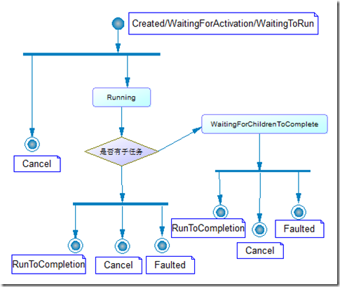
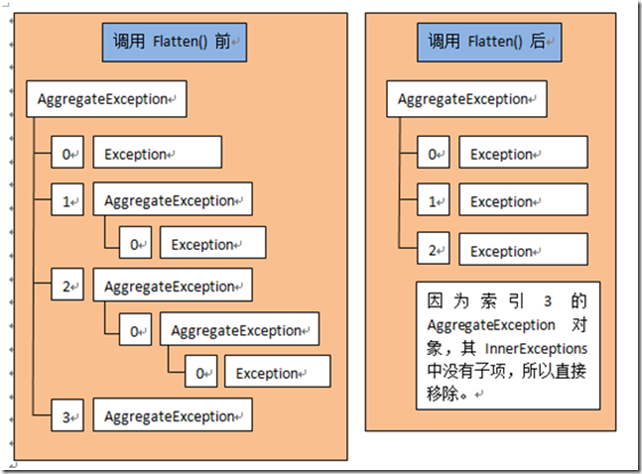

###                                                                                                                                                                                                                                                                                                                                                                 前言

可以使用ThreadPool的QueueUserWorkItem方法来发起一次简单的异步操作。然而，这个技术存在许多限制。最大的问题是没有一个内建的机制让你知道操作在什么时候完成，也没有一个机制在操作完成时获得一个返回值。为了克服这些限制（并解决其他一些问题），Microsoft引入了三种异步编程模式

1. APM    异步编程模型, 基于IAsyncResult接口实现，Asynchronous Programming Model  NET1.0
2.  EAP     基于事件的异步编程模式，Event-based Asynchronous Pattern NET2.0
3. TAP     基于任务的异步编程模式，Task-based Asynchronous Pattern NET4.X
4. TPL      任务并行库，Task Parallel Library

### APM

使用IAsyncResult设计模式的异步操作是通过Begin\*** 开启操作并返回IAsyncResult对象，使用 End\*** 方法来结束操作，通过回调方法来做异步操作后其它事项。

#### BeginInvoke 方法：

1. 方法带有该方法的同步版本签名中声明的任何参数。

2. 方法签名中不包含任何输出参数。方法签名最后两个参数的规范是：

   第一个参数定义一个AsyncCallback委托，此委托引用在**异步操作完成时**调用的方法。

   第二个参数是一个用户定义的对象。此对象可用来向异步操作完成时为AsyncCallback委托方法传递应用程序特定的状态信息（eg：可通过此对象在委托中访问End*** 方法)。

   另外，这两个参数都可以传递null。

3. 返回IAsyncResult对象。

   ```C#
   // 表示异步操作的状态。
   [ComVisible(true)]
   public interface IAsyncResult
   {
       // 获取用户定义的对象，它限定或包含关于异步操作的信息。
       object AsyncState { get; }
       // 获取用于等待异步操作完成的System.Threading.WaitHandle，待异步操作完成时获得信号。
       WaitHandle AsyncWaitHandle { get; }
       // 获取一个值，该值指示异步操作是否同步完成。
       bool CompletedSynchronously { get; }
       // 获取一个值，该值指示异步操作是否已完成。
       bool IsCompleted { get; }
   }
    
   // 常用委托声明（我后面示例是使用了自定义的带ref参数的委托）
   public delegate void AsyncCallback(IAsyncResult ar)
   ```

#### EndInvoke 方法：

1. 方法可结束异步操作，如果调用EndInvoke  时，IAsyncResult对象表示的异步操作还未完成，则 EndInvoke  将在异步操作完成之前阻塞调用线程。

2. EndInvoke 方法的返回值与其同步副本的返回值类型相同。EndInvoke 方法带有该方法同步版本的签名中声明的所有out 和 ref 参数以及由BeginInvoke返回的IAsyncResult，规范上 IAsyncResult 参数放最后。

   1. 要想获得返回结果，必须调用的方法;

   2. 若带有out 和 ref 参数，实现上委托也要带有out 和 ref 参数，以便在回调中获得对应引用传参值做相应逻辑;.

3. 总是调用EndInvoke () 方法，而且只调用一次

#### I/O限制

以下理由都是针对“I/O限制”的异步操作提出。

然而，对于计算限制的异步操作，尽管都是用户代码，但还是推荐遵守此规则。

I/O限制的异步操作：比如像带FileOptions.Asynchronous标识的FileStream，其BeginRead()方法向Windows发送一个I/O请求包（I/O Request Packet，IRP）后方法不会阻塞线程而是立即返回，由Windows将IRP传送给适当的设备驱动程序，IRP中包含了为BeginRead()方法传入的回调函数，待硬件设备处理好IRP后，会将IRP的委托排队到CLR的线程池队列中。

1. 必须调用End方法，否则会造成资源的泄露。有的开发人员写代码调用Begin方法异步执行I/O限制后就不需要进行任何处理了，所以他们不关心End方法的调用。但是，出于以下两个原因，End方法是必须调用的：

   a)     在异步操作时，对于I/O限制操作，CLR会分配一些内部资源，操作完成时，CLR继续保留这些资源直至End方法被调用。如果一直不调用End，这些资源会直到进程终止时才会被回收。（End方法设计中常常包含资源释放）

   b)     发起一个异步操作时，实际上并不知道该操作最终是成功还是失败（因为操作由硬件在执行）。要知道这一点，只能通过调用End***方法，检查它的返回值或者看它是否抛出异常。

2. 另外，需要注意的是I/O限制的异步操作完全不支持取消（因为操作由硬件执行），但可以设置一个标识，在完成时丢弃结果来模拟取消行为。

#### 应用

1. 基于IAsyncResult构造一个异步API，实现带ref引用参数的异步操作

   包含**三种阻塞式响应异步调用**和**一种无阻塞式委托响应异步调用**

2. 使用委托进行异步编程

   对于委托，编译器会为我们生成同步调用方法“invoke”以及异步调用方法“BeginInvoke”和“EndInvoke”

   异步委托是快速为方法构建异步调用的方式，它基于IAsyncResult设计模式实现的异步调用，即，通过BeginInvoke返回IAsyncResult对象；通过EndInvoke获取结果值

#### 问题

没有提供进度通知等功能及多线程间控件的访问。

### EAP

基于事件的异步编程模式(EAP，Event-based Asynchronous Pattern)。

#### 功能实现

通过事件、AsyncOperationManager类和AsyncOperation类两个帮助器类实现如下功能：

1) 异步执行耗时的任务。

2) 获得进度报告和增量结果。

3) 支持耗时任务的取消。

4) 获得任务的结果值或异常信息。

5) 更复杂：支持同时执行多个异步操作、进度报告、增量结果、取消操作、返回结果值或异常信息。

对于相对简单的多线程应用程序，BackgroundWorker组件提供了一个简单的解决方案。对于更复杂的异步应用程序，可以考虑实现一个符合基于事件的异步模式的类。

#### 优点

EAP是为Windows窗体开发人员创建的，其主要优点在于：

1. EAP与Microsoft Visual Studio UI设计器进行了很好的集成。也就是说，可将大多数实现了EAP的类拖放到一个Visual Studio设计器平面上，然后双击事件名，让Visual Studio自动生成事件回调方法，并将方法同事件关联起来。

2. EAP类在内部通过SynchronizationContext类，将应用程序模型映射到合适线程处理模型，以方便跨线程操作控件。

#### AsyncOperationManager和AsyncOperation

AsyncOperationManager类和AsyncOperation类是System.ComponentModel命名空间为我们提供了两个重要帮助器类。在基于事件的异步模式封装标准化的异步功能中，它确保你的异步操作支持在各种应用程序模型（包括 ASP.NET、控制台应用程序和 Windows 窗体应用程序）的适当“线程或上下文”调用客户端事件处理程序。

```C#
// 为支持异步方法调用的类提供并发管理。此类不能被继承。
public static class AsyncOperationManager
{
    // 获取或设置用于异步操作的同步上下文。
    public static SynchronizationContext SynchronizationContext { get; set; }
 
    // 返回可用于对特定异步操作的持续时间进行跟踪的AsyncOperation对象。
    // 参数:userSuppliedState:
    //     一个对象，用于使一个客户端状态（如任务 ID）与一个特定异步操作相关联。
    public static AsyncOperation CreateOperation(object userSuppliedState)
    {
        return AsyncOperation.CreateOperation(userSuppliedState,SynchronizationContext);
    }
}
 
// 跟踪异步操作的生存期。
public sealed class AsyncOperation
{
    // 构造函数
    private AsyncOperation(object userSuppliedState, SynchronizationContext syncContext);
    internal static AsyncOperation CreateOperation(object userSuppliedState
                                            , SynchronizationContext syncContext);
 
    // 获取传递给构造函数的SynchronizationContext对象。
    public SynchronizationContext SynchronizationContext { get; }
    // 获取或设置用于唯一标识异步操作的对象。
    public object UserSuppliedState { get; }
 
    // 在各种应用程序模型适合的线程或上下文中调用委托。
    public void Post(SendOrPostCallback d, object arg);
    // 结束异步操作的生存期。
    public void OperationCompleted();
    // 效果同调用 Post() + OperationCompleted() 方法组合
    public void PostOperationCompleted(SendOrPostCallback d, object arg);
}

// 提供在各种同步模型中传播同步上下文的基本功能。
public class SynchronizationContext
{
    // 获取当前线程的同步上下文。
    public static SynchronizationContext Current { get; }
 
    // 当在派生类中重写时，响应操作已开始的通知。
    public virtual void OperationStarted();
    // 当在派生类中重写时，将异步消息调度到一个同步上下文。
    public virtual void Post(SendOrPostCallback d, object state);
    // 当在派生类中重写时，响应操作已完成的通知。
    public virtual void OperationCompleted();
    ……
}
```

分析:

1. AsyncOperationManager是静态类。静态类是密封的，因此不可被继承。倘若从静态类继承会报错“静态类必须从 Object 派生”。（小常识，**以前以为密封类就是 sealed 关键字**）

2. AsyncOperationManager为支持异步方法调用的类提供并发管理，该类可正常运行于 .NET Framework 支持的所有应用程序模式下。

3. AsyncOperation实例提供对特定异步任务的生存期进行跟踪。可用来处理任务完成通知，还可用于在不终止异步操作的情况下发布进度报告和增量结果（这种不终止异步操作的处理是通过AsyncOperation的 Post() 方法实现）。

4. AsyncOperation类有一个私有的构造函数和一个内部CreateOperation() 静态方法。由AsyncOperationManager类调用AsyncOperation.CreateOperation() 静态方法来创建AsyncOperation实例。

5. AsyncOperation类是通过SynchronizationContext类来实现在各种应用程序的适当“线程或上下文”调用客户端事件处理程序。

   a)  在AsyncOperation构造函数中调用SynchronizationContext的OperationStarted() ；

   b)  在AsyncOperation的 Post() 方法中调用SynchronizationContext的Post() ；

   c)  在AsyncOperation的OperationCompleted()方法中调用SynchronizationContext的OperationCompleted()；

6. SendOrPostCallback委托签名：表示在消息即将被调度到同步上下文时要调用的方法。

   public delegate void SendOrPostCallback(object state);

#### 特征

##### 实现形式

基于事件的异步模式可以采用多种形式，具体取决于某个特定类支持操作的复杂程度：

1) 最简单的类可能只有一个 ***Async**方法**和一个对应的 ***Completed **事件**，以及这些方法的同步版本。

2) 复杂的类可能有若干个 ***Async方法，每种方法都有一个对应的 ***Completed 事件，以及这些方法的同步版本。

3) 更复杂的类还可能为每个异步方法支持取消（CancelAsync()方法）、进度报告和增量结果（ReportProgress() 方法+ProgressChanged事件）。

4) 如果您的类支持多个异步方法，每个异步方法返回不同类型的数据，您应该：

   a)  将您的增量结果报告与您的进度报告分开。

   b)  使用适当的EventArgs为每个异步方法定义一个单独的 ***ProgressChanged事件以处理该方法的增量结果数据。

5) 如果类不支持多个并发调用，请考虑公开IsBusy属性。

6) 如要异步操作的同步版本中有 Out 和 Ref 参数，它们应做为对应 ***CompletedEventArgs的一部分，eg：

   ```C#
   public int MethodName(string arg1, ref string arg2, out string arg3);
    
   public void MethodNameAsync(string arg1, string arg2);
   public class MethodNameCompletedEventArgs : AsyncCompletedEventArgs
   {
       public int Result { get; };
       public string Arg2 { get; };
       public string Arg3 { get; };
   }
   ```

##### 支持并行

如果你的组件要支持多个异步耗时的任务并行执行。那么：

1) 为***Async方法多添加一个userState对象参数（此参数应当始终是***Async方法签名中的最后一个参数），用于跟踪各个操作的生存期。

2) 注意要在你构建的异步类中维护一个userState对象的集合。使用 lock 区域保护此集合，因为各种调用都会在此集合中添加和移除userState对象。

3) 在***Async方法开始时调用AsyncOperationManager.CreateOperation并传入userState对象，为每个异步任务创建AsyncOperation对象，userState存储在AsyncOperation的UserSuppliedState属性中。在构建的异步类中使用该属性标识取消的操作，并传递给CompletedEventArgs和ProgressChangedEventArgs参数的UserState属性来标识当前引发进度或完成事件的特定异步任务。

4) 当对应于此userState对象的任务引发完成事件时，你构建的异步类应将AsyncCompletedEventArgs.UserState对象从集合中删除。

##### 异常处理

EAP的错误处理和系统的其余部分不一致。首先，异常不会抛出。在你的事件处理方法中，必须查询AsyncCompletedEventArgs的Exception属性，看它是不是null。如果不是null，就必须使用if语句判断Exception派生对象的类型，而不是使用catch块。

另外，如果你的代码忽略错误，那么不会发生未处理的异常，错误会变得未被检测到，应用程序将继续运行，其结果不可预知。

##### 注意

1) 确保 ***EventArgs类特定于***方法。即当使用 ***EventArgs类时，切勿要求开发人员强制转换类型值。

2) 确保始终引发方法名称Completed 事件。成功完成、异常或者取消时应引发此事件。任何情况下，应用程序都不应遇到这样的情况：应用程序保持空闲状态，而操作却一直不能完成。

3) 确保可以捕获异步操作中发生的任何异常并将捕获的异常指派给 Error 属性。

4) 确保 ***CompletedEventArgs 类将其成员公开为只读属性而不是字段，因为字段会阻止数据绑定。eg:public MyReturnType Result { get; }

5) 在构建 ***CompletedEventArgs 类属性时，通过this.RaiseExceptionIfNecessary() 方法确保属性值被正确使用。Eg：

   ```C#
   private bool isPrimeValue;
   public bool IsPrime
   {
       get
       {
           RaiseExceptionIfNecessary();
           return isPrimeValue;
       }
   }
   ```

   所以，在***Completed事件处理程序中，应当总是先检查 ***CompletedEventArgs.Error 和 ***CompletedEventArgs.Cancelled 属性，然后再访问RunWorkerCompletedEventArgs.Result属性。

#### BackgroundWorker

System.ComponentModel命名空间的BackgroundWorker组件为我们提供了一个简单的多线程应用解决方案，它允许你在单独的线程上运行耗时操作而不会导致用户界面的阻塞。但是，要注意它同一时刻只能运行一个异步耗时操作（使用IsBusy属性判定），并且不能跨AppDomain边界进行封送处理（不能在多个AppDomain中执行多线程操作）。

```C#
public class BackgroundWorker : Component
{
    public BackgroundWorker();
 
    // 获取一个值，指示应用程序是否已请求取消后台操作。
    public bool CancellationPending { get; }
    // 获取一个值，指示BackgroundWorker是否正在运行异步操作。
    public bool IsBusy { get; }
    // 获取或设置一个值，该值指示BackgroundWorker能否报告进度更新。
    public bool WorkerReportsProgress { get; set; }
    // 获取或设置一个值，该值指示BackgroundWorker是否支持异步取消。
    public bool WorkerSupportsCancellation { get; set; }
 
    // 调用RunWorkerAsync() 时发生。
    public event DoWorkEventHandlerDoWork;
    // 调用ReportProgress(System.Int32) 时发生。
    public event ProgressChangedEventHandlerProgressChanged;
    // 当后台操作已完成、被取消或引发异常时发生。
    public event RunWorkerCompletedEventHandlerRunWorkerCompleted;
 
    // 请求取消挂起的后台操作。
    public void CancelAsync();
    // 引发ProgressChanged事件。percentProgress:范围从 0% 到 100%
    public void ReportProgress(int percentProgress);
    // userState:传递到RunWorkerAsync(System.Object) 的状态对象。
    public void ReportProgress(int percentProgress, object userState);
    // 开始执行后台操作。
    public void RunWorkerAsync();
    // 开始执行后台操作。argument:传递给DoWork事件的DoWorkEventArgs参数。
    public void RunWorkerAsync(object argument);
}

///1)   System.EventArgs基类
    // System.EventArgs是包含事件数据的类的基类。
    public class EventArgs
    {
        // 表示没有事件数据的事件。
        public static readonly EventArgs Empty;
        public EventArgs(); 
    }
 
///2)   DoWorkEventArgs类
    // 为可取消的事件提供数据。
    public class CancelEventArgs : EventArgs
    {
        public CancelEventArgs();
        public CancelEventArgs(bool cancel);
        // 获取或设置指示是否应取消事件的值。
        public bool Cancel { get; set; }
    }
    // 为DoWork事件处理程序提供数据。
    public class DoWorkEventArgs : CancelEventArgs
    {
        public DoWorkEventArgs(object argument);
 
        // 获取表示异步操作参数的值。
        public object Argument { get; }
        // 获取或设置表示异步操作结果的值。
        public object Result { get; set; }
    }
 
///3)   ProgressChangedEventArgs类
    // 为ProgressChanged事件提供数据。
    public class ProgressChangedEventArgs : EventArgs
    {
        public ProgressChangedEventArgs(int progressPercentage, object userState);
 
        // 获取异步任务的进度百分比。
        public int ProgressPercentage { get; }
        // 获取唯一的用户状态。
        public object UserState { get; }
    }
 
///4)   RunWorkerCompletedEventArgs类
    // 为MethodNameCompleted事件提供数据。
    public class AsyncCompletedEventArgs : EventArgs
    {
        public AsyncCompletedEventArgs();
        public AsyncCompletedEventArgs(Exception error, bool cancelled, object userState);
 
        // 获取一个值，该值指示异步操作是否已被取消。
        public bool Cancelled { get; }
        // 获取一个值，该值指示异步操作期间发生的错误。
        public Exception Error { get; }
        // 获取异步任务的唯一标识符。
        public object UserState { get; }
 
        // 访问 AsyncCompletedEventArgs 及其派生类的属性前调用此方法
        protected void RaiseExceptionIfNecessary()
        {
            if (this.Error != null)
            {
                throw new TargetInvocationException(……);
            }
            if (this.Cancelled)
            {
                throw new InvalidOperationException(……);
            }
        }
    }
    public class RunWorkerCompletedEventArgs : AsyncCompletedEventArgs
    {
        public RunWorkerCompletedEventArgs(object result, Exception error, bool cancelled);
 
        // 获取表示异步操作结果的值。
        public object Result { get; }
        // 获取表示用户状态的值。
        public object UserState { get; }
    }
```

##### 示例分析

1) 首先我们为BackgroundWorker组件注册DoWork(异步操作)、ProgressChanged(进度报告) 和RunWorkCompleted(完成通知)事件；

2) 设置WorkerSupportsCancellation和WorkerReportsProgress属性为true，以声明组件支持取消操作和进度报告；

3) 使用RunWorkerAsync() 开启异步操作，通过IsBusy属性判断是否已经有异步任务在执行；

4) 使用CancelAsync() 方法取消异步操作，但要注意：

   a)  它仅仅是将BackgroudWorker.CancellationPending属性设置为true。需要在具体DoWork事件中不断检查BackgroudWorker.CancellationPending来设置DoWorkEventArgs的Cancel属性。

   b)  DoWork事件处理程序中的代码有可能在发出取消请求时完成其工作，轮询循环可能会错过设置为 true 的CancellationPending属性。在这种情况下，即使发出了取消请求，RunWorkerCompleted事件处理程序中RunWorkerCompletedEventArgs的 Cancelled 标志也不会设置为 true。这种情况被称作争用状态。（可以通过直接监控组件的CancellationPending属性，来做判断）

5) 确保在DoWork事件处理程序中不操作任何用户界面对象。而应该通过ProgressChanged和RunWorkerCompleted事件与用户界面进行通信。

   因为RunWorkerAsync() 是通过委托的BeginInvoke() 引发的DoWork事件，即DoWork事件的执行线程已不是创建控件的线程。而ProgressChanged和RunWorkerCompleted事件是通过帮助器类AsyncOperation的 Post() 方法使其调用发生在合适的“线程或上下文”中。

#### 自定义异步组件

BackgroundWorker组件在一个时刻只能开启一个异步操作，如果我们要想同时支持多个异步操作、进度报告、增量结果、取消和返回结果值或异常信息, 可以为自己定义一个基于事件的异步组件。

质数算法：埃拉托色尼筛法.  eg：判断n是否为质数

1、1和0既非素数也非合数；

2、将2和3加入质数集合primes；从n=5开始，通过 n+=2 来跳过所有偶数；

3、循环集合primes中的质数并将其做为n的因子，能整除的为合数；

4、若不能整除，则继续循步骤3直到“因子的平方>n”，即可判断n为质数，并将其加入到集合primes。

示例分析：（组件名：PrimeNumberCalculator）

1. 首先我们为PrimeNumberCalculator组件注册ProgressChanged(进度报告) 和CalculatePrimeCompleted(完成通知)事件；

2. 使用CalculatePrimeAsync(intnumberToTest, object taskId)开启异步任务，注意我们需要传递一个唯一标识Guid taskId = Guid.NewGuid();用于标识取消的操作，并传递给CompletedEventArgs和ProgressChangedEventArgs参数的UserState属性来标识当前引发进度或完成事件的特定异步任务；

3. 取消操作CancelAsync(object taskId)，只是将taskId对应的AsyncOperation实例移除内部任务集合，耗时操作通过判断taskId是否存在于集合来判断其是否被取消；

### TPA

#### 优势

1. 目前版本(.NET4.X)的任务调度器(TaskScheduler)依赖于底层的线程池引擎。通过局部队列的任务内联化(task inlining)和工作窃取机制可以为我们提升程序性能。

2. 轻松实现任务等待、任务取消、延续任务、异常处理（System.AggregateException）、GUI线程操作。

3. 在任务启动后，可以随时以任务延续的形式注册回调。

4. 充分利用现有的线程，避免创建不必要的额外线程。

5. 结合C#5.0引入async和await关键字轻松实现“异步方法”。

#### CLR线程池引擎

CLR线程池引擎维护了一定数量的空闲工作线程以支持工作项的执行，并且能够重用已有的线程以避免创建新的不必要的线程所花费的昂贵的处理过程.

使用爬山算法（hill-climbing algorithm）检测吞吐量，判断是否能够通过更多的线程来完成更多的工作项。这个算法的判断依据是工作项所需某些类型资源的可用情况，例如：CPU、网络带宽或其他。此外这个算法还会考虑一个饱和点，即达到饱和点的时候，创建更多地线程反而会降低吞吐量。

目前版本的TAP的任务调度器（TaskScheduler）基于CLR线程池引擎实现。当**任务调度器（TaskScheduler）**开始**分派任务**时：

1) 在主线程或其他并没有分配给某个特定任务的线程的上下文中创建并启动的任务，这些任务将会在**全局队列**中竞争工作线程。这些任务被称为**顶层任务**。

2) 然而，如果是在其他任务的上下文中创建的任务（**子任务或嵌套任务**），这些任务将被分配在线程的**局部队列**中。

   嵌套任务：是在另一个任务的用户委托中创建并启动的任务。

   子任务：是使用TaskCreationOptions.AttachedToParent选项创建顶层任务的嵌套任务或延续任务；或使用TaskContinuationOptions.AttachedToParent选项创建的延续任务的嵌套任务或延续任务。（应用程序使用TaskCreationOptions.DenyChildAttach选项创建父任务。此选项指示运行时会取消子任务的AttachedToParent规范）

   如果你不想特定的任务放入线程的局部队列，那么可以指定TaskCreationOptions.PreferFairness或TaskContinuationOptions.PreferFairness枚举参数。（使Task与ThreadPool.QueueUserWorkItem行为相同）

#### 线程池的全局队列

​    当调用ThreadPool.QueueUserWorkItem()添加工作项时，该工作项会被添加到线程池的全局队列中。线程池中的空闲线程以FIFO的顺序将工作项从全局队列中取出并执行，但并不能保证按某个指定的顺序完成。

​    线程的全局队列是共享资源，所以内部会实现一个锁机制。**当一个任务内部会创建很多子任务时**，并且这些子任务完成得非常快，就会造成频繁的进入全局队列和移出全局队列，从而降低应用程序的性能。基于此原因，线程池引擎为每个线程引入了局部队列。

#### 线程的局部队列

带来两个性能优势:

1. 任务内联化(task inlining)----活用顶层任务工作线程

2. 工作窃取机制----活用空闲工作线程. 

   当一个工作线程的局部队列中有很多工作项正在等待时，而存在一些线程却保持空闲，这样会导致CPU资源的浪费。此时任务调度器（TaskScheduler）会让空闲的工作线程进入忙碌线程的局部队列中窃取一个等待的任务，并且执行这个任务。

由于局部队列为我们带来了性能提升，所以，我们应尽可能地使用TPL提供的服务（任务调度器（TaskScheduler）），而不是直接使用ThreadPool的方法。

任务内联化示例:

```C#
static void Main(string[] args)
{
    Task headTask= new Task(() =>
    {
        DoSomeWork(null);
    });
    headTask.Start();
    Console.Read();
}
private static void DoSomeWork(object obj)
{
    Console.WriteLine("任务headTask运行在线程“{0}”上",
        Thread.CurrentThread.ManagedThreadId);
 
    var taskTop = new Task(() =>;
    {
        Thread.Sleep(500);
        Console.WriteLine("任务taskTop运行在线程“{0}”上",
            Thread.CurrentThread.ManagedThreadId);
    });
    var taskCenter = new Task(() =>;
    {
        Thread.Sleep(500);
        Console.WriteLine("任务taskCenter运行在线程“{0}”上",
            Thread.CurrentThread.ManagedThreadId);
    });
    var taskBottom = new Task(() =>;
    {
        Thread.Sleep(500);
        Console.WriteLine("任务taskBottom运行在线程“{0}”上",
            Thread.CurrentThread.ManagedThreadId);
    });
    taskTop.Start();
    taskCenter.Start();
    taskBottom.Start();
    Task.WaitAll(new Task[] { taskTop, taskCenter, taskBottom });
}
```

分析：（目前内联机制只有出现在**等待任务场景**）

1. Main方法主线程中创建了一个headTask顶层任务并开启。在headTask任务中又创建了三个嵌套任务并最后WaitAll() 这三个嵌套任务执行完成(嵌套任务安排在局部队列)。此时出现的情况就是headTask任务的线程被阻塞，而“**任务内联化**”技术会使用阻塞的headTask的线程去执行局部队列中的任务。因为减少了对额外线程需求，从而提升了程序性能。

2. 局部队列“**通常**”以**LIFO**的顺序抽取任务并执行，而不是像全局队列那样使用**FIFO**顺序。LIFO顺序通常用有利于数据局部性，能够在牺牲一些公平性的情况下提升性能。

   数据局部性的意思是：运行最后一个到达的任务所需的数据都还在任何一个级别的CPU高速缓存中可用。由于数据在高速缓存中仍然是“热的”，因此立即执行最后一个任务可能会获得性能提升。

#### 任务并行Task

一个任务表示一个异步操作。任务运行的时候需要使用线程，但并不是说任务取代了线程.

任务和线程之间也没有一对一的限制关系，通用语言运行时（CLR）会创建必要的线程来支持任务执行的需求

Task的实例成员, 实例方法, 静态方法:

```C#
public class Task : IThreadPoolWorkItem, IAsyncResult, IDisposable
{
    public Task(Action<object> action, object state
          , CancellationToken cancellationToken,TaskCreationOptions creationOptions);
 
    // 获取此 Task 实例的唯一 ID。
    public int Id { get; }
    // 获取用于创建此任务的TaskCreationOptions。
    public TaskCreationOptions CreationOptions { get; }
    // 获取此任务的TaskStatus。
    public TaskStatus Status { get; }
    // 获取此 Task 实例是否由于被取消的原因而已完成执行。
    public bool IsCanceled { get; }
    // 获取 Task 是否由于未经处理异常的原因而完成。
    public bool IsFaulted { get; }
    // 获取导致 Task 提前结束的System.AggregateException。
    public AggregateException Exception { get; }
 
    #region IAsyncResult接口成员
    private bool IAsyncResult.CompletedSynchronously { get;}
    private WaitHandleIAsyncResult.AsyncWaitHandle { get; }
 
    // 获取在创建 Task 时提供的状态对象，如果未提供，则为 null。
    public object AsyncState { get; }
    // 获取此 Task 是否已完成。 在任务处于以下三个最终状态之一时IsCompleted返回 true: RanToCompletion、 Faulted 或 Canceled
    public bool IsCompleted { get; }
    #endregion
 
    // 释放由 Task 类的当前实例占用的所有资源。
    public void Dispose();

    // 获取用于等待此 Task 的等待者。
    public TaskAwaiter GetAwaiter();
    // 配置用于等待此System.Threading.Tasks.Task的awaiter。
    // 参数:continueOnCapturedContext:
    //     试图在await返回时夺取原始上下文，则为 true；否则为 false。
    public ConfiguredTaskAwaitable ConfigureAwait(bool continueOnCapturedContext);

    // 对提供的TaskScheduler或TaskScheduler.Current中同步运行 Task。
    // 即RunSynchronously()之后的代码会阻塞到Task委托执行完毕。
    public void RunSynchronously(TaskScheduler scheduler);
    // 启动 Task，并将它安排到指定的TaskScheduler中执行。
    public void Start(TaskScheduler scheduler);
    // 等待 Task 完成执行过程。
    public bool Wait(int millisecondsTimeout, CancellationToken cancellationToken);

    // 创建一个在目标 Task 完成时执行的延续任务。
    public Task ContinueWith(Action<Task, object> continuationAction, object state
            , CancellationToken cancellationToken
            , TaskContinuationOptions continuationOptions, TaskScheduler scheduler);
    public Task<TResult>ContinueWith<TResult>(
            Func<Task, object, TResult> continuationFunction
            , object state,CancellationToken cancellationToken
            , TaskContinuationOptions continuationOptions, TaskScheduler scheduler);
  
    // 返回当前正在执行的 Task 的唯一 ID。
    public static int? CurrentId{ get; }
    // 提供对用于创建 Task 和 Task<TResult>实例的工厂方法的访问。
    public static TaskFactory Factory { get; }
    // 创建指定结果的、成功完成的Task<TResult>。创建包含预先计算结果/缓存结果的Task<TResult>对象
    public static Task<TResult> FromResult<TResult>(TResult result);

    // 创建将在指定延迟后完成的任务，返回Task。
    // 可以通过await或Task.Wait()来达到Thread.Sleep()的效果。尽管，Task.Delay() 比Thread.Sleep()消耗更多的资源，但是Task.Delay()可用于为方法返回Task类型；或者根据CancellationToken取消标记动态取消等待。
    // Task.Delay()等待完成返回的Task状态为RanToCompletion；若被取消，返回的Task状态为Canceled。
    public static Task Delay(int millisecondsDelay, CancellationToken cancellationToken);

    // 将在线程池上运行的指定工作排队，并返回该工作的任务句柄。
    public static Task Run(Action action, CancellationToken cancellationToken);
    // 将在线程池上运行的指定工作排队，并返回该工作的 Task(TResult) 句柄。
    public static Task<TResult>  Run<TResult>(Func<TResult> function, CancellationToken  cancellationToken);
    // 将在线程池上运行的指定工作排队，并返回 function 返回的任务的代理项。
    public static Task Run(Func<Task> function, CancellationToken cancellationToken);
    // 将在线程池上运行的指定工作排队，并返回 function 返回的 Task(TResult) 的代理项。
    public static Task<TResult> Run<TResult>(Func<Task<TResult>> function, CancellationToken cancellationToken);

    // 等待提供的所有 Task 对象完成执行过程。
    public static bool WaitAll(Task[] tasks, intmillisecondsTimeout, CancellationToken cancellationToken);
    // 等待提供的任何一个 Task 对象完成执行过程。
    // 返回结果:
    //     已完成的任务在 tasks 数组参数中的索引，如果发生超时，则为 -1。
    public static int WaitAny(Task[] tasks, int millisecondsTimeout, CancellationToken cancellationToken);

    // 所有提供的任务已完成时，创建将完成的任务。
    public static Task WhenAll(IEnumerable<Task> tasks);
    public static Task<TResult[]> WhenAll<TResult>(IEnumerable<Task<TResult>> tasks);
    // 任何一个提供的任务已完成时，创建将完成的任务。
    public static Task<Task> WhenAny(IEnumerable<Task> tasks);
    public static Task<Task<TResult>> WhenAny<TResult>(IEnumerable<Task<TResult>> tasks);

    // 创建awaitable，等待时，它异步产生当前上下文。
    // 返回结果:等待时，上下文将异步转换回等待时的当前上下文。
    // 如果当前SynchronizationContext不为 null，则将其视为当前上下文。
    // 否则，与当前执行任务关联的任务计划程序将视为当前上下文。
    public static YieldAwaitable Yield();
}
```

##### CancellationToken、IsCancel

.NET 4.0提供了一个标准的取消操作模式. 

1. 通过使用CancellationTokenSource创建一个或多个取消标记CancellationToken（cancellationToken可在线程池中线程或 Task 对象之间实现协作取消），
2. 然后将此取消标记传递给应接收取消通知的任意数量的线程或Task对象。
3. 当调用CancellationToken关联的CancellationTokenSource对象的Cancle()时，每个取消标记(CancellationToken)上的IsCancellationRequested属性将返回true。
4. 异步操作中可以通过检查此属性做出任何适当响应。也可调用取消标记的ThrowIfCancellationRequested()方法来抛出OperationCanceledException异常。

更多关于CancellationToken与CancellationTokenSource的介绍及示例请看[《协作式取消》](http://www.cnblogs.com/heyuquan/archive/2013/01/10/2854311.html#quxiao)

在Task任务中实现取消，可以使用以下几种选项之一终止操作：

1. 简单地从委托中返回。在许多情况下，这样已足够；但是，采用这种方式“取消”的任务实例会转换为RanToCompletion状态，而不是 Canceled 状态。

2. 创建Task时传入CancellationToken标识参数，并调用关联CancellationTokenSource对象的Cancel()方法：

   a)    如果Task还未开始，那么Task实例直接转为Canceled状态。（注意，因为已经Canceled状态了，所以不能再在后面调用Start()）

   b)    如果Task已经开始，在Task内部必须抛出OperationCanceledException异常（注意，只能存在OperationCanceledException异常，可优先考虑使用CancellationToken的ThrowIfCancellationRequested()方法），Task实例转为Canceled状态。

   ​       若对抛出OperationCanceledException异常且状态为Canceled的Task进行等待操作（如：Wait/WaitAll），则会在Catch块中捕获到OperationCanceledException异常，但是此异常指示Task成功取消，而不是有错误的情况。因此IsCancel为true；IsFaulted为false且Exception属性为null。

3. 对于使用TaskContinuationOptions枚举值为NotOn或OnlyOn创建的延续任务A，在其前面的任务结束状态不匹配时，延续任务A将转换为Canceled状态，并且不会运行。

##### TaskCreationOptions

定义任务创建、调度和执行的一些可选行为。

| 值               | 描述                                                         |
| ---------------- | ------------------------------------------------------------ |
| None             | 指定应使用默认行为。                                         |
| PreferFairness   | 较早安排的任务将更可能较早运行，而较晚安排运行的任务将更可能较晚运行。(Prefer：更喜欢 ; Fair：公平的) |
| LongRunning      | 该任务需要很长时间运行，因此，调度器可以对这个任务使用粗粒度的操作（**默认TaskScheduler为任务创建一个专用线程，而不是排队让一个线程池线程来处理**，可通过在延续任务中访问：Thread.CurrentThread.IsThreadPoolThread属性判别）。比如：如果任务可能需要好几秒的时间运行，那么就使用这个参数。相反，如果任务只需要不到1秒钟的时间运行，那么就不应该使用这个参数。 |
| AttachedToParent | 指定此枚举值的Task，其内部创建的Task或通过ContinueWith()创建的延续任务都为子任务。（父级是顶层任务） |
| DenyChildAttach  | 如果尝试附加子任务到创建的任务，指定System.InvalidOperationException将被引发。 |
| HideScheduler    | 创建任务的执行操作将被视为TaskScheduler.Default默认计划程序。 |

##### TaskStatus枚举

表示 Task 的生命周期中的当前阶段。一个Task实例只会完成其生命周期一次，即当Task到达它的三种可能的最终状态之一时，Task就结束并释放。

| 可能的初始状态 | Created                      | 该任务已初始化，但尚未被计划。                               |
| -------------- | ---------------------------- | ------------------------------------------------------------ |
|                | WaitingForActivation         | 只有在其它依赖的任务完成之后才会得到调度的任务的初始状态。这种任务是使用定义延续的方法创建的。 |
|                | WaitingToRun                 | 该任务已被计划执行，但尚未开始执行。                         |
| 中间状态       | Running                      | 该任务正在运行，但尚未完成。                                 |
|                | WaitingForChildrenToComplete | 该任务已完成执行，正在隐式等待附加的子任务完成。             |
| 可能的最终状态 | RanToCompletion              | 已成功完成执行的任务。                                       |
|                | Canceled                     | 该任务已通过对其自身的CancellationToken引发OperationCanceledException异常 |
|                | Faulted                      | 由于未处理异常的原因而完成的任务。                           |



##### Dispose()

尽管Task为我们实现了IDisposable接口，但依然不推荐你主动调用Dispose()方法，而是由系统终结器进行清理。原因：

a)    Task调用Dispose()主要释放的资源是WaitHandle对象。

b)    .NET4.5 对.NET4.0 中提出的Task进行过大量的优化，让其尽量不再依赖WaitHandle对象（eg：.NET4.0种Task的WaitAll()/WaitAny()的实现依赖于WaitHandle）。

c)    在使用Task时，大多数情况下找不到一个好的释放点，保证该Task已经完成并且没有被其他地方在使用。

d)    Task.Dispose()方法在“.NET Metro风格应用程序”框架所引用的程序集中甚至并不存在（即此框架中Task没有实现IDisposable接口）。

更详细更专业的Dispose()讨论请看[《.NET4.X并行任务Task需要释放吗？》](http://www.cnblogs.com/heyuquan/archive/2013/02/28/2937701.html)

##### TaskContinuationOptions

在创建一个Task作为另一个Task的延续时,这个参数可以控制延续另一个任务的任务调度和执行的可选行为.

| None                                                         | 默认情况下，完成前面的任务之后“都”将安排运行延续任务，而不考虑前面任务的最终TaskStatus。 |                          |
| ------------------------------------------------------------ | ------------------------------------------------------------ | ------------------------ |
| AttachedToParent                                             | 对延续任务指定此枚举值，表示该延续任务内部创建的新Task或通过ContinueWith()创建的延续任务都为子任务。（父级是延续任务） |                          |
| PreferFairness<br />LongRunning<br />DenyChildAttach      HideScheduler | 参考：[TaskCreationOptions](https://www.cnblogs.com/heyuquan/archive/2013/04/18/Task-based-Asynchronous-Pattern.html#TaskCreationOptions)[枚举](https://www.cnblogs.com/heyuquan/archive/2013/04/18/Task-based-Asynchronous-Pattern.html#TaskCreationOptions) |                          |
| LazyCancellation                                             | 在延续取消的情况下，防止延续的完成直到完成先前的任务。       |                          |
| NotOnRanToCompletion<br />NotOnFaulted<br />NotOnCanceled    | 指定不应在延续任务**前面的任务**“已完成运行、引发了未处理异常、已取消”的情况下安排延续任务。 | 此选项对多任务延续无效。 |
| OnlyOnCanceled<br />OnlyOnFaulted<br />OnlyOnRanToCompletion | 指定只应在延续任务**前面的任务“**已取消、引发了未处理异常、已完成运行”的情况下才安排延续任务。 |                          |
| ExecuteSynchronously                                         | 指定应同步执行延续任务。指定此选项后，延续任务将在导致前面的任务转换为其最终状态的相同线程上运行。 |                          |

- a)    如果使用默认选项TaskContinuationOptions.None，并且之前的任务被取消了，那么延续任务任然会被调度并启动执行。

- b)    如果该条件在前面的任务准备调用延续时未得到满足，则延续将直接转换为 Canceled 状态，之后将无法启动。

- c)    如果调用多任务延续（即：调用TaskFactory或TaskFactory<TResult>的静态ContinueWhenAll和ContinueWhenAny方法）时，NotOn和OnlyOn六个标识或标识的组合都是无效的。也就是说，无论先驱任务是如何完成的，ContinueWhenAll和ContinueWhenAny都会执行延续任务。

- d)    TaskContinuationOptions.ExecuteSynchronously，指定同步执行延续任务。延续任务会使用前一个任务的数据，而保持在相同线程上执行就能快速访问高速缓存中的数据，从而**提升性能**。此外，也可避免调度这个延续任务产生不必要的额外线程开销。

  如果在创建延续任务时已经完成前面的任务，则延续任务将在创建此延续任务的线程上运行。只应同步执行运行时间非常短的延续任务。

##### Start

**只有**Task处于TaskStatus.Created状态时才能使用实例方法Start()。并且，**只有**在使用Task的公共构造函数构造的Task实例才能处于TaskStatus.Created状态。

还有其他方式可以创建Task并开启任务，比如Task.Run() /Task.ContinueWith() /Task.Factory.StartNew() /TaskCompletionSource /异步方法(即使用async与await关键字的方法)，但是这些方法返回的Task已经处于开启状态，即不能再调用Start().

更丰富更专业的讨论请看[《.NET4.X 并行任务中Task.Start()的FAQ》](http://www.cnblogs.com/heyuquan/archive/2013/02/01/2888312.html)

##### ContinueWith

1. 可创建一个根据TaskContinuationOptions参数限制的延续任务。可以为同一个Task定义多个延续任务让它们并行执行。
2. 调用Wait()方法和Result属性会导致线程阻塞，极有可能造成线程池创建一个新线程，这增大了资源的消耗，并损害了伸缩性。可以在延续任务中访问这些成员，并做相应操作。
3. 对前面任务的引用将以参数形式传递给延续任务的用户委托，以将前面任务的数据传递到延续任务中。

##### Wait

一个线程调用Wait()方法时，系统会检查线程要等待的Task是否已开始执行。

1. 如果是，调用Wait()的线程会阻塞，直到Task运行结束为止。

2. 如果Task还没有开始执行，系统可能（取决于局部队列的内联机制）使用调用Wait()的线程来执行Task。如果发生这种情况，那么调用Wait()的线程不会阻塞；它会执行Task并立刻返回.

   这样做的好处在于，没有线程会被阻塞，所以减少了资源的使用（因为不需要创建一个线程来替代被阻塞的线程），并提升了性能（因为不需要花时间创建一个线程，也没有上下文切换）。

   但不好的地方在于，假如线程在调用Wait()前已经获得一个不可重入的线程同步锁(eg：SpinLock)，而Task试图获取同一个锁，就会造成一个死锁的线程！

##### TaskFactory

通过TaskFactory对象提供的Scheduler、CancellationToken、CreationOption和ContinuationOptions属性可以为Task设置共用\默认的参数，以便快捷的创建Task或延续任务。影响方法的默认参数设置。

1. StartNew(): new Task().Start()采用同步方式运行以确保任务对象保持一致的状态即使是同时调用多次Start()，也可能只有一个调用会成功。相比之下，StartNew()返回之前它不会将创建的Task引用给任何人，所以StartNew()不需要采用同步方式执行, 更高效.
2. ContinueWhenAll(): 创建一个延续 Task 或延续 Task<TResult>，它将在提供的一组任务完成后马上开始。延续任务操作委托接受一个Task[]数组做参数。
3. ContinueWhenAny(): 创建一个延续 Task 或延续 Task<TResult>，它将在提供的组中的任何一个任务完成后马上开始。延续任务操作委托接受一个 Task 做参数。
4. FromAsync(): 我们可以将APM转化为TAP。

##### TaskScheduler

表示一个处理将任务排队到线程中的底层工作对象。应用:

1. TaskScheduler是抽象类，可以继承它实现自己的任务调度计划。如：默认调度程序ThreadPoolTaskScheduler、与SynchronizationContext.Current关联的SynchronizationContextTaskScheduler。

2. 由TaskScheduler.Default获取默认调度程序ThreadPoolTaskScheduler。

3. 由TaskScheduler.Current获取当前任务执行的TaskScheduler。

4. 由 TaskScheduler.TaskSchedulerFromCurrentSynchronizationContext() 方法获取与SynchronizationContext.Current关联的SynchronizationContextTaskScheduler，SynchronizationContextTaskScheduler上的任务都会通过SynchronizationContext.Post()在同步上下文中进行调度。通常用于实现跨线程更新控件。

5. 通过MaximumConcurrencyLevel设置任务调度计划能支持的最大并发级别。

6. 通过UnobservedTaskException事件捕获未被观察到的异常。

##### TaskExtensions

提供一组用于处理特定类型的 Task 实例的静态方法。将特定Task实例进行解包操作

```C#
public static class TaskExtensions
{
    public static Task<TResult> Unwrap<TResult>(this Task<Task<TResult>> task);
    public static Task Unwrap(this Task<Task> task);
}
```

#### 处理异常

在任务抛出的未处理异常都封装在System.AggregateException对象中。这个对象会存储在方法返回的Task或Task<TResult>对象中，需要通过访问Wait()、Result、Exception成员才能观察到异常。（所以，在访问Result之前，应先观察IsCanceled和IsFaulted属性）

##### AggregateException

AggregateException对象的三个重要成员

1) InnerExceptions属性

   获取导致当前异常的System.Exception实例的只读集合（即，ReadOnlyCollection<Exception>）。不要将其与基类Exception提供的InnerException属性混淆。

2) Flatten() 方法

   遍历InnerExceptions异常列表，若列表中包含类型为AggregateException的异常，就移除**所有嵌套**的AggregateException，直接返回其真真的异常信息（效果如下图）。

   

3. Handle(Func<Exception, bool> predicate)方法

   它为AggregateException中包含的每个异常都调用一个回调方法。然后，回调方法可以为每个异常决定如何对其进行处理，回调返回true表示异常已经处理，返回false表示没有。在调用Handle之后，如果至少有一个异常没有处理，就创建一个新的AggregateException对象，其中只包含未处理的异常，并抛出这个新的AggregateException对象。

   比如：将任何OperationCanceledException对象都视为已处理。其他任何异常都造成抛出一个新的AggregateException，其中只包含未处理的异常。

   ```java
   try{……}
   catch (AggregateException ae)
   {
       ae.Handle(e => e is OperationCanceledException);
   }
   ```

##### 异常抛出方式

1. 父任务生成了多个子任务，而多个子任务都抛出了异常

   1) 嵌套子任务

      ```java
      Task t4 = Task.Factory.StartNew(() =>
      {
          Task.Factory.StartNew(() => { throw new Exception("子任务Exception_1"); }
                  , TaskCreationOptions.AttachedToParent);
       
          Task.Factory.StartNew(() => { throw new Exception("子任务Exception_2"); }
                  , TaskCreationOptions.AttachedToParent);
       
          throw new Exception("父任务Exception");
      });
      ```

      对于“嵌套子任务”中子任务的异常都会包装在父任务返回的Task或Task<TResult>对象中。如此例子中 t4.Exception.InnerExceptions的Count为3。

      ​    对于子任务返回的异常类型为包装过的AggregateException对象，为了避免循环访问子任务异常对象的InnerExceptions才能获取真真的异常信息，可以使用上面提到的Flatten() 方法移除所有嵌套的AggregateExceprion。

   2)  Continue子任务

      ```java
      Task t1 = Task.Factory.StartNew(() =>
      {
          Thread.Sleep(500);   // 确保已注册好延续任务
          throw new Exception("父任务Exception");
      }, TaskCreationOptions.AttachedToParent);
      Task t2 = t1.ContinueWith((t) =>
      {
          throw new Exception("子任务Exception_1");
      });
      Task t3 = t1.ContinueWith((t) =>
      {
          throw new Exception("子任务Exception_2");
      });
      ```

      对于“Continue子任务”中的子任务其异常与父任务是分离的，各自包装在自己返回的Task或 Task<TResult>对象中。如此示例 t1、t2、t3 的Exception.InnerExceptions的Count都为1。

2. TaskScheduler的UnobservedTaskException事件

   假如你一直不访问Task的Wait()、Result、Exception成员，那么你将永远注意不到这些异常的发生。为了帮助你检测到这些未处理的异常，可以向TaskScheduler对象的UnobservedTaskException事件注册回调函数。每当一个Task被垃圾回收时，如果存在一个没有注意到的异常，CLR的终结器线程会引发这个事件。

   可在事件回调函数中调用UnobservedTaskExceptionEventArgs对象的SetObserved() 方法来指出已经处理好了异常，从而阻止CLR终止线程。然而并不推荐这么做，宁愿终止进程也不要带着已经损坏的状态继续运行。

   示例代码：（要监控此代码必须在GC.Collect();和事件里两个地方进行断点）

   ```java
   TaskScheduler.UnobservedTaskException += (s, e) =>
   {
       //设置所有未觉察异常已被处理
       e.SetObserved();
   };
   Task.Factory.StartNew(() =>
   {
       throw new Exception();
   });
   //确保任务完成
   Thread.Sleep(100);
   //强制垃圾会受到，在GC回收时才会触发UnobservedTaskException事件
   GC.Collect();
   //等待终结器处理
   GC.WaitForPendingFinalizers();
   ```

3. 返回void的async“异步方法”中的异常

   我们已经知道返回Task或Task<TResult>对象的任务中抛出的异常会随着返回对象一起返回，可通过Exception属性获取。这对于返回Task或Task<TResult>对象的“异步方法”情况也是一样。

   然而对于返回void的“异步方法”，方法中抛出的异常会直接导致程序奔溃。

   ```java
   public static async void Test_void_async_Exception()
   {
       throw new Exception();
   }
   
   // 另外，我们还要特别注意lambda表达式构成的“异步方法”，如：
   Enumerable.Range(0, 3).ToList().ForEach(async (i) => { throw new Exception(); });
   ```

### AMP转TAP

通过Task.TaskFactory.FromAsync() 实例方法，我们可以将APM转化为TAP。

注意点：

1) FromAsync方法返回的任务具有WaitingForActivation状态，并将在创建该任务后的某一时间由系统启动。如果尝试在这样的任务上调用 Start，将引发异常。

2) 转化的APM异步模型必须符合两个模式：

   a)    接受Begin和End方法。此时要求Begin***方法签名的委托必须是AsyncCallback以及 End***方法只接受IAsyncResult一个参数。此模式AsyncCallback回调由系统自动生成，主要工作是调用End***方法。

   b)    接受IAsyncResult对象以及End***方法。此时Begin***方法的签名已经无关紧要只要（即：此模式支持传入自定义回调委托）能返回IAsyncResult的参数以及 End***方法只接受IAsyncResult一个参数。

3) 当然，我们有时需要给客户提供统一的 Begin***() 和 End***() 调用方式，我们可以直接使用Task从零开始构造APM。即：在 Begin***() 创建并开启任务，并返回Task。因为Task是继承自IAsyncResult接口的，所以我们可以将其传递给 End***() 方法，并在此方法里面调用Result属性来等待任务完成。

4) 对于返回的Task，可以随时以任务延续的形式注册回调。

```C#
public Task<int> CalculateAsync<TArg1, TArg2>(
      Func<TArg1, TArg2, AsyncCallback, object, IAsyncResult> beginMethod
    , AsyncCallback userCallback, TArg1 num1, TArg2 num2, object asyncState)
{
    IAsyncResult result = beginMethod(num1, num2, userCallback, asyncState);
    return Task.Factory.FromAsync<int>(result
            , EndCalculate, TaskCreationOptions.None);
}
 
public Task<int> CalculateAsync(int num1, int num2, object asyncState)
{
    return Task.Factory.FromAsync<int, int, int>(BeginCalculate, EndCalculate
            , num1, num2, asyncState, TaskCreationOptions.None);
}
```

### EAP转TAP

使用TaskCompletionSource<TResult>实例将EAP操作表示为一个Task<TResult>。

TaskCompletionSource<TResult>表示未绑定委托的Task<TResult>的制造者方，并通过TaskCompletionSource<TResult>.Task属性获取由此Tasks.TaskCompletionSource<TResult>创建的Task<TResult>。

注意，TaskCompletionSource<TResult>创建的任何任务将由TaskCompletionSource启动，因此，用户代码不应在该任务上调用 Start()方法。

```C#
public class TaskCompletionSource<TResult>
{
    public TaskCompletionSource();
    // 使用指定的状态和选项创建一个TaskCompletionSource<TResult>。
    //   state: 要用作基础 Task<TResult>的AsyncState的状态。
    public TaskCompletionSource(object state, TaskCreationOptions creationOptions);
 
    // 获取由此Tasks.TaskCompletionSource<TResult>创建的Tasks.Task<TResult>。
    public Task<TResult> Task { get; }
 
    // 将基础Tasks.Task<TResult>转换为Tasks.TaskStatus.Canceled状态。
    public void SetCanceled();
    public bool TrySetCanceled();
 
    // 将基础Tasks.Task<TResult>转换为Tasks.TaskStatus.Faulted状态。
    public void SetException(Exception exception);
    public void SetException(IEnumerable<Exception> exceptions);
    public bool TrySetException(Exception exception);
    public bool TrySetException(IEnumerable<Exception> exceptions);
 
    // 尝试将基础Tasks.Task<TResult>转换为TaskStatus.RanToCompletion状态。
    public bool TrySetResult(TResult result);
    ……        
}
```

示例

```C#
 // 1、创建 TaskCompletionSource<TResult>
tcs = new TaskCompletionSource<int>();
worker2.RunWorkerCompleted += RunWorkerCompleted;
    // 2、注册延续
tcs.Task.ContinueWith(t =>
{
        if (t.IsCanceled)
            MessageBox.Show("操作已被取消");
        else if (t.IsFaulted)
            MessageBox.Show(t.Exception.GetBaseException().Message);
        else
            MessageBox.Show(String.Format("操作已完成，结果为：{0}", t.Result));
    }, TaskContinuationOptions.ExecuteSynchronously);
    // 3、运行异步任务
    worker2.RunWorkerAsync();
    // 4、Completed事件
    private void RunWorkerCompleted(object sender, RunWorkerCompletedEventArgs e)
    {
        if (e.Error != null)
            tcs.SetException(e.Error);
        else if (e.Cancelled)
            tcs.SetCanceled();
        else
            tcs.SetResult((int)e.Result);
        // 注销事件，避免多次挂接事件
        worker2.RunWorkerCompleted -= RunWorkerCompleted;
    }
```


### 多线程操作控件

访问 Windows 窗体控件本质上不是线程安全的。如果有两个或多个线程操作某一控件的状态，则可能会迫使该控件进入一种不一致的状态。还可能出现其他与线程相关的 bug，包括争用情况和死锁。确保以线程安全方式访问控件非常重要。

1. 非安全方式访问控件（此方式请永远不要再使用）

   多线程访问窗口中的控件，可以在窗口的构造函数中将Form的CheckForIllegalCrossThreadCalls静态属性设置为false。

   ```C#
   // 获取或设置一个值，该值指示是否捕获对错误线程的调用，
   // 这些调用在调试应用程序时访问控件的System.Windows.Forms.Control.Handle属性。
   // 如果捕获了对错误线程的调用，则为 true；否则为 false。
   public static bool CheckForIllegalCrossThreadCalls { get; set; }
   ```

2. 安全方式访问控件

   原理：从一个线程封送调用并跨线程边界将其发送到另一个线程，并将调用插入到创建控件线程的消息队列中,当控件创建线程处理这个消息时,就会在自己的上下文中执行传入的方法。（此过程只有调用线程和创建控件线程，并没有创建新线程）

   注意：从一个线程封送调用并跨线程边界将其发送到另一个线程会耗费大量的系统资源，所以应避免重复调用其他线程上的控件。

   1) 使用BackgroundWork后台辅助线程控件方式（详见：[基于事件的异步编程模式(EMP)](http://www.cnblogs.com/heyuquan/archive/2013/04/01/2993085.html)）。

   2) 结合TaskScheduler.FromCurrentSynchronizationContext() 和Task 实现。

   3) 捕获线程上下文ExecuteContext，并调用ExeceteContext.Run()静态方法在指定的线程上下文中执行。（详见：[执行上下文](http://www.cnblogs.com/heyuquan/archive/2012/12/23/2830214.html#context)）

   4) 使用Control类上提供的Invoke 和BeginInvoke方法。 

   5) 在WPF应用程序中可以通过WPF提供的Dispatcher对象提供的Invoke方法、BeginInvoke方法来完成跨线程工作。

#### APM方式

Invoke 和BeginInvoke跨线程访问控件方式：

Control类实现了ISynchronizeInvoke接口，提供了Invoke和BeginInvoke方法来支持其它线程更新GUI界面控件的机制。

```C#
public interface ISynchronizeInvoke
{
    // 获取一个值，该值指示调用线程是否与控件的创建线程相同。
    bool InvokeRequired { get; }
    // 在控件创建的线程上异步执行指定委托。
    AsyncResult BeginInvoke(Delegate method, params object[] args);
    object EndInvoke(IAsyncResult asyncResult);
    // 在控件创建的线程上同步执行指定委托。
    object Invoke(Delegate method, params object[] args);
}
```

1. Control类的 Invoke,BeginInvoke 内部实现如下:

   a)     Invoke   同步调用）先判断控件创建线程与当前线程是否相同，相同则直接调用委托方法；否则使用Win32API的PostMessage 异步执行,但是 Invoke 内部会调用IAsyncResult.AsyncWaitHandle等待执行完成。

   b)     BeginInvoke  （异步调用）使用Win32API的PostMessage 异步执行，并且返回 IAsyncResult 对象。

   ```C#
   UnsafeNativeMethods.PostMessage(new HandleRef(this, this.Handle)
                     , threadCallbackMessage, IntPtr.Zero, IntPtr.Zero);
   [DllImport("user32.dll", CharSet=CharSet.Auto)]
   public static extern bool PostMessage(HandleRefhwnd, intmsg, IntPtrwparam, IntPtrlparam);
   ```

   PostMessage 是windows api，用来把一个消息发送到一个窗口的消息队列。这个方法是异步的，也就是该方法封送完毕后马上返回，不会等待委托方法的执行结束，调用者线程将不会被阻塞。（对应同步方法的windows api是：SendMessage()；消息队列里的消息通过调用GetMessage和PeekMessage取得）

2) InvokeRequired

   获取一个值，该值指示调用线程是否与控件的创建线程相同。内部关键如下：

   ```C#
   // 返回“通过GetWindowThreadProcessId功能函数得到创建指定窗口线程的标识和创建窗口的进程的标识符与当前线程Id进行比较”的结果。
   Int windowThreadProcessId = SafeNativeMethods.GetWindowThreadProcessId(ref2, out num);
   Int currentThreadId = SafeNativeMethods.GetCurrentThreadId();
   return (windowThreadProcessId != currentThreadId);
   ```

3. 示例

   ```C#
   private void InvokeControl(object mainThreadId)
   {
       if (this.InvokeRequired)
       {
           this.Invoke(new Action<String>(ChangeText), "InvokeRequired = true.改变控件Text值");
           //this.textBox1.Invoke(new Action<int>(InvokeCount), (int)mainThreadId);
       }
       else
       {
           ChangeText("在创建控件的线程上，改变控件Text值");
       }
   }
    
   private void ChangeText(String str)
   {
       this.textBox1.Text += str;
   }
   ```

   在InvokeControl方法中使用 this.Invoke(Delegate del) 和使用 this.textBox1.Invoke(Delegate del) 效果是一样的。因为在执行Invoke或BeginInvoke时，内部首先调用 FindMarshalingControl() 进行一个循环向上回溯，从当前控件开始回溯父控件，直到找到最顶级的父控件，用它作为封送对象。也就是说 this.textBox1.Invoke(Delegate del) 会追溯到和 this.Invoke(Delegate del) 一样的起点。

   子控件的创建线程一定是创建父控件的线程，所以这种追溯不会导致将调用封送到错误的目的线程。

4. 异常信息："在创建**窗口句柄**之前,不能在控件上调用 Invoke 或 BeginInvoke"

   a)     可能是在窗体还未构造完成时，在构造函数中异步去调用了Invoke 或BeginInvoke；

   b)     可能是使用辅助线程创建一个窗口并用Application.Run()去创建句柄，在句柄未创建好之前调用了Invoke 或BeginInvoke。（此时新建的窗口相当于开了另一个进程，并且为新窗口关联的辅助线程开启了消息循环机制），类似下面代码：

   ```C#
   new Thread((ThreadStart)delegate
       {
           WaitBeforeLogin = new Form2();
           Application.Run(WaitBeforeLogin);
       }).Start();
   
   // 解决方案
   // 获取一个值，该值指示控件是否有与它关联的句柄。
   public bool IsHandleCreated { get; }
   while (!this.IsHandleCreated) { …… }
   ```

