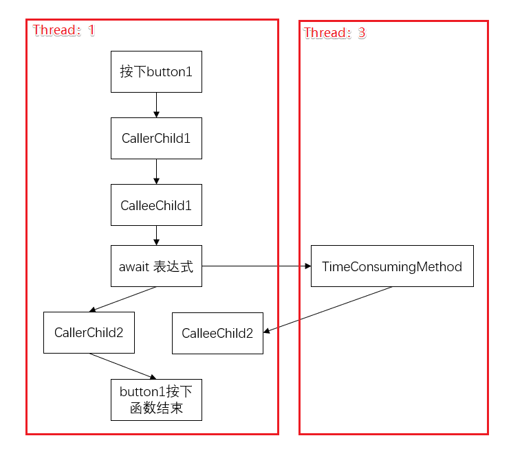

使用关键字async和await实现异步方法: 在C#5.0中引入了async和await关键字，可以方便我们使用顺序结构流(即不用回调)来实现异步编程，大大降低了异步编程的复杂程度

### 异步方法

**实现原理**

1. 异步方法不需要多线程，因为一个异步方法并不是运行在一个独立的线程中的。
2. 异步方法运行在当前同步上下文中，只有激活的时候才占用当前线程的时间。
3. 异步模型采用时间片轮转来实现。

**参数和返回值**

1. 异步方法的参数：

   不能使用“ref”参数和“out”参数，但是在异步方法内部可以调用含有这些参数的方法

2. 异步方法的返回类型：

   Task<TResult>:Tresult为异步方法的返回值类型。

   Task：异步方法没有返回值。

   void：主要用于事件处理程序（不能被等待，无法捕获异常）。异步事件通常被认为是一系列异步操作的开始。使用void返回类型不需要await，而且调用void异步方法的函数不会捕获方法抛出的异常。（异步事件中使用await，倘若等待的任务由有异常会导致抛出“调用的目标发生了异常”。当然你可以在异步事件中调用另一个有返回值的异步方法）

**异步方法的命名规范**

1. 异步方法的方法名应该以Async作为后缀
2. 事件处理程序，基类方法和接口方法，可以忽略此命名规范：例如： startButton_Click不应重命名为startButton_ClickAsync

### async原理

async和await关键字不会导致其他线程的创建，执行异步方法的线程为其调用线程。

而异步方法旨在成为非阻塞操作，即当await等待任务运行时，异步方法会将控制权转移给异步方法外部，让其不受阻塞的继续执行，待await等待的任务执行完毕再将控制权转移给await处，继续执行异步方法后续的代码。

函数执行时，一旦遇到await就会返回。等到触发的异步操作完成，再接着执行函数体内后面的语句。

**await语句后面的代码，相当于回调函数**

### 示例

```c#
//Caller
private void button1_Click(object sender, EventArgs e)
{
    Console.WriteLine("CallerChild1. My Thread ID is :" + Thread.CurrentThread.ManagedThreadId);
    var ResultTask  = AsyncMethod();
    // 此处会发生死锁， 
    Console.WriteLine(ResultTask.Result);
    // await修饰的Task/Task<TResult>得到的是TResult。
    Console.WriteLine(await ResultTask);
    Console.WriteLine("CallerChild2. My Thread ID is :" + Thread.CurrentThread.ManagedThreadId);
}

//CalleeAsync
private async Task<string> AsyncMethod()
{
    Console.WriteLine("CalleeChild1");
    var ResultFromTimeConsumingMethod = TimeConsumingMethod();
    string Result = await ResultFromTimeConsumingMethod + " + AsyncMethod. My Thread ID is :" + Thread.CurrentThread.ManagedThreadId;
    Console.WriteLine("CalleeChild2"+Result);
    return Result;
}

//这个函数就是一个耗时函数，可能是IO操作，也可能是cpu密集型工作。
private Task<string> TimeConsumingMethod()
{            
    var task = Task.Run(()=> {
        Console.WriteLine("Helo I am TimeConsumingMethod. My Thread ID is :" + Thread.CurrentThread.ManagedThreadId);
        Thread.Sleep(5000);
        Console.WriteLine("Helo I am TimeConsumingMethod after Sleep(5000). My Thread ID is :" + Thread.CurrentThread.ManagedThreadId);
        return "Hello I am TimeConsumingMethod";
    });
    return task;
}
```

### 流程

1. Caller函数被调用，先执行CallerChild1代码，这里是同步执行与一般函数一样，然后遇到了异步函数CalleeAsync。
2. 在CalleeAsync函数中有await关键字，await的作用是打分裂点。
3. 编译器会把整个函数（CalleeAsync）从这里分裂成两个函数。await关键字之前的代码作为一个函数（CalleeChild1）await关键字之后的代码作为一个函数（CalleeChild2）。
4. CalleeChild1在调用方线程执行（在示例中就是主线程Thread1），执行到await关键字之后，另开一个线程耗时工作在Thread3中执行，然后立即返回。
5. 调用方会继续执行下面的代码CallerChild2（注意是Caller不是Callee）
6. 在CallerChild2被执行期间，TimeConsumingMethod也在异步执行（可能是在别的线程也可能是CPU不参与操作直接DMA的IO操作）



### 应用

`Task`的`TaskContinueWith`方法的实现

```C#
private void button1_Click(object sender, EventArgs e)
{
    var ResultTask = Task.Run(()=> {
        Console.WriteLine("Helo I am TimeConsumingMethod. My Thread ID is :" + Thread.CurrentThread.ManagedThreadId);
        Thread.Sleep(5000);
        return "Hello I am TimeConsumingMethod";
    });

    ResultTask.ContinueWith(OnDoSomthingIsComplete);
}

private void OnDoSomthingIsComplete(Task<string> t)
{
    Action action = () => {
        textBox1.Text = t.Result;
    };
    textBox1.Invoke(action);
    Console.WriteLine("Continue Thread ID :" + Thread.CurrentThread.ManagedThreadId);
}
```

async & await 的实现

```C#
private async void button1_Click(object sender, EventArgs e)
{
    var t = Task.Run(() => {
        Thread.Sleep(5000);
        return "Hello I am TimeConsumingMethod";
    });
    textBox1.Text = await t;
}
```

### 参考

进一步考察是否理解执行顺序：https://blog.csdn.net/qq_35735344/article/details/79876480