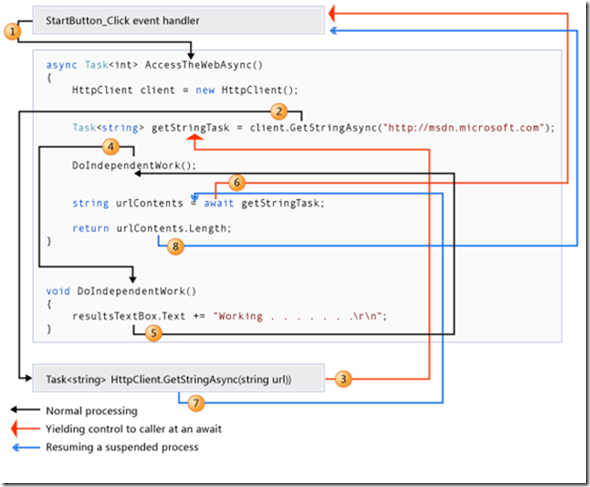

使用关键字async和await实现异步方法: 在C#5.0中引入了async和await关键字，可以方便我们使用顺序结构流(即不用回调)来实现异步编程，大大降低了异步编程的复杂程度

### 异步方法

**实现原理**

1. 异步并不总是意味着并行执行 
2. 异步方法不需要多线程，因为一个异步方法并不是运行在一个独立的线程中的。
3. 异步方法运行在当前同步上下文中，只有激活的时候才占用当前线程的时间。
4. 异步模型采用时间片轮转来实现。

**参数和返回值**

1. 异步方法的参数：

   不能使用“ref”参数和“out”参数，但是在异步方法内部可以调用含有这些参数的方法

2. 异步方法的返回类型：

   Task<TResult>:Tresult为异步方法的返回值类型。

   Task：异步方法没有返回值。

   void：主要用于事件处理程序（不能被等待，无法捕获异常）。异步事件通常被认为是一系列异步操作的开始。使用void返回类型不需要await，而且调用void异步方法的函数不会捕获方法抛出的异常。（异步事件中使用await，倘若等待的任务由有异常会导致抛出“调用的目标发生了异常”。当然你可以在异步事件中调用另一个有返回值的异步方法）

**异步方法的命名规范**

1. 异步方法的方法名应该以Async作为后缀
2. 事件处理程序，基类方法和接口方法，可以忽略此命名规范：例如： startButton_Click不应重命名为startButton_ClickAsync

### async原理

async和await关键字不会导致**其他线程的创建**，执行异步方法的线程为其调用线程。

1. 而异步方法旨在成为非阻塞操作，即当await等待任务运行时，异步方法会将控制权转移给异步方法外部，让其不受阻塞的继续执行，待await等待的任务执行完毕再将控制权转移给await处，继续执行异步方法后续的代码。

2. 函数执行时，一旦遇到await就会返回。等到触发的异步操作完成，再接着执行函数体内后面的语句。

3. **await语句后面的代码，相当于回调函数**



**被“async”关键字标记的方法的调用都会强制转变为异步方式吗？**

1. 不会，当你调用一个标记了”async”关键字的方法，它会在当前线程以同步的方式开始运行。所以，如果你有一个同步方法，它返回void并且你做的所有改变只是将其标记的“async”，这个方法调用依然是同步的。返回值为Task或Task<TResult>也一样。
2. 方法用“async”关键字标记不会影响方法是同步还是异步运行并完成，而是，它使方法可被分割成多个片段，其中一些片段可能异步运行，这样这个方法可能异步完成。这些片段界限就出现在方法内部显示使用“await”关键字的位置处。所以，如果在标记了“async”的方法中没有显示使用“await”，那么该方法只有一个片段，并且将以同步方式运行并完成。

### 编译器转换

使用 async 关键字标记方法，会导致 C#  编译器使用状态机重新编写该方法的实现。借助此状态机，编译器可以在该方法中多个明确使用 await 关键字的位置插入中断点，以便该方法可以在不阻止线程的情况下，挂起和恢复其执行。

**当您等待未完成的异步操作时，编译器生成的代码可确保与该方法相关的所有状态（例如，局部变量）封装并保留在堆中。然后，该函数将返回到调用程序，允许在其运行的线程中执行其他任务。当所等待的异步操作在稍后完成时，该方法将使用保留的状态恢复执行。**

await模式主要由一个公开的 GetAwaiter()方法组成，该方法会返回一个提供 IsCompleted、OnCompleted 和 GetResult 成员的类型。当您编写以下代码时：await someObject;

编译器会生成一个包含 MoveNext 方法的状态机类：

```java
private class FooAsyncStateMachine : IAsyncStateMachine
{ 
    // Member fields for preserving “locals” and other necessary     state 
    int $state; 
    TaskAwaiter $awaiter; 
    … 
    public void MoveNext() 
    { 
        // Jump table to get back to the right statement upon         resumption 
        switch (this.$state) 
        { 
            … 
        case 2: goto Label2; 
            … 
        } 
        … 
        // Expansion of “await someObject;” 
        this.$awaiter = someObject.GetAwaiter(); 
        // 实例someObject上使用这些成员来检查该对象是否已完成（通过 IsCompleted）
        if (!this.$awaiter.IsCompleted) 
        { 
            this.$state = 2; 
            // 如果未完成，则挂接一个续体（通过 OnCompleted），
            // 当所等待实例最终完成时，系统将再次调用 MoveNext 方法
            this.$awaiter.OnCompleted(MoveNext); 
            return; 
            Label2: 
        } 
    // 完成后，来自该操作的任何异常将得到传播或作为结果返回（通过 GetResult），并跳转至上次执行中断的位置。
        this.$awaiter.GetResult(); 
        … 
    } 
}
```

###  自定义类型支持等待

如果希望某种自定义类型支持等待，我们可以选择两种主要的方法。

1) 一种方法是针对自定义的可等待类型手动实现完整的 await 模式，提供一个返回自定义等待程序类型的 GetAwaiter 方法，该等待程序类型知道如何处理续体和异常传播等等。

2) 第二种实施该功能的方法是将自定义类型转换为Task，然后只需依靠对等待任务的内置支持来等待特殊类型。前文所展示的[“](https://www.cnblogs.com/heyuquan/archive/2013/04/18/3028044.html#zhuanhuaeap)[EAP转化为TAP](https://www.cnblogs.com/heyuquan/archive/2013/04/18/3028044.html#zhuanhuaeap)[”](https://www.cnblogs.com/heyuquan/archive/2013/04/18/3028044.html#zhuanhuaeap)正属于这一类，关键代码如下：

   ```java
   private async void btn_Start_Click(object sender, EventArgs e)
   {
       this.progressBar1.Value = 0;
    
       tcs = new TaskCompletionSource<int>();
       worker2.RunWorkerCompleted += RunWorkerCompleted;
       tcs.Task.ContinueWith(t =>;
       {
           if (t.IsCanceled)
               MessageBox.Show("操作已被取消");
           else if (t.IsFaulted)
               MessageBox.Show(t.Exception.GetBaseException().Message);
           else
               MessageBox.Show(String.Format("操作已完成，结果为：{0}", t.Result));
       }, TaskContinuationOptions.ExecuteSynchronously);
    
       worker2.RunWorkerAsync();
       // void的异步方法：主要用于事件处理程序（不能被等待，无法捕获异常）。异步事件通常被认为
       // 是一系列异步操作的开始。使用void返回类型不需要await，而且调用void异步方法的函数不
       // 会捕获方法抛出的异常。（异步事件中使用await，倘若等待的任务由有异常会导致
       // 抛出“调用的目标发生了异常”。当然你可以在异步事件中调用另一个有返回值的异步方法）
    
       // 所以不需要下面的await，因为会出现在执行取消后拖动界面会因异常被观察到并且终止整个进程
       // await tcs.Task;
   }
   ```


### 示例

```c#
//Caller
private void button1_Click(object sender, EventArgs e)
{
    Console.WriteLine("CallerChild1. My Thread ID is :" + Thread.CurrentThread.ManagedThreadId);
    var ResultTask  = AsyncMethod();
    // 此处会发生死锁， 
    Console.WriteLine(ResultTask.Result);
    // await修饰的Task/Task<TResult>得到的是TResult。
    Console.WriteLine(await ResultTask);
    Console.WriteLine("CallerChild2. My Thread ID is :" + Thread.CurrentThread.ManagedThreadId);
}

//CalleeAsync
private async Task<string> AsyncMethod()
{
    Console.WriteLine("CalleeChild1");
    var ResultFromTimeConsumingMethod = TimeConsumingMethod();
    string Result = await ResultFromTimeConsumingMethod + " + AsyncMethod. My Thread ID is :" + Thread.CurrentThread.ManagedThreadId;
    Console.WriteLine("CalleeChild2"+Result);
    return Result;
}

//这个函数就是一个耗时函数，可能是IO操作，也可能是cpu密集型工作。
private Task<string> TimeConsumingMethod()
{            
    var task = Task.Run(()=> {
        Console.WriteLine("Helo I am TimeConsumingMethod. My Thread ID is :" + Thread.CurrentThread.ManagedThreadId);
        Thread.Sleep(5000);
        Console.WriteLine("Helo I am TimeConsumingMethod after Sleep(5000). My Thread ID is :" + Thread.CurrentThread.ManagedThreadId);
        return "Hello I am TimeConsumingMethod";
    });
    return task;
}
```

### 流程

1. Caller函数被调用，先执行CallerChild1代码，这里是同步执行与一般函数一样，然后遇到了异步函数CalleeAsync。
2. 在CalleeAsync函数中有await关键字，await的作用是打分裂点。
3. 编译器会把整个函数（CalleeAsync）从这里分裂成两个函数。await关键字之前的代码作为一个函数（CalleeChild1）await关键字之后的代码作为一个函数（CalleeChild2）。
4. CalleeChild1在调用方线程执行（在示例中就是主线程Thread1），执行到await关键字之后，另开一个线程耗时工作在Thread3中执行，然后立即返回。
5. 调用方会继续执行下面的代码CallerChild2（注意是Caller不是Callee）
6. 在CallerChild2被执行期间，TimeConsumingMethod也在异步执行（可能是在别的线程也可能是CPU不参与操作直接DMA的IO操作）


### 应用

`Task`的`TaskContinueWith`方法的实现

```C#
private void button1_Click(object sender, EventArgs e)
{
    var ResultTask = Task.Run(()=> {
        Console.WriteLine("Helo I am TimeConsumingMethod. My Thread ID is :" + Thread.CurrentThread.ManagedThreadId);
        Thread.Sleep(5000);
        return "Hello I am TimeConsumingMethod";
    });

    ResultTask.ContinueWith(OnDoSomthingIsComplete);
}

private void OnDoSomthingIsComplete(Task<string> t)
{
    Action action = () => {
        textBox1.Text = t.Result;
    };
    textBox1.Invoke(action);
    Console.WriteLine("Continue Thread ID :" + Thread.CurrentThread.ManagedThreadId);
}
```

async & await 的实现

```C#
private async void button1_Click(object sender, EventArgs e)
{
    var t = Task.Run(() => {
        Thread.Sleep(5000);
        return "Hello I am TimeConsumingMethod";
    });
    textBox1.Text = await t;
}
```

### 参考

进一步考察是否理解执行顺序：https://blog.csdn.net/qq_35735344/article/details/79876480

### 优化-最佳做法

通过Task实例的ConfigureAwait()方法，可以设置使用await时同步上下文的行为，

- 默认情况下，await操作符会尝试捕捉同步上下文，并在其中执行代码，即调度器会向UI线程投入成千上百个后续操作任务，这会使用它的消息循环来异步地执行这些任务，
- 当我们不需要在UI线程中运行这些代码时，向ConfigureAwait方法传入false将会是一个更高效的方案。

异步方法尽量少用 void类型返回值、替代方案 使用Task类型，特例：异步事件处理函数使用void类型

- 原因1、async void 无法使用try ... catch进行异常捕获，它的异常会在上下文中引发。捕获该种异常的方式为在GUI或web系统中使用AppDomain.UnhandledException 进行全局异常捕获, 但不能从拦截的地方恢复进程。线程池中未被处理的异常会终结整个进程。
- 原因2、async void 方法、不可以“方便”的知道其什么时候完成，这对于超过50%的异步方法而言、将是灭顶之灾。而 async Task可以配合 await、await Task.WhenAny、await Task.WhenAll、await Task.Delay、await Task.Yield 方便的进行后续的任务处理工作。
- 特例、因为事件本身是不需要返回值的，并且事件的异常也会在上下文中引发、这是合理的。所以异步的事件处理函数使用void类型。
- async void的lambda表达式，同Action类型是兼容的，
- 强烈建议仅仅在UI事件处理器中使用async void方法，在其他情况下，请使用返回Task或者Task的方法。

推荐一直使用async，而不要混合使用阻塞和异步（async）避免死锁， 特例：Main方法

```C#
public static class DeadlockDemo
{
  private static async Task DelayAsync()
  {
    await Task.Delay(1000);
  }
  // This method causes a deadlock when called in a GUI or ASP.NET context.
public static void Test()
  {
    // Start the delay.
var delayTask = DelayAsync();
    // Wait for the delay to complete.
delayTask.Wait();
  }
}
```

当在GUI或者web上执行（具有上下文的环境中），会导致死锁。

- 这种死锁的根本原因是 await 处理上下文的方式。 

- 默认情况下，当等待未完成的 Task 时，会捕获当前“上下文”，在 Task 完成时使用该上下文恢复方法的执行。 此“上下文”是当前 SynchronizationContext（除非它是 null，这种情况下则为当前 TaskScheduler）。 GUI 和 ASP.NET 应用程序具有 SynchronizationContext，它每次仅允许一个代码区块运行。

-  当 await 完成时，它会尝试在捕获的上下文中执行 async 方法的剩余部分。 

- 但是该上下文已含有一个线程，该线程在（同步）等待 async 方法完成。 它们相互等待对方，从而导致死锁。

- 特例：Main方法是不可用async修饰符进行修饰的（编译不通过）。

  | 执行以下操作…      | 阻塞式操作…              | async的替换操作    |
  | ------------------ | ------------------------ | ------------------ |
  | 检索后台任务的结果 | Task.Wait 或 Task.Result | await              |
  | 等待任何任务完成   | Task.WaitAny             | await Task.WhenAny |
  | 检索多个任务的结果 | Task.WaitAll             | await Task.WhenAll |
  | 等待一段时间       | Thread.Sleep             | await Task.Delay   |

如果可以，请用ConfigureAwait 忽略上下文

- 上文也说过了，当异步任务完成后、它会尝试在之前的上下文环境中恢复执行。这样带来的问题是时间片会被切分成更多、造成更多的线程调度上的性能损耗。
- 一旦时间片被切分的过多、尤其是在GUI和Web具有上下文环境中运行，影响会更大。
- 另外，使用ConfigureAwait忽略上下文后、可避免死锁。 因为当等待完成时，它会尝试在线程池上下文中执行 async 方法的剩余部分，不会存在线程等待。

### 等待

在异步方法中，不要使用 Thread.Sleep；在同步方法中，不要使用Task.Delay ，否则可能出现线程死锁

1. Thread.Sleep 是同步延迟，Task.Delay异步延迟。

2. Thread.Sleep 会阻塞线程，Task.Delay不会。

3. Thread.Sleep不能取消，Task.Delay可以。

4. Task.Delay() 比 Thread.Sleep() 消耗更多的资源，但是Task.Delay()可用于为方法返回Task类型；或者根据CancellationToken取消标记动态取消等待

5. Task.Delay() 实质创建一个运行给定时间的任务， Thread.Sleep() 使当前线程休眠给定时间。

同步延迟还可以是：Task.Delay().Wait(), WaitHandle.WaitOne().

异步延迟配合异步方法async  await Task.Delay(1000);

### 问题

使用一个await运算符，就一定会使用一个新的线程吗？ 答案：不是的。

await运算符是依赖Task完成异步的、并且将后续代码至于Task的延续任务之中（这一点是编译器搞得怪、生成了大量的模板代码来实现该功能）。

1. 因此，编译器以await为分割点，将前一部分的等待任务和后一部分的延续任务分割到两个线程之中。
2. 前一部分的等待任务：该部分是Task依赖调度器（TaskScheduler）、从线程池中分配的工作线程。
3. 而后一部分的延续任务：该部分所运行的线程取决于两点：
   1. 第一点，Task等待任务在运行之前捕获的上下文环境，
   2. 第二点：是否使用ConfigureAwait (false) 忽略了之前捕获的上下文。
   3. 如果没有忽略上下文并且之前捕获的上下文环境为：SynchronizationContext（即 GUI UI线程 或 Web中具有HttpContext的线程环境）则 延续任务继续在 SynchronizationContext 上下文环境中运行，
   4. 否则 将使用调度器（TaskScheduler）从线程池中获取线程来运行。
4. 另外注意：调度器从线程池中获取的线程、并不一定是新的，即使在循环连续使用多次（如果任务很快完成），那么也有可能多次都使用同一个线程。

### 缺点

1、由于编译在搞怪、会生成大量的模板代码、使得单个异步方法 比 单个同步方法 运行得要慢，与之相对应的获取到的性能优势是、充分利用了多核心CPU，提高了任务并发量。

2、掩盖了线程调度、使得系统开发人员无意识的忽略了该方面的性能损耗。

3、如果使用不当，容易造成死锁
