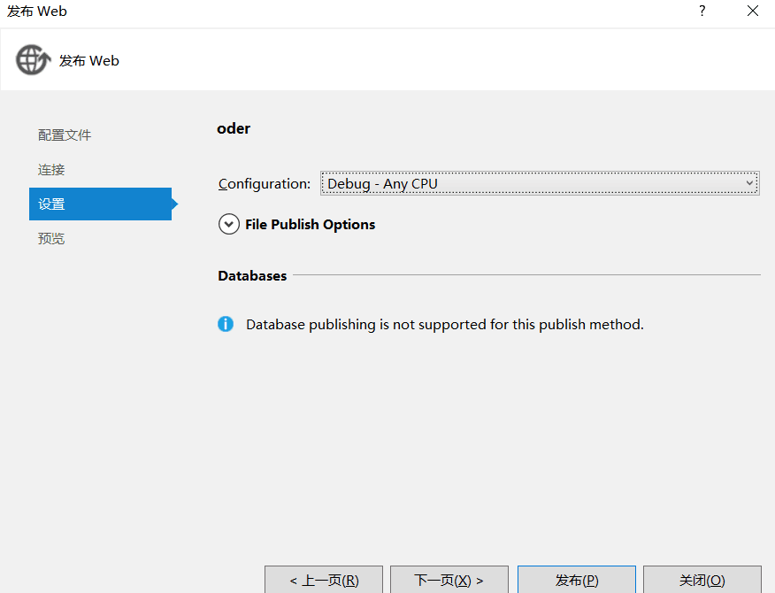

### 调用

1. 在VS中，添加服务引用--高级--添加web引用，直接输入webservice URL，然后直接实例化该命名空间下的类的对象，调用该接口下的各个方法即可。
2. 动态生成代理类和实例，并调用指定类和方法。**只适用于.Net Framework 4.5**

```C#
using Microsoft.CSharp;
using System;
using System.CodeDom;
using System.CodeDom.Compiler;
using System.IO;
using System.Net;
using System.Text;

namespace ADF.Utility
{
    class WSHelper
    {
        public static object InvokeWebService(string url, string classname, string methodname, object[] args)
        {
            string @namespace = "EnterpriseServerBase.WebService.DynamicWebCalling";
            if ((classname == null) || (classname == ""))
            {
                classname = GetWsClassName(url);
            }

            try
            {
                //获取WSDL
                WebClient wc = new WebClient();
                ServiceDescription sd = null;
                using (Stream stream = wc.OpenRead(url + "?WSDL"))
                {
                    sd = ServiceDescription.Read(stream);
                }
                ServiceDescriptionImporter sdi = new ServiceDescriptionImporter();
                sdi.AddServiceDescription(sd, "", "");
                CodeNamespace cn = new CodeNamespace(@namespace);

                //生成客户端代理类代码
                CodeCompileUnit ccu = new CodeCompileUnit();
                ccu.Namespaces.Add(cn);
                sdi.Import(cn, ccu);
                CodeDomProvider provider = new CSharpCodeProvider();//设定编译参数
                CompilerParameters cplist = new CompilerParameters();
                cplist.GenerateExecutable = false;
                cplist.GenerateInMemory = true;
                cplist.ReferencedAssemblies.Add("System.dll");
                cplist.ReferencedAssemblies.Add("System.XML.dll");
                cplist.ReferencedAssemblies.Add("System.Web.Services.dll");
                cplist.ReferencedAssemblies.Add("System.Data.dll");

                //编译代理类
                CompilerResults cr = provider.CompileAssemblyFromDom(cplist, ccu);
                if (true == cr.Errors.HasErrors)
                {
                    System.Text.StringBuilder sb = new System.Text.StringBuilder();
                    foreach (System.CodeDom.Compiler.CompilerError ce in cr.Errors)
                    {
                        sb.Append(ce.ToString());
                        sb.Append(System.Environment.NewLine);
                    }
                    throw new Exception(sb.ToString());
                }

                //生成代理实例，并调用方法
                System.Reflection.Assembly assembly = cr.CompiledAssembly;
                Type t = assembly.GetType(@namespace + "." + classname, true, true);
                object obj = Activator.CreateInstance(t);
                System.Reflection.MethodInfo mi = t.GetMethod(methodname);

                return mi.Invoke(obj, args);
            }
            catch (Exception ex)
            {
                throw new Exception(ex.InnerException.Message, new Exception(ex.InnerException.StackTrace));
            }
        }

        private static string GetWsClassName(string wsUrl)
        {
            string[] parts = wsUrl.Split('/');
            string[] pps = parts[parts.Length - 1].Split('.');
            return pps[0];
        }
    }
}
```

### 调试

问题：代码调试没问题，发布后，接口中的数据无法获取。

调试：VS2019中，调试-附加进程，（配置在IIS中项目，进程都是以w3wp.exe 开头的）

调试无法进入断点：

1. config是否有把debug设置成false： <compilation debug="true" targetFramework="4.0"/>
2. webService发布时，选择Debug，而非Release。

解决：将项目的WEB项目目录直接做为IIS WEB的目录.  或者用代码中生成的bin目录文件，替换发布后的bin目录文件夹。

### 访问

#### 远程无法测试

错误描述：在asp.net 开发的webservice本地测试可以运行，放在远程服务器上后访问却显示“测试窗体只能用于来自本地计算机的请求”。

解决方法： 在web.config的<system.web></system.web>加入

```
<webServices>
     <protocols>
      <add name="HttpSoap"/>
      <add name="HttpPost"/>
      <add name="HttpGet"/>
      <add name="Documentation"/>
     </protocols>
</webServices>
```

#### xml参数有危险值

错误描述：接口的参数中传入xml提示潜在危险值，无法正常调用。

解决方案：在配置文件中的system.web中增加以下节点：

```
<system.web>
	<httpRuntime requestValidationMode="2.0" />
	<pages validateRequest="false"/>
</system.web>
```

### 
