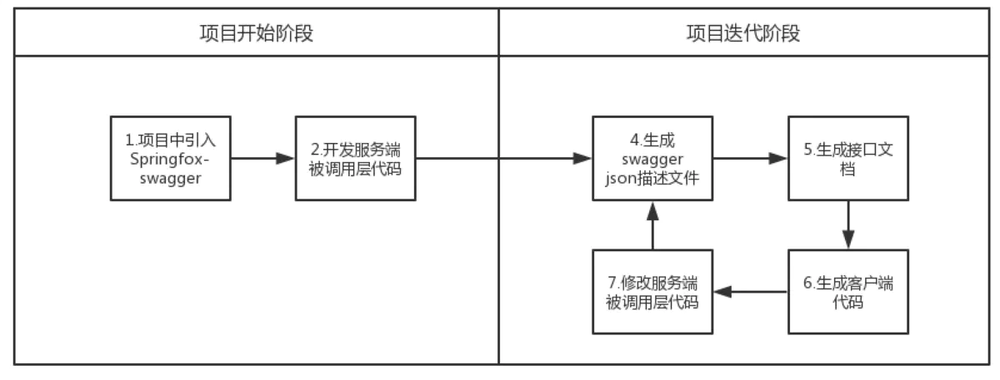

# 介绍

Swagger，也称为**OpenAPI**，解决了为Web API生成有用的文档和帮助页面的问题。

是一个与语言无关的**规范**，用于描述 REST API。按照它的规范去定义接口及接口相关的信息。再通过Swagger衍生出来的一系列项目和工具，就可以做到生成各种格式的接口文档，生成多种语言的客户端和服务端的代码，以及在线接口调试页面等等



# 使用

Swashbuckle.AspNetCore 是一个开源项目，用于生成 [ASP.NET](http://asp.net/) Core Web API 的 Swagger 文档。

NSwag 是另一个用于生成 Swagger 文档并将 Swagger UI 或 ReDoc 集成到 [ASP.NET](http://asp.net/) Core Web API 中的开源项目。 此外，NSwag 还提供了为 API 生成 C# 和 TypeScript 客户端代码的方法。

**Swagger UI** 提供了基于 Web 的 UI，它使用生成的 OpenAPI 规范提供有关服务的信息。

## Swashbuckle

[domaindrivendev/Swashbuckle.AspNetCore](https://github.com/domaindrivendev/Swashbuckle.AspNetCore#assign-explicit-operationids)

Swashbuckle.AspNetCore源码和使用说明

[带有 Swagger/OpenAPI 的 ASP.NET Core Web API 帮助页](https://docs.microsoft.com/zh-cn/aspnet/core/tutorials/web-api-help-pages-using-swagger)

Swashbuckle 有三个主要组成部分：

- [Swashbuckle.AspNetCore.Swagger](https://www.nuget.org/packages/Swashbuckle.AspNetCore.Swagger/)：将 `SwaggerDocument` 对象公开为 JSON 终结点的 Swagger 对象模型和中间件。
- [Swashbuckle.AspNetCore.SwaggerGen](https://www.nuget.org/packages/Swashbuckle.AspNetCore.SwaggerGen/)：从路由、控制器和模型直接生成 `SwaggerDocument` 对象的 Swagger 生成器。 它通常与 Swagger 终结点中间件结合，以自动公开 Swagger JSON。
- [Swashbuckle.AspNetCore.SwaggerUI](https://www.nuget.org/packages/Swashbuckle.AspNetCore.SwaggerUI/)：Swagger UI 工具的嵌入式版本。 它解释 Swagger JSON 以构建描述 Web API 功能的可自定义的丰富体验。 它包括针对公共方法的内置测试工具。

## 使用步骤：

- 将 Swagger 生成器添加到 Startup.ConfigureServices 方法中的服务集合中

  ```csharp
  using Swashbuckle.AspNetCore.Swagger;
  public void ConfigureServices(IServiceCollection services)
  {
      services.AddDbContext<TodoContext>(opt =>
          opt.UseInMemoryDatabase("TodoList"));
      services.AddControllers();
  
      // Register the Swagger generator, defining 1 or more Swagger documents
      services.AddSwaggerGen();
  }
  ```

- 在 Startup.Configure 方法中，启用中间件为生成的 JSON 文档和 Swagger UI 提供服务

  ```csharp
  public void Configure(IApplicationBuilder app)
  {
  // Enable middleware to serve generated Swagger as a JSON endpoint.
  app.UseSwagger();
  // Enable middleware to serve swagger-ui (HTML, JS, CSS, etc.),
  // specifying the Swagger JSON endpoint.
  app.UseSwaggerUI(c =>
  {
      c.SwaggerEndpoint("/swagger/v1/swagger.json", "My API V1");
  });
  
  app.UseRouting();
  app.UseEndpoints(endpoints =>
  {
      endpoints.MapControllers();
  });
  }
  ```

- 启动应用，并导航到 http://localhost:<port>/swagger/v1/swagger.json。 生成的描述终结点的文档显示在 OpenAPI 规范 (openapi.json) 中。

- 可在 http://localhost:<port>/swagger 找到 Swagger UI。 通过 Swagger UI 浏览 API，并将其合并其他计划中。

- API 信息和说明

  ```csharp
  services.AddSwaggerGen(s =>
              {
                  s.SwaggerDoc("v1", new OpenApiInfo
  								{ Title = "My API", Version = "v1", 
  									Description = "API Description Doc" });
              });
  ```

- XML 注释,手动将突出显示的行添加到 .csproj 文件：

  ```csharp
  <PropertyGroup>
    <GenerateDocumentationFile>true</GenerateDocumentationFile>
    <NoWarn>$(NoWarn);1591</NoWarn>
  </PropertyGroup>
  ```

  将 Swagger 配置为使用按照上述说明生成的 XML 文件

  ```csharp
  // Register the Swagger generator, defining 1 or more Swagger documents
      services.AddSwaggerGen(c =>
      {
          c.SwaggerDoc("v1", new OpenApiInfo
          {
              Version = "v1",
              Title = "ToDo API",
              Description = "A simple example ASP.NET Core Web API",
              TermsOfService = new Uri("<https://example.com/terms>"),
              Contact = new OpenApiContact
              {
                  Name = "Shayne Boyer",
                  Email = string.Empty,
                  Url = new Uri("<https://twitter.com/spboyer>"),
              },
              License = new OpenApiLicense
              {
                  Name = "Use under LICX",
                  Url = new Uri("<https://example.com/license>"),
              }
          });
  
          // Set the comments path for the Swagger JSON and UI.
  				var xmlFile = $"{System.Reflection.Assembly.GetExecutingAssembly().GetName().Name}.xml";
          var xmlPath = System.IO.Path.Combine(AppContext.BaseDirectory, xmlFile);
          c.IncludeXmlComments(xmlPath);
      });
  ```

  使用三斜杠注释，添加接口说明

  ```csharp
  /// <summary>
  /// Creates a TodoItem.
  /// </summary>
  /// <remarks>
  /// Sample request:
  ///
  ///     POST /Todo
  ///     {
  ///        "id": 1,
  ///        "name": "Item1",
  ///        "isComplete": true
  ///     }
  ///
  /// </remarks>
  /// <param name="item"></param>
  /// <returns>A newly created TodoItem</returns>
  /// <response code="201">Returns the newly created item</response>
  /// <response code="400">If the item is null</response>  --描述响应类型       
  [HttpPost]
  [ProducesResponseType(StatusCodes.Status201Created)] 
  [ProducesResponseType(StatusCodes.Status400BadRequest)]
  public ActionResult<TodoItem> Create(TodoItem item)
  {
      _context.TodoItems.Add(item);
      _context.SaveChanges();
      return CreatedAtRoute("GetTodo", new { id = item.Id }, item);
  }
  ```

- 数据注释，使用 System.ComponentModel.DataAnnotations 命名空间中的属性来标记模型

- 某些客户端信息通过header带到服务中，例如token信息，用户信息，API调试实现：

  在ConfigureServices添加了OperationFilter<AddAuthTokenHeaderParameter>() ，通过这种方式我们可以在swagger中显示token的header, AddAuthTokenHeaderParameter 的apply的属性context中带了controller以及action的各种信息，可以配合实际情况使用

  ```csharp
  public void ConfigureServices(IServiceCollection services)
    {
     services.AddMvc();
     services.AddSwaggerGen(c =>
     {
      c.SwaggerDoc("v1", new Info { Title = "Hello", Version = "v1" });
      var basePath = PlatformServices.Default.Application.ApplicationBasePath;
      var xmlPath = Path.Combine(basePath, "WebApplication2.xml");
      c.IncludeXmlComments(xmlPath);
      c.OperationFilter<AddAuthTokenHeaderParameter>();
     });
     services.AddMvcCore().AddApiExplorer();
    }
  ```

  ```csharp
  public class AddAuthTokenHeaderParameter : IOperationFilter
  {
   public void Apply(Operation operation, OperationFilterContext context)
   {
    if (operation.Parameters == null)
    {
     operation.Parameters = new List<IParameter>();
    }
    operation.Parameters.Add(new NonBodyParameter()
    {
     Name = "token",
     In = "header",
     Type = "string",
     Description = "token认证信息",
     Required = true
    });
   }
  }
  ```

  或者使用AuthorizeAttribute权限认证。

  ```csharp
  public class HttpHeaderOperation : IOperationFilter
    {
      public void Apply(Operation operation, OperationFilterContext context)
      {
        if (operation.Parameters == null)
        {
          operation.Parameters = new List<IParameter>();
        }
  
        var actionAttrs = context.ApiDescription.ActionAttributes();
  
        var isAuthorized= actionAttrs.Any(a => a.GetType() == typeof(AuthorizeAttribute));
  
        if (isAuthorized == false) //提供action都没有权限特性标记，检查控制器有没有
        {
          var controllerAttrs= context.ApiDescription.ControllerAttributes();
  
          isAuthorized= controllerAttrs.Any(a => a.GetType() == typeof(AuthorizeAttribute));
        }
  
        var isAllowAnonymous = actionAttrs.Any(a => a.GetType() == typeof(AllowAnonymousAttribute));
  
        if (isAuthorized && isAllowAnonymous == false)
        {
          operation.Parameters.Add(new NonBodyParameter()
          {
            Name = "Authorization", //添加Authorization头部参数
            In = "header",
            Type = "string",
            Required = false
          });
        }
      }
    }
  ```

- 打开 launchSettings.json 文件，把webapi项目的启动路径设置成 swagger。这样每次调试运行项目都会自动跳转到swagger帮助页面

# 导出

## 思路

1. 获取Swagger生成的json文件
2. 解析Json文件数据填充到Html的表格中
3. 根据生成的html转work文档

## 第三方包

Swashbuckle.AspNetCore  ：生成接口的json文件

RazorEngine.NetCore：数据填充到cshtml文件中，并编译成html

Spire.Doc：静态文件转文档

## 实现

配置Swagger，并修改接口页面，增加文件导出按钮

```C#
// 开发环境下使用swagger中间件
app.UseSwagger();
app.UseSwaggerUI(c =>
{
    c.SwaggerEndpoint("/swagger/V1/swagger.json", "My API V1");
    //c.RoutePrefix = string.Empty;
    c.DocumentTitle = "在线文档调试";
    #region 自定义样式
    //css 注入
    c.InjectStylesheet("/css/swaggerdoc.css");
    c.InjectStylesheet("/css/app.min.css");
    //js 注入，在页面中增加导出文件的按钮和方法
    c.InjectJavascript("/js/jquery.js");
    c.InjectJavascript("/js/swaggerdoc.js");
    c.InjectJavascript("/js/app.min.js");
    #endregion
});

// 注册服务
services.AddScoped<SpireDocHelper>();
services.AddScoped<SwaggerGenerator>();
services.AddSwaggerGen(c =>
{
    c.SwaggerDoc("V1", new OpenApiInfo
    {
        Version = "V1",   //版本 
        Title = $"接口文档",  //标题
        Description = $"重症4.0接口服务",    //描述
    });

    var xmlFile = $"{System.Reflection.Assembly.GetExecutingAssembly().GetName().Name}.xml";
    var xmlPath = System.IO.Path.Combine(AppContext.BaseDirectory, xmlFile);
    c.IncludeXmlComments(xmlPath);
});
```

导出文档的方法

```C#
[Route("[controller]/[action]")]
[ApiExplorerSettings(IgnoreApi = true)]
public class SwaggerController: ControllerBase
{
    private readonly IWebHostEnvironment _webHostEnvironment;
    private readonly SwaggerGenerator _swaggerGenerator;
    private readonly SpireDocHelper _spireDocHelper;

    public SwaggerController(IWebHostEnvironment hostingEnvironment,SpireDocHelper spireDocHelper,SwaggerGenerator swaggerGenerator)
    {
        _webHostEnvironment = hostingEnvironment;
        _spireDocHelper = spireDocHelper;
        _swaggerGenerator = swaggerGenerator;
    }
    
    /// <summary>
    /// 导出文件
    /// </summary>
    /// <param name="type">文件类型</param>
    /// <param name="version">版本号V1</param>
    /// <returns></returns>
    [HttpGet]
    public FileResult ExportWord(string type,string version)
    {
        string contenttype = string.Empty;
        //1. 根据指定版本获取指定版本的json对象。
        var model = _swaggerGenerator.GetSwagger(version); 
        //2. 根据模板引擎生成html
        var html = HtmlHelper.GeneritorSwaggerHtml($"{_webHostEnvironment.WebRootPath}\\SwaggerDoc.cshtml", model); 
        /3.将html导出文件类型
        var op = _spireDocHelper.SwaggerConversHtml(html, type, out contenttype); /
        return File(op, contenttype, $"接口文档{type}");
    }
}
```

辅助类

1. SwaggerDoc.cshtml模板文件
2. swaggerdoc.js导出文件的脚本
3. ByteHelper：文件流转为内存流
4. HtmlHelper：将数据填充到静态页面中，生成html
5. SpireDocHelper：