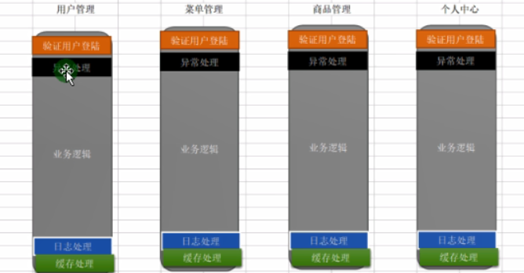
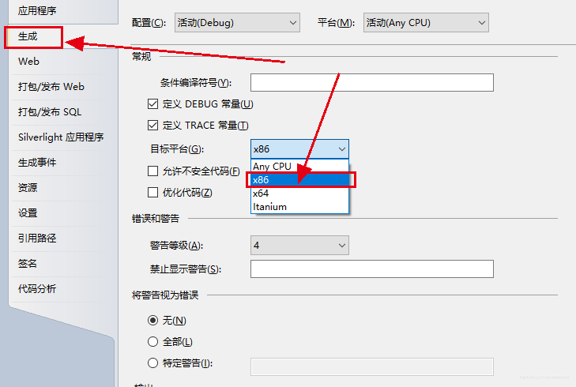
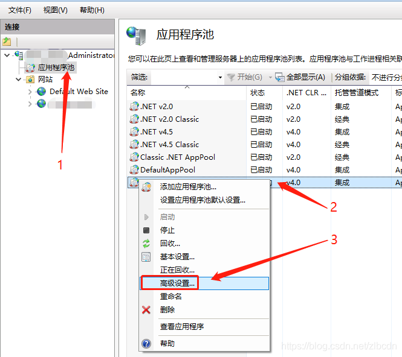
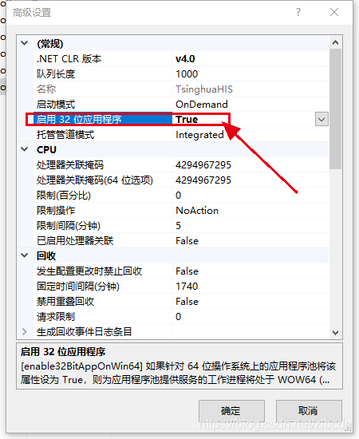
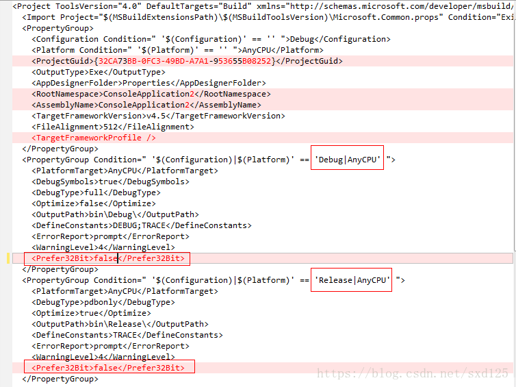

# ORM

orm是一个封装，代理。将数据库映射到程序中，基于映射类来完成对数据库的操作。不用写sql

## 通用SQL

1. 使用**工厂模式**生成各种数据库的操作帮助类，用于执行不同数据库的操作。

2. **泛型Generic**完成类型通用，泛型约束保证类型正确。

3. **反射Reflection**完成sql动态拼装和数据动态绑定。

   1. 获取泛型所映射的表名和列名，以及主键ID
   2. 可空值类型：数据库是null时，查询出来的是DbNull类型，不能直接赋值给Nullable，需要判断为DbNull类型是，直接返回null

4. **特性Attribute**提供额外信息，完成映射和过滤

   1. 标识实体类和数据库表字段的映射关系
   2. 区分主键（主键是否自增，对于Oracle数据库，增加序列名的属性）

5. **SQL注入**：使用参数化替换string.fromat拼接。

6. **DBContext上下文**，用于封装数据库操作，如指定数据库类型，增删改查，事务管理

   通过类型生成SQL可执行语句

## 缓存

泛型缓存

1. 可以使用泛型的静态变量缓存每个类型各自的SQL语句
2. 实现：使用SqlCacheBuilder，封装执行语句的生成，并加入缓存。

字典缓存

1. 使用Dictionary<String,String>
2. 缓存所有类型的SQL语句（使用classname+sqltype做key）
3. 缓存数据多时（约为1w），hash存储的性能下降。

## 数据校验

通过增加特性，实现数据库更新时的不同类型的数据校验。

一般包括：数据长度，是否可为空，是否是有效值。

## 复杂条件

1. 复杂条件的查询与删除

   Expression：从右往左解析，在BinaryExpression（具有二进制运算符的表达式）中递归

## EFCore

有缓存，同一DBContext会跟踪缓存插入的实体，直接使用Find查询时，是从缓存中查找，不走数据库。

而使用条件查找时，一定会查数据库。

# IOC

定义：

1. 控制反转Invosion of Control，是一种设计模式，降低代码的耦合度。
2. 反转的是对细节对象的选择决定权。由高层模块转移到第三方工厂。

六大设计原则：单一职责，里氏替换，依赖倒置，接口隔离，迪米特法则，开闭原则 ，

## DIP

Dependence Inversion Principle

依赖倒置原则：高层模块不依赖于低层模块，依赖抽象（接口)，不依赖细节（类）。

分层架构：应用层，表示层，会话层，传输层，网络层，数据链路层，物理层。

好处：解耦，低层的变化不影响高层，稳定，可扩展。

**因为抽象是稳定的，而细节是多变的。**

把对细节的依赖（决定细节的权力）从高层模块转移到第三方。

## DI

Dependency Injection。

依赖注入：构造A对象时，需要依赖B对象，则先构造依赖对象，再通过构造函数注入进去，这种技术手段叫依赖注入。

作用：屏蔽细节，支持IOC控制反转，解决无限层级的对象依赖。

**DI是IOC的实现手段**

**注入方式：构造函数注入，属性注入（用特性标识），方法注入。**

## IOC

作用：基于抽象完成对象的实例化。

贯彻DIP，高层模块中依赖抽象，但抽象无法实例化，所以使用第三方，就是IOC容器。

1. 简单容器：使用**config配置文件**存储具体实现类的类名和命名空间。使用**反射**实例化。

   若项目事先没有引用dll，而是copy dll，反射失败。

   切换实现类（如重新实现一个IUser接口的类），只需修改配置文件，对高层模块无影响，可扩展

2. 泛型优化

常规IOC容器的实现，无限依赖注入。

1. 容器对象：实现注册和生成，

2. 使用字典存储Dictionary<string,type>，接口类型的名称，实现类的类型。

3. 对于**构造函数有多个参数**的类型：生成时，反射获取类型的构造函数的参数，先创建参数实例。

   使用递归构造无限依赖。

4. 对于**有多个构造函数**的类型：.Net Core中是选择多个构造函数的超集（全集）。

   其它商业IOC框架，如Autofac，是选择参数最多的构造函数中的参数。

   或者直接用特性来指定用哪个构造函数进行实例化。

5. 对于**单接口多实现**：注册时加参数name，进行区分。

6. 对于**参数类型是基础类型int,string，**的情况，支持指定参数值构造，构造函数的基础类型参数前加特性标识，resove对象时分别处理.

7. 支持构造函数注入，属性注入，方法注入。（用特性标识）

ServiceCollection：ASP.Net Core内置容器，只支持构造函数注入。**ServiceProvider**

```C#
// 1.创建一个ContainerBuilder
IServiceCollection services = new ServiceCollection();
// 2.注册抽象和实现关系
services.AddTransient<ITestServiceA, TestServiceA>();//瞬时生命周期
services.AddSingleton<ITestServiceB, TestServiceB>();//单例--进程唯一实例
services.AddScoped<ITestServiceC, TestServiceC>();//作用域单例--一个请求一个实例
services.AddTransient<ITestServiceE, TestServiceE>();
services.AddTransient<ITestServiceD, TestServiceD>();
// 3.build生成IContainer容器
var container = services.BuildServiceProvider();
// 4.通过容器获取服务实例
System.Console.WriteLine("****************1************");
var A1 = container.GetService<ITestServiceA>();
var A2 = container.GetService<ITestServiceA>();
var A3 = container.GetService<ITestServiceC>();
System.Console.WriteLine(A1.Equals(A2));

var container1 = services.BuildServiceProvider();
var A4 = container.GetService<ITestServiceC>();
bool flag = object.ReferenceEquals(A3,A4); // 作用域不同，引用不同
```

**对象生命周期管理：是否重用对象**

1. 瞬时：每次resolve获取时，都重新创建。（大部分情况）

2. 单例：只创建一次。（如配置文件，连接池）

3. 作用域：

   Http请求时，一个请求处理过程中，创建都是同一个实例； 不同的请求处理过程中，就是不同的实例。

   第一次Http请求，Asp.NetCore内置Kestrel，初始化一个容器实例

   然后每次来一个Http请求，就clone一个新的IOC容器实例，或者叫创建子容器(包含注册关系)。

   其实就是子容器单例。

# AOP

定义

1. Aspect Oriented Programming 面向切面编程
2. 在程序运行期间，将某段代码动态切入到指定方法的指定位置进行运行的编程方式

作用：



1. 聚焦代码逻辑，轻松扩展功能
2. 代码复用，集中管理

CastleAop实现：

1. 动态代理：ProxyGenerator生成动态代理对象。
2. 拦截器：代理对象中，注入拦截器，StandardInterceptor，AsyncInterceptorBase
   1. 类型注入：virtual方法
   2. 接口注入：全部方法
   3. pre，perform，post三个方法，进行模板化执行。
3. 特性：MethodInvocationTarget，InvocationTarget
4. 执行方式：
   1. 框架模式：拦截器和特性方法中，只重写pre，post方法。
   2. 俄罗斯套娃：拦截器和特性方法中，只重写perform方法，责任链模式，将织入的方法依次放入责任链中，再执行。

## Filter过滤器

包含：Authorization，Resource，Action，Exception，Result


### 使用

注册方式：Controller控制器，Action，全局Global。都可以使用特性。

特性是编译时确定的，构造函数只能传常量（如类型），而不是变量。 

Filter属于MVC中间件的流程，流程外的无法处理，如404，图片防盗链（中间件）

**过滤器执行顺序：**

1. 控制器构造函数，
2. OnActionExecuting：Global全局 ->Controller控制器->Action；
3. Action
4. OnActionExecuted：Action->Controller->Global

```C#
自定义ExceptionFilter继承：ExceptionFilterAttribute
自定义ActionFiter继承并实现：Attribute, IActionFilter, IFilterMetadata, IOrderedFilter
 		或者ActionFilterAttribute，或者 Attribute, IAsyncActionFilter
IFilterMetadata用于依赖注入，生成自定义过滤器实例。
    
// 注入方式有4种：
// 1.全局注册：所有的Controller和其中的Action
builder.Services.AddControllersWithViews(options =>
{
    options.Filters.Add(typeof(CustomGlobalFilterAttribute));
});

// 2.使用特性ServiceFilter并注册服务实例，可以没有无参构造函数，支持依赖注入，必须注册服务
[ServiceFilter(typeof(CustomExceptionFilterAttribute))]
builder.Services.AddTransient<CustomExceptionFilterAttribute>()
    
// 3.使用特性TypeFilter，可以没有无参构造函数，支持依赖注入
[TypeFilter(typeof(CustomExceptionFilterAttribute))]
     
// 4.实现IFilterFactory接口，使用自定义特性FilterFactory标记，并注册服务实例
// 和Type、ServiceFilterAttribute源码类似，都是基于IFilterFactory
public class CustomFilterFactoryAttribute : Attribute, IFilterFactory
{
    private Type _FilterType = null;
    public CustomFilterFactoryAttribute(Type type)
    {
        this._FilterType = type;
    }
    public bool IsReusable => true;

    /// <summary>
    /// 容器的实例--构造对象---就可以依赖注入---
    /// </summary>
    /// <param name="serviceProvider"></param>
    /// <returns>空接口，为了标识，是一个filter</returns>
    public IFilterMetadata CreateInstance(IServiceProvider serviceProvider)
    {
        return (IFilterMetadata)serviceProvider.GetService(this._FilterType);
        //throw new NotImplementedException();
    }
}
```

### 执行顺序

1. IResourceFilter-OnResourceExecuting发生在控制器实例化之前
2. IActionFilter-OnActionExecuting
3. IActionFilter-OnActionExecuted
4. IResultFilter-OnResultExecuting
5. IResultFilter-OnResultExecuted   Result是视图替换环节
6. IResourceFilter-OnResourceExecuted 发生在最后

### 缓存

1. IResourceFilter可以做Action缓存，避免了控制器实例化和Action执行，但是视图重新执行。

   继承和实现：Attribute, IResourceFilter, IFilterMetadata, IOrderedFilter

   ```C#
   /// <summary>
   /// OnResourceExecuted 缓存结果
   /// OnResourceExecuting 使用缓存
   /// </summary>
   public class CustomCacheResourceFilterAttribute : Attribute, IResourceFilter, IFilterMetadata, IOrderedFilter
   {
       private static Dictionary<string, IActionResult> _CustomCacheResourceFilterAttributeDictionary = new Dictionary<string, IActionResult>();
   
       public int Order => 0;
       public void OnResourceExecuting(ResourceExecutingContext context)
       {
           string key = context.HttpContext.Request.Path;
           if (_CustomCacheResourceFilterAttributeDictionary.ContainsKey(key))
           {
               context.Result = _CustomCacheResourceFilterAttributeDictionary[key];
               //这个就是你说的结束请求，，短路器
           }
       }
   
       public void OnResourceExecuted(ResourceExecutedContext context)
       {
           string key = context.HttpContext.Request.Path;
           _CustomCacheResourceFilterAttributeDictionary.Add(key, context.Result);
       }
   }
   ```

2. 客户端（视图）缓存：ResponseCache:在请求响应式，添加了一个responseheader，缓存浏览器结果

   ```C#
   /// <summary>
   /// 客户端缓存，可以用IResultFilter实现
   /// </summary>
   public class CustomCacheResultFilterAttribute : Attribute, IResultFilter, IFilterMetadata, IOrderedFilter
   {
       public int Duration { get; set; }
   
       public int Order => 0;
   
       public void OnResultExecuted(ResultExecutedContext context)
       {
           //这个不行  已经指定了response
       }
   
       public void OnResultExecuting(ResultExecutingContext context)
       {
           context.HttpContext.Response.Headers["Cache-Control"] = $"public,max-age={this.Duration}";
       }
   }
   ```

3. 中间件：结合ResponseCache，在中间件完成拦截，可以完全不进入MVC，跨浏览器。

4. 基于autofac的AOP可以缓存了service层的结果：若实现类里的有两个方法，但是想在使用时只缓存一个方法返回值，则在方法加一个特性，拦截后然后判断一下

# Autofac

nuget引入Autofac，AutoFac.Extensions. DependencyInjection，Autofac.Extras.DynamicProxy，Castle.DynamicProxy

## 使用和注入

```C#
// 重新指定IOC工厂
builder.UseServiceProviderFactory(new AutofacServiceProviderFactory())
    
public void ConfigureContainer(ContainerBuilder containerBuilder)
{
    containerBuilder.RegisterModule<CustomAutofacModule>();
}

public class CustomAutofacModule : Autofac.Module
{
    protected override void Load(ContainerBuilder containerBuilder)
    {
        var assembly = this.GetType().GetTypeInfo().Assembly;
        var builder = new ContainerBuilder();
        var manager = new ApplicationPartManager();
        manager.ApplicationParts.Add(new AssemblyPart(assembly));
        manager.FeatureProviders.Add(new ControllerFeatureProvider());
        var feature = new ControllerFeature();
        manager.PopulateFeature(feature);
        builder.RegisterType<ApplicationPartManager>().AsSelf().SingleInstance();
        builder.RegisterTypes(feature.Controllers.Select(ti => ti.AsType()).ToArray()).PropertiesAutowired(); 
        
        // 属性注入
        containerBuilder.RegisterType<TestServiceA>().As<ITestServiceA>().SingleInstance().PropertiesAutowired();
        // 方法注入：SetService方法的参数
        containerBuilder.RegisterType<TestServiceB>().OnActivated(e => e.Instance.SetService(e.Context.Resolve<ITestServiceA>())).As<ITestServiceB>();
        // 构造函数注入
        containerBuilder.RegisterType<TestServiceD>().As<ITestServiceD>();
        containerBuilder.RegisterType<TestServiceE>().As<ITestServiceE>();

        containerBuilder.Register<FirstController>();
        containerBuilder.RegisterType<JDDbContext>().As<DbContext>();
        containerBuilder.RegisterType<CategoryService>().As<ICategoryService>();
        containerBuilder.RegisterType<UserServiceTest>().As<IUserServiceTest>();
    }
}
```

## 生命周期

常用5种：瞬时，单例，作用域，请求

```C#
//定义生命周期范围
ContainerBuilder containerBuilder = new ContainerBuilder();
IContainer container = containerBuilder.Build();
using (var scope = container.BeginLifetimeScope())
{
    
}

// 瞬时
containerBuilder.RegisterType<TestServiceA>().As<ITestServiceA>().InstancePerDependency();
// 单例：进程中，对象永远都是同一个实例
containerBuilder.RegisterType<TestServiceA>().As<ITestServiceA>().SingleInstance();
// 作用域：每个生命周期范围一个实例
containerBuilder.RegisterType<TestServiceA>().As<ITestServiceA>().InstancePerLifetimeScope();
// 指定作用域：每个匹配生命周期范围的一个实例
containerBuilder.RegisterType<TestServiceA>().As<ITestServiceA>().InstancePerMatchingLifetimeScope("ID");
// 请求：每个请求一个实例
containerBuilder.RegisterType<TestServiceA>().As<ITestServiceA>().InstancePerRequest();

ContainerBuilder containerBuilder = new ContainerBuilder();
containerBuilder.RegisterType<TestServiceA>().As<ITestServiceA>().InstancePerMatchingLifetimeScope("ID");
IContainer container = containerBuilder.Build();
ITestServiceA testServiceA15 = null;
ITestServiceA testServiceA16 = null;
using (var scope1 = container.BeginLifetimeScope("ID"))
{
    ITestServiceA testServiceA11 = scope1.Resolve<ITestServiceA>();
    using (var scope2 = scope1.BeginLifetimeScope())
    {
        ITestServiceA testServiceA12 = scope2.Resolve<ITestServiceA>();
        //True
        Console.WriteLine(object.ReferenceEquals(testServiceA11, testServiceA12));
    }
    testServiceA15 = testServiceA11;
}
using (var scope1 = container.BeginLifetimeScope("ID"))
{
    ITestServiceA testServiceA13 = scope1.Resolve<ITestServiceA>();
    using (var scope2 = scope1.BeginLifetimeScope())
    {
        ITestServiceA testServiceA14 = scope2.Resolve<ITestServiceA>();
        //True
        Console.WriteLine(object.ReferenceEquals(testServiceA13, testServiceA14));
    }
    testServiceA16 = testServiceA13;
}
Console.WriteLine(object.ReferenceEquals(testServiceA15, testServiceA16)); //False
```

## 配置文件

```C#
ContainerBuilder containerBuilder = new ContainerBuilder();
// 就可以在这里写入Autofac注入的各种 
//读取配置文件,把配置关系装载到ContainerBuilder
IConfigurationBuilder config = new ConfigurationBuilder();
IConfigurationSource autofacJsonConfigSource = new JsonConfigurationSource()
{
    Path = "config/autofac.json",
    Optional = false,//boolean,默认就是false,可不写
    ReloadOnChange = true,//同上
};
config.Add(autofacJsonConfigSource);
ConfigurationModule module = new ConfigurationModule(config.Build());
containerBuilder.RegisterModule(module);
IContainer container = containerBuilder.Build();
ITestServiceA testServiceA = container.Resolve<ITestServiceA>();

// autfac.json
{
	"components": [
		{
			"type": "ADF.Business.TestServiceA, ADF.Business",
			"services": [
				{
					"type": "ADF.IBusiness.ITestServiceA, ADF.IBusiness"
				}
			],
			"instanceScope": "single-instance", //生命周期
			"injectProperties": true // 属性注入 
		}
	]
}
```

## 单抽象多实例

```C#
注册时指定标识
containerBuilder.RegisterType<TestServiceA>().Named<ITestServiceA>("TestServiceA");
containerBuilder.RegisterType<TestServiceUpdate>().Named<ITestServiceA>("TestServiceUpdate");

 private readonly IComponentContext _ComponentContext = null; 
// 使用Auutofac上下文+不同注册标识，获取不同的具体实例。
ITestServiceA testServiceUpdate = _ComponentContext.ResolveNamed<ITestServiceA>("TestServiceUpdate");
```

## AOP

EnableInterfaceInterceptors+ 抽象标记特性[Intercept(typeof(CustomAutofacAop))]，只要实现了这个抽象就可以支持AOP

EnableClassInterceptors+ 抽象标记特性[Intercept(typeof(CustomAutofacAop))]，只有标记了特性的实现类，才可以支持AOP，且实现类中支持AOP的方法，必须为虚方法

```C#
//aop注册
containerBuilder.Register(c => new CustomAutofacAop());
containerBuilder.RegisterType<A>().As<IA>().EnableInterfaceInterceptors();
containerBuilder.RegisterType<A>().As<IA>().EnableClassInterceptors();

public class CustomAutofacAop : IInterceptor
{
     private static Dictionary<string, object> CustomAutofacAopDictionary = new Dictionary<string, object>();
    public void Intercept(IInvocation invocation)
    {
        Console.WriteLine($"invocation.Methond={invocation.Method}");
        Console.WriteLine($"invocation.Arguments={string.Join(",", invocation.Arguments)}");
        string key = $"{invocation.Method}_{string.Join(",", invocation.Arguments)}";
        if (!CustomAutofacAopDictionary.ContainsKey(key))
        {
            invocation.Proceed(); //继续执行
            CustomAutofacAopDictionary.Add(key, invocation.ReturnValue);
        }
        else
        {
            invocation.ReturnValue = CustomAutofacAopDictionary[key];
        }
        Console.WriteLine($"方法{invocation.Method}执行完成了");
    }
}

public interface IA
{
    void Show(int id, string name);
    DateTime PlusTime(int i, int k);
}

// autofac是5.0
[Intercept(typeof(CustomAutofacAop))]
public class A : IA
{
    public void Show(int id, string name)
    {
        Console.WriteLine($"This is {id} _{name}");
    }
    
    public DateTime PlusTime(int i, int k)
    {
        Console.WriteLine("PlusTime");
        return DateTime.Now;
    }
}
```


# 问题汇总

1. UnitTest，测试读取配置文件appsettings.json，无法生成到运行目录下，只能拷贝。

2. 测试时，connection.Open()方法报错：System.BadImageFormatException : 试图加载格式不正确的程序。 (0x8007000B)，

   两种原因：

   ​	一是程序的运行平台和系统位数不匹配。

   ​	二是Vistual Studio导致的。

   三种情况

   	1. 64位程序与32位程序之间互相调用发生的。一般情况是：x64平台的软件调用旧版（x86）或C++编译的dll，而之前的dll往往是x86编译或32位的，因此常常出现此问题。
   	2. 64位系统是IIS发布还有32位的*.dll应用程序时。
   	3. 64位系统上编写C++ \*.dll,在64位系统上通过 C#调用 ,可能成功,也可能失败。VS导致。

   解决方案：

   1、对于第一种情况：修改ADF.Test的项目属性->生成->目标平台，从Any CPU改为x86；
   选择启动项目，右键属性，选择生成平台为x86。
   
   2、对于第二种情况：IIS中找到网站所使用的应用程序池->高级设置->启用32位应用程序，改为True。
   

   

   3. 对于第三种情况，**是VS中C#工程的问题,打开对应的工程文件(\*.csproj),如下图<Prefer32Bit>false</Prefer32Bit>节点**

      ****

      下面是MSDN的解释:

      CSharpProjectConfigurationProperties6.Prefer32Bit 属性

      获取或设置一个标志，指示是否首选的 32 位平台。

      我们要做的修改就是将Prefer32Bit节点删除掉或是把节点的值改为true,保存,重新打开或是加载VS中的工程

3. 数据库连接错误： An open Connection object is required to continue.

   数据库Connection和Command使用后，都需要回收，不能重复使用，

   不能将Connection和Command设置为DBHelper的属性，让一个客户端和服务端的连接一直存在。

4. 两个重载的泛型参数方法，T和List<T>会导致循环调用，死锁。因为List<T>也会被认为是T类型。

5. Oracle的列名用双引号解决列名是数据库关键字的问题，但双引号会区分大小写，加双引号的列，在执行sql语句时Oracle不会默认转成大写。

   解决方法：将sql字符串，转为大写