# 高并发

高并发解决方案：

1. 应用服务器集群，水平扩展，分担压力

2. 数据库主从复制：水平扩展，分担压力

3. 缓存：降低并发

   **以上属于釜底抽薪。**

4. 分布异步队列：时间换空间

   **以上属于扬汤止沸**

# 集群

集群：是将原本一台独立完成业务逻辑的服务器，克隆出多台，做相同独立完整的业务。并使用负载均衡，分担高并发的访问。

分布式：原本一台服务器完成，分成多台服务器写作完成。（狭义）

广义上，集群也是分布式。

# 负载均衡

**DNS负载均衡**

DNS（Domain Name System）负载均衡工作原理

1. 部署多个独立IP对外提供服务
2. DNS服务器配置多个IP，进行域名解析时转发

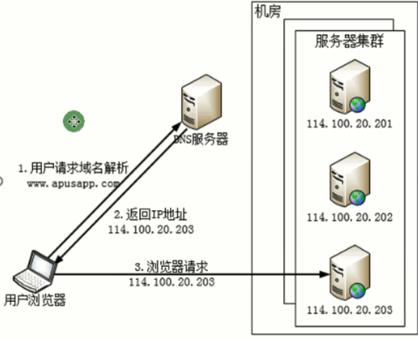

优点：就近原则，高效。

缺点：负载均衡策略只能是轮询，独立IP贵，服务器集群出现错误不容易发现。

**硬件负载均衡**

有F5，Array，Netscale，是集成解决方案，有商业化支持，省心省事，需要花钱。

**软件负载均衡**

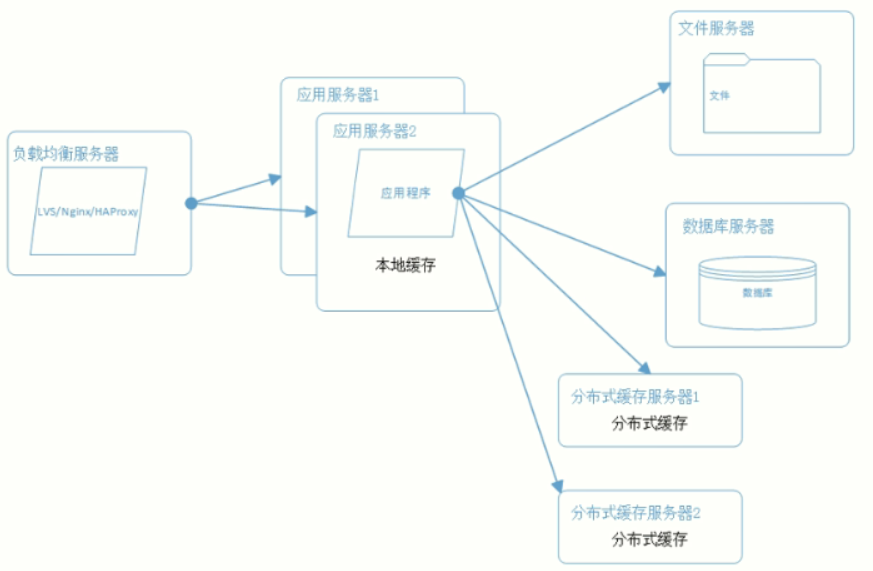

LVS：Linux Visual Server，Linux内核上，基于4层协议（传输层），性能更高效，负载均衡策略少。

HAProxy&Nginx：基于7层协议（应用层），更丰富的负载均衡策略。

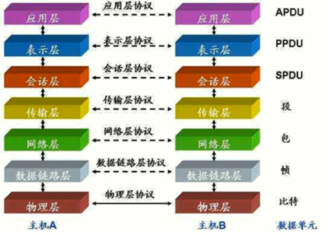

## Nginx

配置转发

```cmd
# 分发服务器IP和端口，以及负载均衡策略
upstream DbServers{
	server localhost:5726 weight=1;
	server localhost:5727 weight=3;
	server localhost:5728 weight=6;
	#default 轮询
	#weight 权重策略，按照1：3：6的比例分配
	#ip_hash 同一ip的请求分配同一服务器
	#fair
	#least_conn
}

server{
	listen		8080;
	server_name localhost;
	
	location / {
		proxy_pass http://DbServers;
		proxy_redirect off;
        proxy_set_header X-Forwarded-For $proxy_add_x_forwarded_for;
        proxy_set_header X-Real-IP $remote_addr;
        proxy_set_header Host $http_host;
	}
}
```

操作

1. 启动：start nginx.exe
2. 重载配置：nginx -s reload

## 用户持久化

分布式开发开发中的用户设别问题：

1. Http是无状态的，单机时用cookie&session，识别已登录用户。
2. 而在集群中，同一IP的请求不一定一直在同一个服务器中

解决方案：

1. 是同一ip的请求转发到同一服务器：

   方法：注入Session实例，使用HttpContext.Session存储用户，Nginx的负载均衡策略为ip_hash.

   缺点：负载不均衡，会话粘滞（可能某个IP的请求很多）

2. Session共享。

   方法：Session统一放入第三方库，如Stateserver，数据库，Redis。

    services.AddDistributedRedisCache() : Session不再放入进程的内存，而放入Redis中。

3. 请求携带

   使用cookie中保存用户的信息，请求时用cookie的用户信息做验证。

   缺点：不安全，占带宽

   **使用token-JWT/IdentityServer4**

# 读写分离

三个角色：主库-写库，从库-多个读库，发布服务器

主库将日志推送到发布服务器上，再由发布服务器同步到订阅的从库中。

**SQL Server数据库配置：**

1. 复制-》配制分发服务器（配制快照文件夹，权限），服务器名称要统一。

2. 本地发布-》事务发布（主库以快照的方式发布到分发服务器上），注意共享路径。

3. 本地订阅-》选择分发服务器和订阅的从库（可以订阅多个）

**代码实现**：

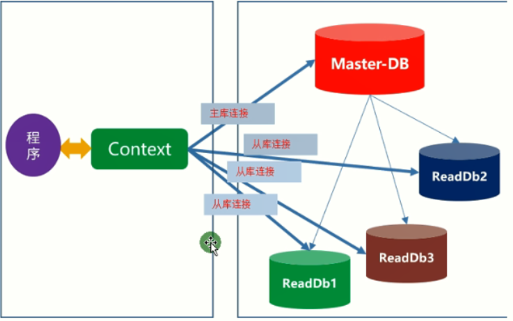

1. 配制文件中多个数据库连接，one-write-n-read

2. SqlConnectionPool And Dispatch，DBOperateType

3. 数据上下文DBContext，接受指定的连接，默认为Write。

主从同步的延迟问题：

1. 一般更新的数据，需要3~7秒，适用于接受延迟的操作，业务接受脏数据（未及时更新的数据）
2. 对于实时的业务，进行特殊处理，直接查主库
3. 使用短时间缓存/nosql，增删改除了同步主库，也同步nosql（需实时更新的数据放入缓存中，之后的查询先查缓存，缓存没有再去查从库。）

负载均衡策略：

1. 轮询，一个一个轮流用。
2. 平均分配，随机
3. 按权重分配，生成有重复的连接串数组，随机
4. 执行sql时，记录时间，只保存最近的10次，然后取平均值，就是这个库的响应时间。根据响应时间来分配任务。
5. 数据库提供获取硬件信息的接口，根据每个数据库的运行情况进行分配任务。
6. 实时获取下数据库连接数

## 数据库负载均衡

第三方中间件Moebius：没有主从之分，所有的库都是主库，增删改都去修改3个库。 

缺点：增删改的瓶颈高。花钱

优点：省事省心。

# 分库分表

读写分离依据二八原则，80%的请求都是查询；只有20%的增删改。所以可以把增删改放入主库，查询的请求放在集群中，分担压力。

若20%的增删改请求，并发还是很大大，无法靠数据库提供的功能来解决。

则需要使用分治思想：

1. 表分区，把数据表的数据拆分到多个存储空间。
2. 分库分表

分库方法：

1. 水平分库：时间，地域，数据类别
2. 垂直分库：按业务分，订单/仓储/物流/财务
3. 查询：通过微服务获取数据，可通过事先统计历史数据，或使用集中库（报表数据），或业务妥协（减少查跨库的数据的业务），来解决跨库查询速度慢的问题。

# 缓存

缓存是一种效果，把数据结果保存在某个介质中，下次直接重用。

二八原则：80%的请求都集中在20%的数据上，用缓存存储20%的数据，直接复用。

作用：

1. 缩短网络路径，加快响应速度，
2. 减少请求，降低服务器压力。

按存储介质分类：

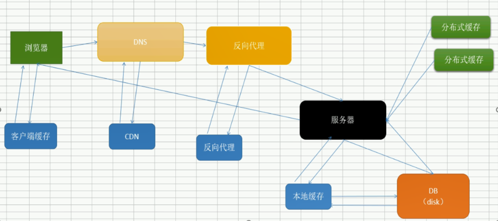

## 客户端缓存

浏览器内存缓存MemoryCache，硬盘DiskCache-新建文件夹。

网页的网络请求中，有些请求的size为memory cache，来自内存缓存，不用请求服务器。

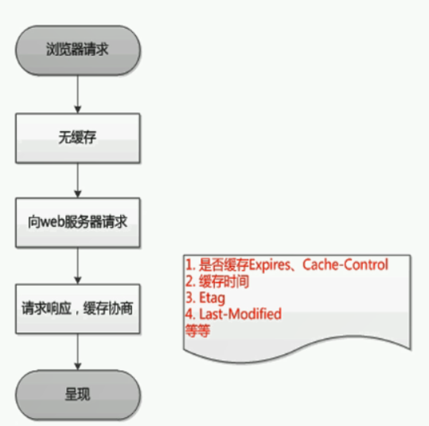

浏览器首次请求：HTTP协议 -> 请求响应式模型 -> 传输文本 -> 服务器解析文本 -> 返回响应（包含ResponseHeader标记需要缓存的信息）-> Header里的数据放入浏览器的缓存中（key-value） 

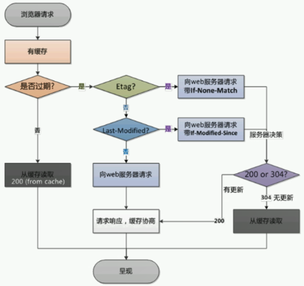

浏览器再次请求：**使用url做key**，获取缓存中的数据。

**强制刷新Ctrl+F5**，所有文件从服务器重新获取。

缓存过期的补救措施

1. Etag：**是一个MD5摘要，检查文件是否更新**。若缓存过期，若有Etag标签数据，则带着Etag向服务器请求数据if-None-Match（体积小）， 
   1. 若请求的数据无更新，则返回304，在缓存中读取。
   2. 若请求的数据有更新，则返回200，重新，进行缓存协商。
2. Last-Modified：检查最后修改时间（新版本浏览器已弃用）

客户端缓存更新策略：Cache-Control（过期时间 + Etag）+  Version.，通过制定HttpHeader。

ASP.NET的实现静态文件的缓存：

1. 静态文件在浏览器中用memory cache存储

2. 注册静态资源文件中间件时，指定配置项和缓存策略

   ```c#
   app.UseStaticFiles(new StaticFileOptions()
   {
       // 缓存wwwroot下的静态文件
       FileProvider = new PhysicalFileProvider(Path.Combine(Directory.GetCurrentDirectory(), @"wwwroot")),
       OnPrepareResponse = context =>
       {
           // 缓存过期时间为60s
           context.Context.Response.Headers[HeaderNames.CacheControl] = "public,max-age=10";
           context.Context.Response.Headers[HeaderNames.CacheControl] = "no-cache";//
           context.Context.Response.Headers[HeaderNames.CacheControl] = "no-store";//
       }
   });
   ```

3. 静态资源文件中间件：StaticFileMiddleware实现校验和提供静态资源文件。

4. 静态资源文件上下文：StaticFileContext生成Etag，校验更新，内置缓存策略

5. **若遇到让文件的修改立即生效的情况，则要替换文件的url，例如引用的文件加版本号，动态控制。**

ASP.NET的实现动态页面的缓存：

1. 动态页面用disk cache

2. Controller的Index()方法上加特性[ResponseCache(Duration = 60)]

   或Index()方法中执行：base.HttpContext.Response.Headers["Cache-Control"] = "public,max-age=60";

修改访问地址，加个随机参数，则页面重新获取，而不走缓存。因为客户端缓存是用url做key

## CDN缓存

数据分发服务器（**正向代理缓存**）。由HttpHeader指定缓存的内容。

流程解析	域名供应商维护缓存服务器，根据CName分配合适的缓存服务器，

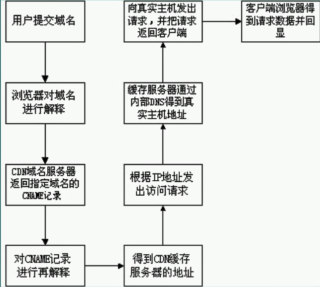

作用：DNS一般都在离请求用户最近的地方，实现缓存效果好，可以对一批用户生效，存储体积大的消息。

## 反向代理缓存

Nginx配置反向代理：nginx-1.17.8\conf\nginx.conf 文件中 proxy_cache的选项。

1. 配置Nginx转发：location--name,upstream--name,server--port

2. 配置反向代理缓存：http--proxy_cache_path，Location--路径+规则 

   ```cmd
   http {
       proxy_cache_path /software/nginx-1.17.8/data levels=1:2 keys_zone=web_cache:50m inactive=1m max_size=1g;
       
       upstream CacheDemo{
           server localhost:7082;
       }
   
       server {
           listen       7027;
           server_name  localhost;
       
           location /Home/ {
               proxy_store off;
               proxy_redirect off;
               proxy_set_header X-Forwarded-For $proxy_add_x_forwarded_for;
               proxy_set_header X-Real-IP $remote_addr;
               proxy_set_header Host $http_host;
               proxy_pass http://CacheDemo/Home/;
   
               # 开启反向代理缓存
               proxy_cache web_cache; # 缓存使用之前定义的内存区域
               # 对于 200 和 304 的响应码进行缓存，过期时间2分钟，会覆盖之前定义的1分钟过期时间
               proxy_cache_valid 200 304 2m; 
               proxy_cache_key  $scheme$proxy_host$request_uri; #url地址做key
           }
       }
   }
   ```

3. 使用访问地址为key，把生成的页面缓存，多个页面使用相同地址访问的都是同一个缓存，

示例：一般首页访问的请求很多，且不会频繁更新，可以使用代理缓存页面。

## 本地缓存

HttpRuntime.Cache

ASP.Net core的内置缓存：MemoryCache的使用

1. nuget引用：Microsoft.Extensions.Caching.Memory.

2. 注册服务和注入，配置项**LocalClock**

   ```C#
   //注册MemoryCache 
   services.AddMemoryCache(options =>
   {
       // 指定过期时间
       options.Clock = new LocalClock();
       // 限定体积（自定义的体积单位）
       options.SizeLimit = 1000;
   });
   
   private class LocalClock : ISystemClock
   {
       // 用本地时间做过期时间
       public DateTimeOffset UtcNow => DateTime.Now;
   }
   
   //使用
   IMemoryCache.TryGetValue<string>(key, out string time)
   IMemoryCache.Set(key, time, TimeSpan.FromSeconds(120))
   ```

3. 当前进程内存的缓存：重启可以释放---内存读写快、数据可丢失、体积有限，无法共享

##  分布式缓存

多服务实例+Nginx（默认为轮询）

集群数据共享：不同实例的数据共享，Redis

1. nuget引用：StackExchange.Redis

   ```C#
   // 注册分布式Redis缓存实例
   services.AddDistributedRedisCache(options =>
   {
       options.Configuration = "127.0.0.1:6379";
       options.InstanceName = "RedisDistributedCache0428";
   });
   
   // 使用
   IDistributedCache.GetString(keyDistributedCache)
   IDistributedCache.SetString(keyDistributedCache, time, 
   new DistributedCacheEntryOptions()
   {
       AbsoluteExpirationRelativeToNow = TimeSpan.FromSeconds(120)
   });
   ```

2. **缓冲层应用**：数据缓存，菜单、权限，数据字典（相对稳定，即时性要求低）

   文章点赞、阅读量（变化快，数据库访问压力大）

   密码错误24小时最多尝试5次，一天投票一次（账号做key，次数为value，有效期为24小时）

   分布式锁

   秒杀：利用redis单线程模型（无线程安全问题）。

3. Redis读写快，可开启持久化，

**启动多个不同端口的Web实例：**

1. wwwroot拷贝到debug目录下。

2. 在D:\GitHub\NET\NET6\code\ADF.Web\bin\Debug\net6.0目录下执行命令

3. dotnet ADF.Web.dll --urls=http://*.5188 --port=5188（直接运行）

   或者dotnet run ADF.Web --urls=http://*.5188 --ip="127.0.0.1" --port=5188（先编译，再运行）

## 基于HTTP协议缓存

包含客户端缓存，CDN

ASP.NET内置ResponseCache

|                     ResponseCache的设置                      |                         响应头                         |
| :----------------------------------------------------------: | :----------------------------------------------------: |
| [ResponseCache(Duration = 60，Location=ResponseCacheLocation.Client)] |        Cache-Control：<br />private,max-age=60         |
| [ResponseCache(Location=ResponseCacheLocation.None,NoStore=true)] |         Cache-Control：<br />no-cache,no-store         |
|   [ResponseCache(Duration = 60,VaryByHeader="User-Agent")]   | Cache-Control：public,max-age=60<br />Vary：User-Agent |

**如果NoStore没有设置为true，则Duration必须要赋值。**

ResponseCache特性是基于ActionFilter完成指定，所以可以自定义特性：执行base.HttpContext.Response.Headers["Cache-Control"] = "public,max-age=60";

```C#
public class CustomCacheActionFilterAttribute : Attribute, IActionFilter, IFilterMetadata
{
    /// <summary>
    /// Second
    /// </summary>
    public int Duration { get; set; }

    public void OnActionExecuted(ActionExecutedContext context)
    {
        int timeSecond = this.Duration == 0 ? 60 : this.Duration;
        context.HttpContext.Response.Headers["Cache-Control"] = $"public,max-age={timeSecond }";
        Console.WriteLine("This is CustomCacheActionFilterAttribute OnActionExecuted");
    }

    public void OnActionExecuting(ActionExecutingContext context)
    {
        //throw new NotImplementedException();
    }
}

// 使用Controller的方法上加特性
[CustomCacheActionFilterAttribute(Duration = 60)]
```

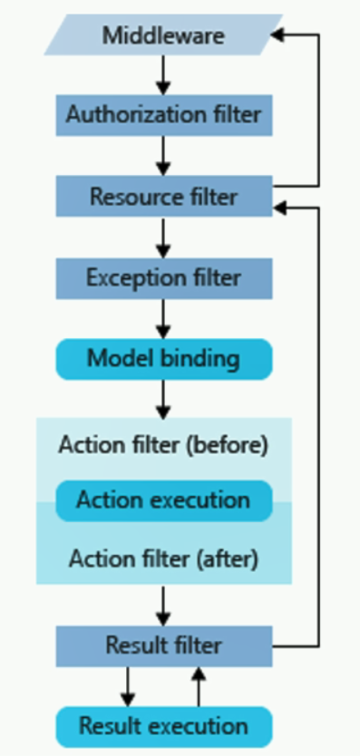

也可以使用中间件实现ResponseCache缓存

```C#
app.Use(next =>
{
    return new RequestDelegate(
        async context =>
        {
            context.Response.OnStarting(state =>
            {
                var httpContext = (HttpContext)state;
                if (httpContext.Request.Path.Value.Contains("Home", StringComparison.OrdinalIgnoreCase))
                {
                    httpContext.Response.Headers[HeaderNames.CacheControl] = "public,max-age=500";
                }
                return Task.CompletedTask;
            }, context);
            await next.Invoke(context);
            //context.Response.Headers[HeaderNames.CacheControl] = "public,max-age=60";//请求响应后是不能修改了
        });
});
```

## 服务端响应式缓存

1. 反向代理Nginx，页面缓存在代理中，不进入服务器。

2. ASP.NET中的缓存中间件

   1. service.AddResponseCaching() 注册
   2. app.UseResponseCaching() 应用中间件
   3. 配合ResponseCache特性，加在Controller的方法上。
   4. 实现不同浏览器访问同一地址，都得到在中间件中缓存的页面，内容数据相同。

3. 特性实现IResourceFilter

   ```C#
   public class CustomCacheResourceFilterAttribute : Attribute, IResourceFilter, IFilterMetadata, IOrderedFilter
   {
       private static Dictionary<string, IActionResult> _CustomCacheResourceFilterAttributeDictionary = new Dictionary<string, IActionResult>();
   
       public int Order => 0;
       public void OnResourceExecuting(ResourceExecutingContext context)
       {
           string key = context.HttpContext.Request.Path;
           if (_CustomCacheResourceFilterAttributeDictionary.ContainsKey(key))
           {
               context.Result = _CustomCacheResourceFilterAttributeDictionary[key];
               //拦截请求：没有进入Action，缓存的不是Html，是ActionResult
               //---需要执行Index()方法才能得到Html
           }
       }
       public void OnResourceExecuted(ResourceExecutedContext context)
       {
           string key = context.HttpContext.Request.Path;
           _CustomCacheResourceFilterAttributeDictionary.Add(key, context.Result);
       }
   }
   ```

   1. 第一次请求，生成后放入字典缓存中
   2. 第二次请求，直接从字典缓存中取到IActionResult，还需要替换视图中的数据。
   3. ViewTime实时变化，ActionTime不变的原因：ResourceFilter只缓存视图IActionResult，而非页面。

## 数据获取缓存

本地缓存，分布式缓存

autofac-aop模式提供。

1. nuget引用：Autofac.Extensions.DependencyInjection（IOC），Autofac.Extras.DyanmicProxy（AOP扩展）

2. 用AOP实现方法执行结果的缓存。

3. ```C#
   // 注册服务实例，并开启AOP扩展
   ContainerBuilder.RegisterType<UserService>().As<IUserService>()
       .EnableInterfaceInterceptors()
       .InterceptedBy(typeof(CustomAutofacCacheInterceptor));
   // 注册拦截器
   ContainerBuilder.RegisterType<CustomAutofacCacheInterceptor>();
   ```

4. ```C#
   // 实现拦截器 
   public class CustomAutofacCacheInterceptor : IInterceptor
       {
           private IDistributedCache _iDistributedCache = null;
           public CustomAutofacCacheInterceptor(IDistributedCache distributedCache)
           {
               this._iDistributedCache = distributedCache;
           }
   
           public void Intercept(IInvocation invocation)
           {
               Console.WriteLine($"invocation.Methond={invocation.Method}");
               Console.WriteLine($"invocation.Arguments={string.Join(",", invocation.Arguments)}");
               string key = $"{invocation.Method}-{string.Join(",", invocation.Arguments)}";
               string sResult = this._iDistributedCache.GetString(key);
               if (string.IsNullOrWhiteSpace(sResult))
               {
                   invocation.Proceed(); //继续执行
                   this._iDistributedCache.SetString(key, Convert.ToString(invocation.ReturnValue));
               }
               else
               {
                   invocation.ReturnValue = Convert.ChangeType(sResult, invocation.Method.ReturnType);
               }
               Console.WriteLine($"方法{invocation.Method}执行完成了");
           }
       }
   ```

## 缓存问题

1. 缓存预热：

   项目刚上线，或数据库重新启动，热点数据的缓存被清空，没有缓存保护，请求太多服务器容易挂掉

   解决：将数据先导入缓存

2. 缓存穿透：利用不存在的数据进行访问。

   短时间存储访问的结果key-null，或者存储所有有效key的信息，无效的过滤掉。

3. 缓存击穿：Redis中某个值突然过期，大量请求涌入，

   避免缓存失效，增删改数据时，只更新缓存，不删除。

   热点数据不过期。

4. 缓存雪崩：大量的key同时失效，数据压力大，导致死机

   随机过期时间，或不过期只更新，或者分布式缓存数据均衡分布。

**主要原因：并发高，在缓存和数据库直接增加分布式锁，缓存没有数据时，先获取锁，互斥访问数据库，保证只有一个请求访问数据，降低并发。**

# 异步队列

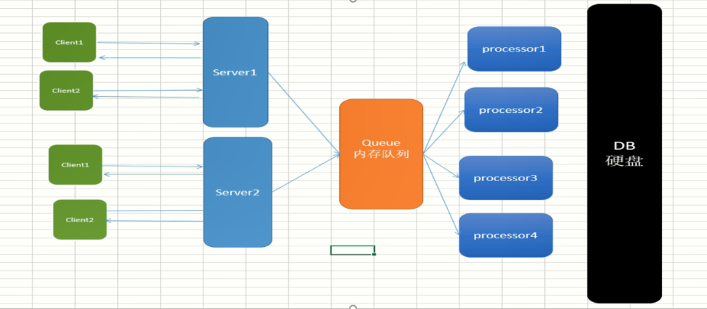

高并发问题：请求的操作远远大于服务器线程数，在单位时间内处理不过来，大量的请求不停的索要处理线程，造成系统卡死。

解决方法：异步处理，时间换空间。延长处理时间。

1. 异步处理，响应速度快，增强服务器的承载能力
2. 削峰，将某个时刻的流量高峰分解到时间段中处理。
3. 高可用，处理器的问题不会影响可用性，（任务存储在队列中，多个处理服务器，某个处理器出问题不影响）
4. 扩展性，使用异步队列做中间件，使提供的服务和业务处理解耦，可独立演化。实现多客户端，多处理器。

缺陷：

1. 时效性低，降低用户体验，只能业务妥协
2. 复杂性提高，包含交互规则，异常情况的处理。

队列包含：RabbitMQ，Redis-List（省技术栈），Kafka，RocketMQ....

## RabbitMQ

功能齐全高性能，共有三个角色，交换机，处理器，队列。

客户端将任务写入交换机中，由交换机分发给绑定的多个队列，处理器直接处理指定队列中的任务。

环境安装：

1. Erlang语言运行环境：http://www.erlang.org/downloads
2. RabbitMQ包：https://www.rabbitmq.com 
3. 安装后：访问http://localhost:15672/#/  进入图形化管理。用户名、密码都是guest

实操：

1. nuget引用，RabbitMQ.Client.

2. 客户端写入任务数据

   ```C#
   var factory = new ConnectionFactory();
   factory.HostName = "localhost";//RabbitMQ服务在本地运行
   factory.UserName = "guest";//用户名
   factory.Password = "guest";//密码
   
   // 生产者和消费者模式ExchangeType.Direct
   using (var connection = factory.CreateConnection())
   {
       using (IModel channel = connection.CreateModel())
       {
           channel.QueueDeclare(queue: "OrderOnly0416",
              durable: true,
              exclusive: false,
              autoDelete: false,
              arguments: null);
   
           channel.ExchangeDeclare(exchange: "OrderOnlyChange0416",
                  type: ExchangeType.Direct,
                  durable: true,
                  autoDelete: false,
                  arguments: null);
   
           channel.QueueBind(queue: "OrderOnly0416",
                       exchange: "OrderOnlyChange0416",
                       routingKey: string.Empty, arguments: null);
   
           Console.WriteLine("准备就绪,开始写入~~~");
           for (int i = 0; i < number; i++)
           {
               string message = $"Task{i}";
               byte[] body = Encoding.UTF8.GetBytes(message);
               channel.BasicPublish(exchange: "OrderOnlyChange0416",
                               routingKey: string.Empty,
                               basicProperties: null,
                               body: body);
               Console.WriteLine($"消息：{message} 已发送~");
           }
       }
   }
   
   // 订阅模式 ExchangeType.Fanout,
   using (var connection = factory.CreateConnection())
   {
       using (IModel channel = connection.CreateModel())
       {
           channel.ExchangeDeclare(exchange: "OrderAllChangeFanout",
                 type: ExchangeType.Fanout,
                 durable: true,
                 autoDelete: false,
                 arguments: null);
   
           channel.QueueDeclare(queue: "OrderAll",
              durable: true,
              exclusive: false,
              autoDelete: false,
              arguments: null);
   
           channel.QueueBind(queue: "OrderAll",
                       exchange: "OrderAllChangeFanout",
                       routingKey: string.Empty,
                       arguments: null);
   
           channel.QueueDeclare(queue: "SMSQueue",
                       durable: true,
                       exclusive: false,
                       autoDelete: false,
                       arguments: null);
   
           channel.QueueBind(queue: "SMSQueue",
                       exchange: "OrderAllChangeFanout",
                       routingKey: string.Empty,
                       arguments: null);
   
           channel.QueueDeclare(queue: "EmailQueue",
                       durable: true,
                       exclusive: false,
                       autoDelete: false,
                       arguments: null);
   
           channel.QueueBind(queue: "EmailQueue",
                     exchange: "OrderAllChangeFanout",
                     routingKey: string.Empty,
                     arguments: null);
   
           Console.WriteLine("准备就绪,开始写入");
           for (int i = 0; i < number; i++)
           {
               string message = $"来自{this._iConfiguration["port"]}的Task{i}";
               byte[] body = Encoding.UTF8.GetBytes(message);
               channel.BasicPublish(exchange: "OrderAllChangeFanout",
                               routingKey: string.Empty,
                               basicProperties: null,
                               body: body);
               Console.WriteLine($"消息：{message} 已发送");
           }
       }
   }
   
   ```

3. 处理器：读取数据，并处理，支持命令行参数

   dotnet ProcesssorProject.dll --id=2 --timespan=20

   ```C#
   #region 命令行参数
   var builder = new ConfigurationBuilder()
      .AddCommandLine(args);
   var configuration = builder.Build();
   string id = configuration["id"];
   int.TryParse(configuration["timespan"] ?? "1", out int timeSpan);
   string queueName = configuration["queue"];
   #endregion
   
   var factory = new ConnectionFactory();
   factory.HostName = "localhost";//RabbitMQ服务在本地运行
   factory.UserName = "guest";//用户名
   factory.Password = "guest";//密码
   
   // 生产者消费者
   using (var connection = factory.CreateConnection())
   {
       using (var channel = connection.CreateModel())
       {
           try
           {
               var consumer = new EventingBasicConsumer(channel);
               consumer.Received += (model, ea) =>
               {
                   var body = ea.Body;
                   var message = Encoding.UTF8.GetString(body);
                   Console.WriteLine($"消费者{id} 接受消息: {message} {Thread.CurrentThread.ManagedThreadId}");
                   Thread.Sleep(timeSpan);
               };
               channel.BasicConsume(queue: "OrderOnly0416",
                            autoAck: true,
                            consumer: consumer);
               Console.WriteLine(" Press [enter] to exit.");
               Console.ReadLine();
           }
           catch (Exception ex)
           {
               Console.WriteLine(ex.Message);
           }
       }
   }
   
   // 发布订阅
   using (var connection = factory.CreateConnection())
   {
       using (var channel = connection.CreateModel())
       {
           //声明交换机exchang
           channel.ExchangeDeclare(exchange: "OrderAllChangeFanout",
                                   type: ExchangeType.Fanout,
                                   durable: true,
                                   autoDelete: false,
                                   arguments: null);
           //声明队列SMSqueue
           channel.QueueDeclare(queue: queueName,
                                durable: true,
                                exclusive: false,
                                autoDelete: false,
                                arguments: null);
           //绑定
           channel.QueueBind(queue: queueName, exchange: "OrderAllChangeFanout", routingKey: string.Empty, arguments: null);
           //定义消费者                                      
           var consumer = new EventingBasicConsumer(channel);
           consumer.Received += (model, ea) =>
           {
               var body = ea.Body;
               var message = Encoding.UTF8.GetString(body);
               Console.WriteLine($"订阅{id}接收到消息：{message},完成{queueName}处理");
           };
           Console.WriteLine($"订阅{id}已经准备 {queueName} 就绪...");
           //处理消息
           channel.BasicConsume(queue: queueName,
                                autoAck: true,
                                consumer: consumer);
           Console.ReadLine();
       }
   }
   ```

   

主流模式

1. 生产者和消费者模式：一个消息只消费一次
2. 订阅模式：一个消息可以多个消费。

应用场景：

1. 异步化保证主流程的效率：注册后发短信或发邮件。冗余字段更新（比如创建用户名称，每个表都有，修改用户名后，所有表都更新）
2. 利用重试机制：调用第三方接口（失败后重试尝试，将任务放入队列中，用一个处理器处理，若失败，重新放入队列，一会后重试）
3. 延时队列：订单未支付限时取消。（比定时轮询好）
4. 即时通讯：群消息
5. 秒杀，抢购：根本问题是资源少，请求多，导致数据库挂掉。用队列拦截请求，分配处理资源，其余的请求不处理，前端进行轮询访问。

# 分布式系统

 进行业务拆分：从负载均衡服务器，到业务应用服务，缓存，数据库服务器，都拆分出新的。

分布式在流量支撑上可以理想为无限，但需要承担的问题：

1. 分布式锁
2. 分布式事务，数据一致性
3. 稳定性-可用性。

## CAP定理

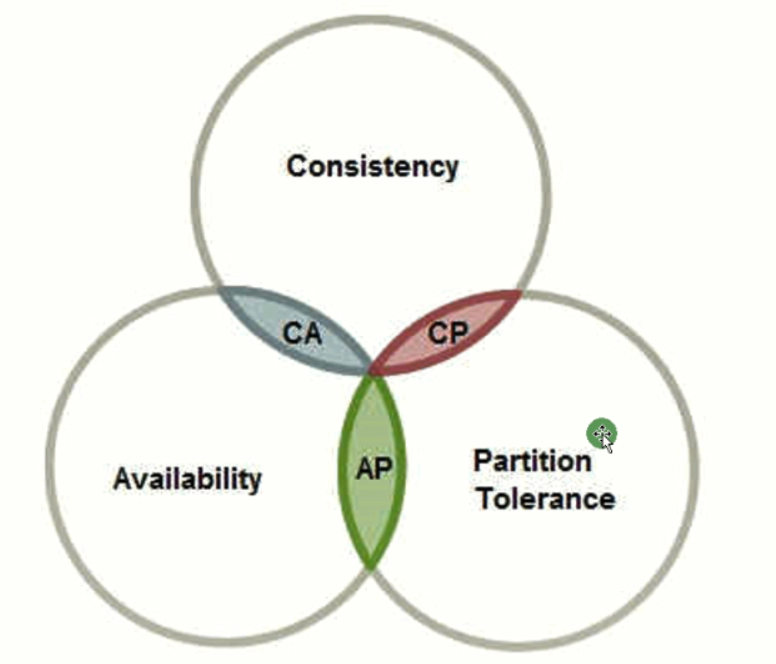

1. 数据一致性，数据正确。

2. 可用性，及时响应

3. 分区容错，集群里服务器存在延迟，丢包，错误，断网的问题。

   CAP不可能同时成立。

在分布式系统下，分区容错一定是成立的，可用性和一致性不能同时满足。

示例：两银行之间转账，应为银行都有自己的服务器，所以两个服务器之间交互，肯定有分区容错。

若要保证数据一致性，则先锁定，只有两个服务器的数据都更新成功以后，才可以查询；用户只能等待，无法及时响应，不能满足可用性。

若要保证可用性，则两个银行的数据因为延迟可能不一致，导致查询到错误数据，不能满足一致性。

### 2PC

two-phase commit protocol（强一致性），但没有可用性。

事务管理器加锁，全部都成功才提交。若失败都回滚。

使用场景很少，**因为分布式是可用性优先，只需要保证最终一致性。才能保证服务器正常，不会因为死锁而卡死。**

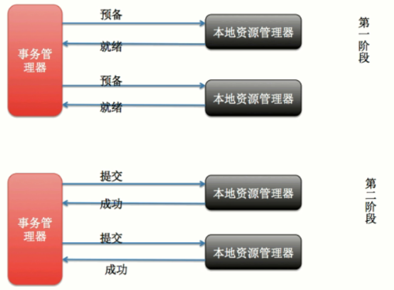

### TCC

**Try Confirm Cancel，保证最终一致性**。应用场景：转账。

try的时候，加额外的临时金额，存储更新后的金额，

commit时将临时金额更新到金额中，临时金额里存之前的金额。

cancel用临时金额的数据替换金额。

优点：逻辑严谨，缺点：开发成本高，所有事务逻辑都要按这个流程做，工作量大。

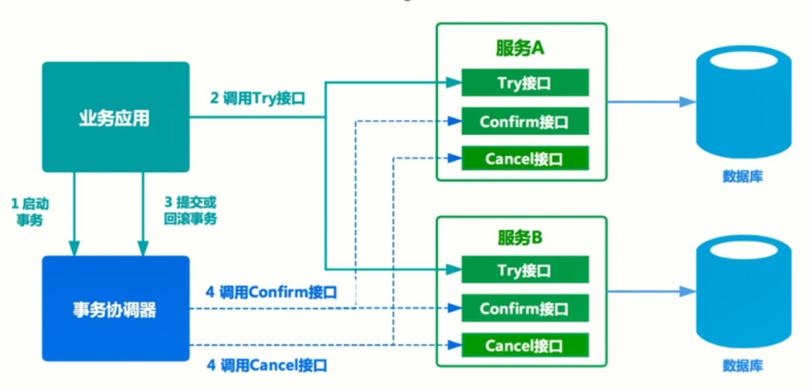

### 本地信息表

**MQ分布式事务，使用本地消息表，基于消息的一致性，来保证数据**

用消息队列，数据中转，服务调用执行失败时，不断重试（一直失败，就人工处理）。保证最终一致性。

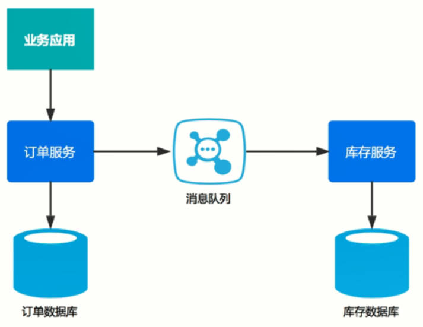

## 分布式锁

单进程下，多线程操作对象，用lock锁，保证对象在任意时刻只能一个线程进入

多进程（分布式）下，集群中，用分布式锁，保证只有一个服务操作数据库。

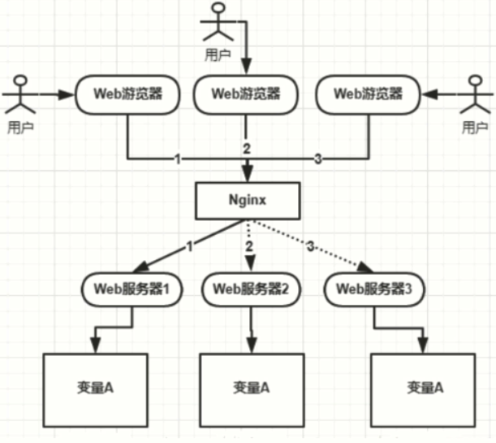

1. 基于数据库的实现

   建表，用方法字段做唯一索引，若库中有数据，则无法操作，进行等待。

   获取锁：增加一条数据；释放锁：删除该数据。

   问题：数据库的可用性无法保证，效率低，锁信息未释放（需要定期清理）

   锁的重入：同一个线程可以获取锁。因为锁是加在线程上的。数据中增加GUID字段，保证访问到是自己加的锁时，继续使用。

   锁等待：需要设置重试机制。

2. 基于Redistribution实现

   共享存储，读写快，操作时原子性。

   加锁setnx，释放锁delete，锁过期时间。

   若加锁后，但处理慢，锁过期：两个线程进入同一方法，线程1可能把线程2的锁释放掉。

   解决方案：守护线程，定期更新有效期，保证线程1执行中，锁一直有效，直到自己主动释放。

## 可用性

1. 服务实例集群：保证高可用，可伸缩。

2. 负载均衡，服务注册与发现，健康检查。

3. Nginx单纯时负载均衡，无法做到动态伸缩，增加节点后需要重新加载配置文件。调度策略都写死。

   Consul，可由服务决定调度策略。

   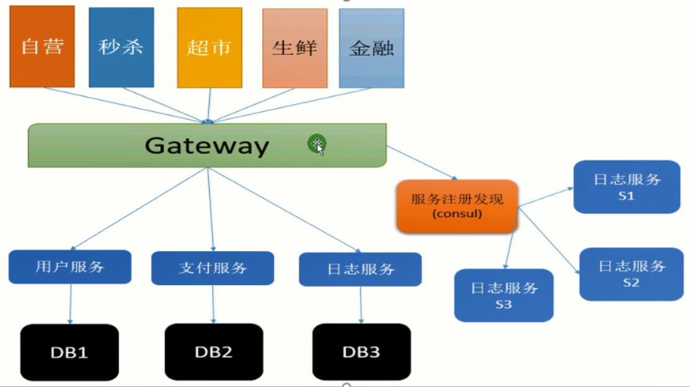

# 总结

问题解决方法：

1. 钱能解决，用钱解决，买服务
2. 钱不能解决，靠技术解决，
3. 技术不能解决，靠业务解决，