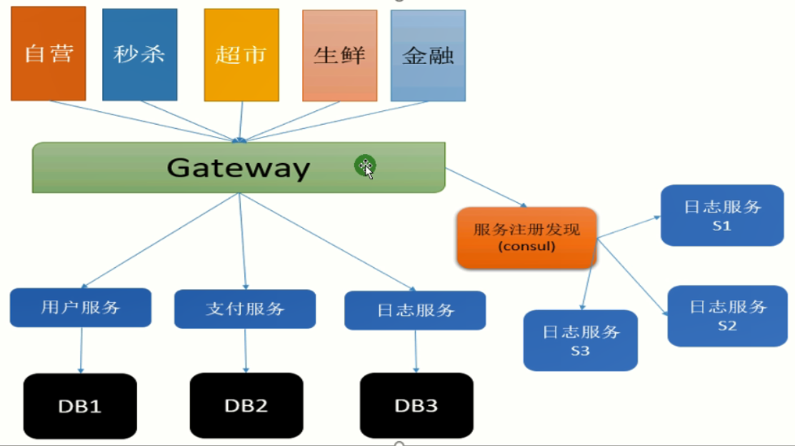

# 技术发展

**业务演进是技术发展的第一推动力。**

## 单体架构Monolithic

应用程序就是一个项目，在一个进程里运行

1. 优点：开发简单，集中管理，没有分布式损耗
2. 缺点：不好维护，升级困难，无法快速迭代

## 垂直拆分

分成各个子系统，独立部署和维护，分而治之。

缺点：还是单体架构，拆分越多，存储越复杂，系统间重复的功能也越多。


## 分布式服务

由一系列的服务组成系统，

1. 独立开发，部署，维护，独立运行
2. 分布式管理，强调隔离性
3. 分布式技术成熟后，常常当作解耦，分流的手段


## 微服务

微服务架构是一个用分布式服务拆分业务逻辑，完成解耦的架构模式，也是分布式的一种。

它是一种架构概念，通过将功能分解到各个离散的服务中以实现解决方案的解耦。

概念：把一个大型的单个应用程序和服务，拆分成多个支持的微服务，可扩展单个组件而不是整个应用程序堆栈，从而满足服务等级协议。

## SOA面向服务架构

Service-Oriented Architecture面向服务架构：是一个组件模型，它将应用程序的不同功能单元进行拆分，并通过这些服务之间定义良好的接口和协议联系起来，

使用场景：整合多个单体业务系统


## SOA VS Micro Service

1. SOA是为了重用，微服务为了重写
2. SOA更水平，微服务是垂直的
3. SOA是自上而下，微服务是自下而上
4. SOA是中介者Mediator模式，微服务是门面Facade模式

# 微服务

## 定义

架构基础：

1. 服务的高可用：集群
2. 服务的可伸缩：网关（处理能力能动态增加和减少）

核心：

1. 服务注册和发现
2. 负载均衡

实现：

1. 把不同业务应用的相同的功能拆出来，独立开发部署，等同于把以前调用方法换成调用一个服务。
2. 做成集群实现高可用后，使用RPC进行调用和管理，如Dubbo（分布式服务调度）

## 发展的三个阶段

### 1.0 集中式代理Nginx

服务注册发现和负载均衡（调度策略）都需要人工配置


### 2.0 客户端嵌入Consul

功能强大，实现：

1. 负载均衡：在客户端S-A种实现，客户端集成复杂。
2. 服务注册和发现：自动发现和注册，下线
3. 健康检查
4. 服务治理：熔断，限流，降级


### 3.0 服务网格Service Mesh

主机+代理实现，统一管理


## 架构2.0核心

集群：

1. 微服务的第一要务：集群，多个完全相同的实例都可独立完成业务处理
2. 多个相同的服务实例组成集群，并使用服务注册发现，网关的请求发送给consul



### 服务实例

命令行参数支持，启动多个服务实例：多个进程协作完成（分布式）

1. 在D:\GitHub\NET\NET6\code\ADF.Web\bin\Debug\net6.0目录下执行命令

   dotnet ADF.Web.dll --urls=http://*:5188 --ip="127.0.0.1"  --port=5188（直接运行）

2. 或者dotnet run ADF.Web --urls=http://*:5188 --ip="127.0.0.1" --port=5188（先编译，再运行）

注意：多个服务的端口必须唯一，不重复，且没被占用。一个端口不能被多个服务实例监听。

错误：Unable to start Kestrel; SocketException(10013): 以一种访问权限不允许的方式做了一个访问套接字的尝试。

### Consul

官网：https://www.consul.io/

启动：在安装目录下执行 consul.exe agent -dev

默认监听端口：8500.

可视化服务管理页面：http://localhost:8500

**解决的问题：**

1. 服务注册和发现，调用
2. 实现健康检查：在服务注册时，增加检查的回调函数。

问题： 客户端得到服务实例的地址，直接访问，导致所有的服务实例都会暴露给客户端，需要网关保护。

Nuget 引入 Consul，Newtonsoft.Json

#### 客户端代码

web项目，HomeController.cs中

```C#
// 1.0 通过url直接访问指定的服务实例
string url =  "http://localhost:5726/api/users/all";

// 基于HttpClient完成服务调用
using (HttpClient httpClient = new HttpClient())
{
    HttpRequestMessage message = new HttpRequestMessage();
    message.Method = HttpMethod.Get;
    message.RequestUri = new Uri(url);
    var result = httpClient.SendAsync(message).Result;
    string content = result.Content.ReadAsStringAsync().Result;
    return content;
}

// 2.0 通过Nginx转发，配置多个服务实例的url，实现负载均衡
upstream Microservice{
    server localhost:5726;
    server localhost:5727;
    server localhost:5728;
    #默认是轮询
}
server {
    listen       8088;
    server_name  localhost;
    location / {
       proxy_pass   http://Microservice;
    }
}
// 启动Nginx：start nginx.exe
// 只知道nginx地址,nginx配置的端口是8080
string url = "http://localhost:8080/api/users/all";

// Consul服务发现和调用，
ConsulClient client = new ConsulClient(c =>
{
    c.Address = new Uri("http://localhost:8500/");
    c.Datacenter = "dc1";
});
// 异步获取所有已注册的服务信息。并遍历。
var response = client.Agent.Services().Result.Response;
foreach (var item in response)
{
    Console.WriteLine("***************************************");
    Console.WriteLine(item.Key);
    var service = item.Value;
    Console.WriteLine($"{service.Address}--{service.Port}--{service.Service}");
    Console.WriteLine("***************************************");
}
// 调用指定的服务，是服务注册时的组名Name，很像DNS
string url= "http://UserService/api/users/all";
Uri uri = new Uri(url);
string groupName = uri.Host; // UserService
AgentService agentService = null;
var serviceDictionary = response.Where(s => s.Value.Service.Equals(groupName, StringComparison.OrdinalIgnoreCase)).ToArray();
// 实现负载均衡，指定任意一个服务来调用。
{
    //轮询策略 也是平均，但是太僵硬了
    agentService = serviceDictionary[iIndex++ % serviceDictionary.Length].Value;
    //平均策略--随机获取索引--相对就平均
    agentService = serviceDictionary[new Random(iIndex++).Next(0, serviceDictionary.Length)].Value;
    //权重策略--能给不同的实例分配不同的压力---注册时提供权重
    List<KeyValuePair<string, AgentService>> pairsList = new List<KeyValuePair<string, AgentService>>();
    foreach (var pair in serviceDictionary)
    {
        //服务注册时提供的标签(权重)：1   5   10
        int count = int.Parse(pair.Value.Tags?[0]);
        for (int i = 0; i < count; i++)
        {
            pairsList.Add(pair);
        }
    } 
    agentService = pairsList.ToArray()[new Random(iIndex++).Next(0, pairsList.Count())].Value; 
}
// 使用HttpClient完成服务调用
url = $"{uri.Scheme}://{agentService.Address}:{agentService.Port}{uri.PathAndQuery}";

// 静态字段，暂不考虑线程安全
private static int iIndex = 0;
```

#### 服务端代码

webAPI项目

```C#
// Program.cs
// 根据启动服务实例的不同端口，建立集群，
builder.Configuration.SetBasePath(Directory.GetCurrentDirectory())
    .AddCommandLine(args).Build();

// Consul的服务注册
this.Configuration.ConsulRegist();
// 增加配置的扩展方法
public static void ConsulRegist(this IConfiguration configuration)
{
    ConsulClient client = new ConsulClient(c =>
    {
        // consul程序启动的地址
        c.Address = new Uri("http://localhost:8500/");
        c.Datacenter = "dc1";
    });

    string ip = configuration["ip"];
    int port = int.Parse(configuration["port"]);//命令行参数必须传入
    int weight = string.IsNullOrWhiteSpace(configuration["weight"]) ? 1 : int.Parse(configuration["weight"]);
    client.Agent.ServiceRegister(new AgentServiceRegistration()
    {
        ID = "service" + Guid.NewGuid(),//唯一的标识
        Name = "UserService",//组名称-Group 
        Address = ip,//其实应该写ip地址
        Port = port,//不同实例
        Tags = new string[] { weight.ToString() },
        // 服务的健康检查
        Check = new AgentServiceCheck()
        {
            Interval = TimeSpan.FromSeconds(12),//间隔12s一次
            HTTP = $"http://{ip}:{port}/Api/Health/Index",
            Timeout = TimeSpan.FromSeconds(5),//检测等待时间
            DeregisterCriticalServiceAfter = TimeSpan.FromSeconds(20)//失败后多久移除
        }
    });
    //命令行参数获取
    Console.WriteLine($"{ip}:{port}--weight:{weight}");
}

// UsersController.cs
// 服务接口
[HttpGet]
[Route("All")]
public IEnumerable<User> Get()
{
    Console.WriteLine($"This is UsersController {this._iConfiguration["port"]} Invoke");

    return this._iUserService.UserAll().Select(u => new User()
    {
        Id = u.Id,
        Account = u.Account,
        Name = u.Name,
        Role = $"{ this._iConfiguration["ip"]}{ this._iConfiguration["port"]}",
        Email = u.Email,
        LoginTime = u.LoginTime,
        Password = u.Password
    });
}

// HealthController.cs
// 服务健康检查接口
[HttpGet]
[Route("Index")]
public IActionResult Index()
{
    Console.WriteLine($"This is HealthController  {this._iConfiguration["port"]} Invoke");
    return Ok();//只是个200  占空间最小
}
```

### 网关Gateway

类似门面模式：所有客户端只能通过网关访问服务

Gateway的核心是路由，而集群的管理和服务的选择由Nginx，Consul负责，

**解决的问题：**

1. 保护服务实例：使用网络路由映射，管理请求和服务的关系 
2. 客户端服务端解耦，简化客户端操作
3. 服务治理：单个服务的降级，下线，升级，更新或授权。

#### Ocelot请求路由

是一个第三方的网关框架。

官网：https://threemammals.com/ocelot

源码：https://github.com/ThreeMammals/Ocelot

学习：https://ocelot.readthedocs.io/en/latest/index.html

实现代码：

1. webAPI程序GatewayApp中，nuget引入Ocelot 和Consul包

2. 配置：downstream（网关下发的服务），upstream(上层客户端访问的网关地址)

3. 流程：客户端访问网关，网关再转发给服务

4. 启动程序: dotnet GatewayApp.dll --urls=http://*:6299--ip="127.0.0.1"  --port=6299

   客户端调用：https://localhost:6299/T5726/users/all

5. ```C#
   // Program.cs 启动
   // 读取配置文件
   builder.Configuration.AddJsonFile("configuration.json", optional: false, reloadOnChange: true);
   // 注册实例
   builder.Services.AddOcelot();
   // 整个进程的管道换成Ocelot的默认管道
   app.UseOcelot();
   
   // 或者自定义管道（管道扩展）
   var pipeConfig = new OcelotPipelineConfiguration{
       // 管道扩展-中间件
       PreQueryStringBuilderMiddleware = async (context, next)=>{
           await Task.Run(()=>Console.Writeline($"This is custom Middle {context.HttpContext.Request.Path}"));
           await next.Invoke();
       }
   }
   app.UseOcelot(pipeConfig);
   
   //configuration.json 配置；动态路由，优先级
   //*****************************单地址(T5726)******************************
   {
     "ReRoutes": [
       {
         "DownstreamPathTemplate": "/api/{url}", //服务地址--url变量
         "DownstreamScheme": "http",
         "DownstreamHostAndPorts": [
           {
             "Host": "localhost",
             "Port": 5726 //服务端口
           } 
         ],
         "UpstreamPathTemplate": "/T5726/{url}", //网关地址--url变量   //冲突的还可以加权重Priority
         "UpstreamHttpMethod": [ "Get", "Post" ]
       }
     ]
   }
   //*****************************单地址全匹配********************************
   {
     "ReRoutes": [
       {
         "DownstreamPathTemplate": "/{url}", //服务地址--url变量
         "DownstreamScheme": "http",
         "DownstreamHostAndPorts": [
           {
             "Host": "localhost",
             "Port": 5726 //服务端口
           }
         ],
         "UpstreamPathTemplate": "/{url}", //网关地址--url变量   //冲突的还可以加权重Priority
         "UpstreamHttpMethod": [ "Get", "Post" ]
       }
     ]
   }
   //*****************************多地址多实例********************************
   {
     "ReRoutes": [
       {
         "DownstreamPathTemplate": "/api/{url}", //服务地址--url变量
         "DownstreamScheme": "http",
         "DownstreamHostAndPorts": [
           {
             "Host": "localhost",
             "Port": 5726 //服务端口
           } //可以多个，自行负载均衡
         ],
         "UpstreamPathTemplate": "/T5726/{url}", //网关地址--url变量   //冲突的还可以加权重Priority
         "UpstreamHttpMethod": [ "Get", "Post" ]
       },
       {
         "DownstreamPathTemplate": "/api/{url}", //服务地址--url变量
         "DownstreamScheme": "http",
         "DownstreamHostAndPorts": [
           {
             "Host": "localhost",
             "Port": 5727 //服务端口
           }
         ],
         "UpstreamPathTemplate": "/T5727/{url}", //网关地址--url变量
         "UpstreamHttpMethod": [ "Get", "Post" ]
       }
     ]
   }
   //MVC的路由规则是近水楼台先得月,匹配多个选第一个
   //**********************路由冲突+带权匹配(加权重Priority)*********************
   {
     "ReRoutes": [
       {
         "DownstreamPathTemplate": "/{url}", //服务地址--url变量
         "DownstreamScheme": "http",
         "DownstreamHostAndPorts": [
           {
             "Host": "localhost",
             "Port": 5726 //服务端口
           }
         ],
         "UpstreamPathTemplate": "/{url}", //网关地址--url变量  
         "UpstreamHttpMethod": [ "Get", "Post" ],
         "Priority": 0 //默认是0 加个1
       },
       {
         "DownstreamPathTemplate": "/api/users/get?id={id}", //服务地址--url变量
         "DownstreamScheme": "http",
         "DownstreamHostAndPorts": [
           {
             "Host": "localhost",
             "Port": 5727 //服务端口
           }
         ],
         "UpstreamPathTemplate": "/api/users/get/{id}", //网关地址--url变量  
         "UpstreamHttpMethod": [ "Get", "Post" ],
         "Priority": 1 //默认是0 加个1
       },
       {
         "DownstreamPathTemplate": "/api/users/{url}?id={id}", //服务地址--url变量
         "DownstreamScheme": "http",
         "DownstreamHostAndPorts": [
           {
             "Host": "localhost",
             "Port": 5728 //服务端口
           }
         ],
         "UpstreamPathTemplate": "/api/users/{url}/{id}", //网关地址--url变量 
         "UpstreamHttpMethod": [ "Get", "Post" ],
         "Priority": 2 //默认是0 加个1
       }
     ]
   }
   
   //*****************************单地址多实例负载均衡********************************
   {
     "ReRoutes": [
       {
         "DownstreamPathTemplate": "/api/{url}", //服务地址--url变量
         "DownstreamScheme": "http",
         "DownstreamHostAndPorts": [
           {
             "Host": "localhost",
             "Port": 5726 //服务端口
           } 
           ,
           {
             "Host": "localhost",
             "Port": 5727 //服务端口
           },
           {
             "Host": "localhost",
             "Port": 5728 //服务端口
           }
         ],
         "UpstreamPathTemplate": "/T/{url}", //网关地址--url变量   //冲突的还可以加权重Priority
         "UpstreamHttpMethod": [ "Get", "Post" ],
         "LoadBalancerOptions": {
           "Type":"RoundRobin" //轮询 //"LeastConnection" //最少连接数的服务器  "NoLoadBalance" //不负载均衡  //"CookieStickySessions" //会话粘滞  //
         }
         //"LoadBalancerOptions": {
         //  "Type": "CookieStickySessions",
         //  "Key": "ASP.NET_SessionId",
         //  "Expiry": 1800000
         //}
       }
     ]
   }
   ```

#### 配合Consul

Ocelot无法实现动态服务注册和发现，以及健康检查，只能手动更改配置，再重启Ocelot服务，

所以需要配合Consul，

```C#
// Program.cs
// 注册实例
builder.Services.AddOcelot().AddConsul();

// 配置
*****************************单地址多实例负载均衡+Consul********************************
{
  "ReRoutes": [
    {
      "DownstreamPathTemplate": "/api/{url}", //服务地址--url变量
      "DownstreamScheme": "http",
      "UpstreamPathTemplate": "/T/{url}", //网关地址--url变量
      "UpstreamHttpMethod": [ "Get", "Post" ],
      "UseServiceDiscovery": true, // 使用服务发现
      "ServiceName": "UserService", //consul服务名称
      "LoadBalancerOptions": {
        "Type": "RoundRobin" //轮询      LeastConnection-最少连接数的服务器   NoLoadBalance不负载均衡
      }
    }
  ],
  "GlobalConfiguration": {
    "BaseUrl": "http://127.0.0.1:6299", //网关对外地址
    "ServiceDiscoveryProvider": {
      "Host": "localhost",
      "Port": 8500,
      "Type": "Consul" //由Consul提供服务发现, 每次请求去consul那得到服务地址，再调用
    },
    // 或者使用主动获取服务的方式
    "ServiceDiscoveryProvider": {
      "Host": "localhost",
      "Port": 8500,
      "Type": "PollConsul", //主动查询Consul的服务, 降低网关和Consul通信频率
      "PollingInterval": 1000 //轮询consul的服务,频率毫秒--down掉是不知道的，1000毫秒内所有的请求，不再去Consul那获取服务，使用已获取好的。
      //"Token": "footoken"//需要ACL的话
    }
  }
}
```

#### 反向代理缓存

引入Ocelot.Cache.CacheManager，使用默认Cache

```C#
// Program.cs
// 注册实例
services.AddCacheManager(x =>
    {
        x.WithDictionaryHandle();//默认字典存储（内存）
    })

// 配置 configuration.json
//*****************************Consul+缓存cache********************************
{
  "ReRoutes": [
    {
      "DownstreamPathTemplate": "/api/{url}", //服务地址--url变量
      "DownstreamScheme": "http",
      "UpstreamPathTemplate": "/T/{url}", //网关地址--url变量
      "UpstreamHttpMethod": [ "Get", "Post" ],
      "UseServiceDiscovery": true,
      "ServiceName": "UserService", //consul服务名称
      "LoadBalancerOptions": {
        "Type": "RoundRobin" //轮询 
      },
      // 文件缓存配置
      "FileCacheOptions": {
        "TtlSeconds": 15,
        "Region": "UserCache" //可以调用Api清理
      }
    }
  ],
  "GlobalConfiguration": {
    "BaseUrl": "http://127.0.0.1:6299", //网关对外地址
    "ServiceDiscoveryProvider": {
      "Host": "localhost",
      "Port": 8500,
      "Type": "PollConsul", //主动查询Consul的服务, 降低网关和Consul通信频率
      "PollingInterval": 1000 //轮询consul的服务,频率毫秒--down掉是不知道的，1000毫秒内所有的请求，不再去Consul那获取服务，使用已获取好的。
      //"Token": "footoken"//需要ACL的话
    }
  }
}
```

客户端调用：https://localhost:6299/T/users/all，响应的结果会缓存起来，下次请求不再查询服务。

使用自定义缓存，重写OcelotCache

```C#
// 自定义缓存继承默认缓存的约束，服务的依赖注入的映射中，使用新的实例替换旧的
services.AddSingleton<IOcelotCache<CachedResponse>, CustomCache>();

/// <summary>
/// 自定义的Cache 实现IOcelotCache<CachedResponse>
/// </summary>
public class CustomCache : IOcelotCache<CachedResponse>
{
    private class CacheDataModel
    {
        public CachedResponse CachedResponse { get; set; }
        public DateTime Timeout { get; set; }
        public string Region { get; set; }
    }

    private static Dictionary<string, CacheDataModel> CustomCacheDictionary = new
         Dictionary<string, CacheDataModel>();

    /// <summary>
    /// 没做过期清理  所以需要
    /// </summary>
    /// <param name="key"></param>
    /// <param name="value"></param>
    /// <param name="ttl"></param>
    /// <param name="region"></param>
    public void Add(string key, CachedResponse value, TimeSpan ttl, string region)
    {
        Console.WriteLine($"This is {nameof(CustomCache)}.{nameof(Add)}");
        //CustomCacheDictionary.Add(key, new CacheDataModel()
        //{
        //    CachedResponse = value,
        //    Region = region,
        //    Timeout = DateTime.Now.Add(ttl)
        //});
        CustomCacheDictionary[key] = new CacheDataModel()
        {
            CachedResponse = value,
            Region = region,
            Timeout = DateTime.Now.Add(ttl)
        };
    }

    public void AddAndDelete(string key, CachedResponse value, TimeSpan ttl, string region)
    {
        Console.WriteLine($"This is {nameof(CustomCache)}.{nameof(AddAndDelete)}");
        CustomCacheDictionary[key] = new CacheDataModel()
        {
            CachedResponse = value,
            Region = region,
            Timeout = DateTime.Now.Add(ttl)
        };
    }

    public void ClearRegion(string region)
    {
        Console.WriteLine($"This is {nameof(CustomCache)}.{nameof(ClearRegion)}");
        var keyList = CustomCacheDictionary.Where(kv => kv.Value.Region.Equals(region)).Select(kv => kv.Key);
        foreach (var key in keyList)
        {
            CustomCacheDictionary.Remove(key);
        }
    }

    public CachedResponse Get(string key, string region)
    {
        Console.WriteLine($"This is {nameof(CustomCache)}.{nameof(Get)}");
        if (CustomCacheDictionary.ContainsKey(key) && CustomCacheDictionary[key] != null
            && CustomCacheDictionary[key].Timeout > DateTime.Now
            && CustomCacheDictionary[key].Region.Equals(region))
        {
            return CustomCacheDictionary[key].CachedResponse;
        }
        else
            return null;
    }
}
```

#### 服务治理

雪崩效应：微服务架构下，单个服务的故障，造成请求等待，处理中止，在串行的流程中，会引发系列服务故障，无法响应，然后请求量堆积，导致服务挂掉。

治理方案：Nuget引入Ocelot.Provider.Polly，故障处理

1. 超时机制：若服务未能在规定时间内响应，则回复失败的消息。

   配置QoSOptions中 TimeoutValue。

2. 熔断机制：使用断路器来检测故障是否已解决，防止请求反复尝试执行一个可能失败的操作，从而减少等待纠正故障的时间。、

   若当前服务多次调用失败，则在一段时间内该服务被熔断，不被访问。

3. 限流机制：限制单位时间内的请求数，超过就返回指定信息

   保护机制，QPS不超过1w，**配置缓存后，限流优先于缓存**。

4. 降级机制：满足一定条件，直接关闭服务（比如双十一时，关闭评论功能）

   网关降级：超时，熔断，限流

   下端降级：关闭服务

   上端降级：不再调用。

   ```C#
   // 超时的测试接口
   [HttpGet]
   [Route("Timeout")]
   public IEnumerable<User> Timeout()
   {
       Thread.Sleep(5000);//休息5000ms
       Console.WriteLine($"This is UsersController {this._iConfiguration["port"]} Invoke Timeout");
       return this._iUserService.UserAll().Select(u => new User()
       {
           Id = u.Id,
           Account = u.Account,
           Name = u.Name,
           Role = $"{ this._iConfiguration["ip"]}:{ this._iConfiguration["port"]}",
           Email = u.Email,
           LoginTime = u.LoginTime,
           Password = u.Password
       });
   }
   
   // 配置瞬间故障处理polly configuration.json
   //*****************超时+限流+熔断+降级+Consul+Polly***********************
   {
     "ReRoutes": [
       {
         "DownstreamPathTemplate": "/api/{url}", //服务地址--url变量
         "DownstreamScheme": "http",
         "UpstreamPathTemplate": "/T/{url}", //网关地址--url变量
         "UpstreamHttpMethod": [ "Get", "Post" ],
         "UseServiceDiscovery": true,
         "ServiceName": "UserService", //consul服务名称
         "LoadBalancerOptions": {
           "Type": "RoundRobin" //轮询 
         },
         // 限流机制
         "RateLimitOptions": {
           "ClientWhitelist": [ "eleven", "seven" ], //白名单 ClientId 区分大小写
           "EnableRateLimiting": true,
           "Period": "5m", //1s, 5m, 1h, 1d 以5分钟为单位进行统计
           "PeriodTimespan": 30, //多少秒之后客户端可以重试
           "Limit": 5 //统计时间段内允许的最大请求数量
         },
         // 超时和熔断，断路器
         "QoSOptions": {
           "ExceptionsAllowedBeforeBreaking": 3, //允许多少个异常请求
           "DurationOfBreak": 10000, // 熔断的时间，单位为ms
           "TimeoutValue": 4000 //如果下游请求的处理时间超过多少则自如将请求设置为超时 默认90秒
         },
         // 缓存
         "FileCacheOptions": {
             "TtlSeconds": 15,
             "Region": "UserCache" //标识，可以调用Api清理
           }
       }
     ],
     "GlobalConfiguration": {
       "BaseUrl": "http://127.0.0.1:6299", //网关对外地址
       "ServiceDiscoveryProvider": {
         "Host": "localhost",
         "Port": 8500,
         "Type": "Consul" //由Consul提供服务发现
       },
       // 请求太多时，返回的执行信息
       "RateLimitOptions": {
         "QuotaExceededMessage": "Too many requests, maybe later? 11", // 当请求过载被截断时返回的消息
         "HttpStatusCode": 666 // 当请求过载被截断时返回的http status
       }
     }
   }
   ```

#### 聚合请求

将多个请求打包，一次调用一次返回。

```C#
*****************************请求聚合aggregator********************************
{
  "ReRoutes": [
    {
      "DownstreamPathTemplate": "/api/users/all", //服务地址--url变量
      "DownstreamScheme": "http",
      "DownstreamHostAndPorts": [
        {
          "Host": "localhost",
          "Port": 5726 //服务端口
        } //可以多个，自行负载均衡
      ],
      "UpstreamPathTemplate": "/T5726/users/all", //网关地址--url变量   //冲突的还可以加权重Priority
      "UpstreamHttpMethod": [ "Get", "Post" ],
      "key": "T5726"
    },
    {
      "DownstreamPathTemplate": "/api/users/all", //服务地址--url变量
      "DownstreamScheme": "http",
      "DownstreamHostAndPorts": [
        {
          "Host": "localhost",
          "Port": 5727 //服务端口
        }
      ],
      "UpstreamPathTemplate": "/T5727/users/all", //网关地址--url变量
      "UpstreamHttpMethod": [ "Get", "Post" ],
      "key": "T5727"
    }
  ],
  "Aggregates": [
    {
      "ReRouteKeys": [
        "T5726",
        "T5727"
      ],
      "UpstreamPathTemplate": "/UserAggregator",
      // "Aggregator": "UserAggregator"//自定义聚合器
    }
  ]
}
```

客户端调用：https://localhost:6299/UserAggregator

将两个服务的响应数据用Json拼起来，用ReRouteKeys做主键区分。

限制：响应Response的其它数据都不要，若其中某个服务响应错误，用null拼接

自定义聚合器

```C#
// 注册服务实例,
builder.Services.AddSingletonDefinedAggregator<UserAggregator>();

// 配置中 
"Aggregator": "UserAggregator"//自定义聚合器
    
// 自定义聚合器
public class UserAggregator : IDefinedAggregator{
    public async Task<DownstreamResponse> Aggregate(List<DownstreamContext> response){
        List<string> results=new List<string>();
        var contentBuilder=new StringBuilder();
        contentBuilder.Append("{");
        foreach(var down in responses)
        {
            string content = await down.DownstreamResponse.Content.ReadAsStringAsync()
            results.Add($"\{Guid.NewGuid()}:{content}");
        }
        return results; 
    }
}
```

### 鉴权&授权中心

http无状态，第一次请求和第二次请求没有联系

#### 鉴权发展

1. 传统用户识别：基于cookie-session，把用户信息保存在服务器上，每次请求带上标识匹配权限

   流程：登录成功后，服务器返回一个GUID（sessionid），服务端和客户端都存一份。以后的每一次请求都带着sessionid

   缺点：无法横向扩展。

2. 集群-用户认证：

   Session共享：使用redis存储session，无法适用于微服务架构

   会话粘滞：同一用户的请求分配同一服务。

   请求附带：如cookie，但由安全问题，容易泄露，**token解决了安全性**

Token安全问题：

1. Token生成：使用不对称可逆加密，私钥加密只有对应的公钥才能 解密，证明token来源
2. 保护token ，使用SSL
3. 有限制的token，时间有限

#### JWT

1. 轻量级，Json-Web-Token模式（去中心化）
2. 实现：
   1. 授权：一旦用户登录，每个后序请求将包括JWT，允许用户访问该令牌允许的路由，服务和资源。实现SSO（Single Sign On)单点登录，开销小，能在不同的域中使用。
   2. 信息交换：各方之间可以安全传输信息，因为JWT可以签名。使用公钥私钥对，可以确定发件人是他们所说的人；使用标头和有效负载计算签名，可以验证内容是否被篡改。
3. JWT令牌结构：Header头，Payload负载，Signature：防止抵赖和篡改
4. https://jwt.io/debuger

#### IdentityServer4

1. 实现了OpenId  Connect 和OAuth2.0协议。ASP.NET Core中的认证授权中间件。

2. 构建**鉴权中心**，新建WebAPI：MicroserviceAuthCenter，nuget引入**IdentityServer4**；

   ```C#
   // 注册服务
   builder.Services.AddIdentityServer()
      .AddDeveloperSingningCredential() // 默认的开发者证书，正式环境需要安装私钥的管理
      .AddInMemoryClients(InitConfig.GetClients())
      .AddInMemoryApiResources(InitConifg.GetApiResources());
   // 添加认证中间件
   app.UseIdentityServer();
   
   // 自定义管理信息
   public class InitConfig{
       // 返回多个API Resource。
       public static IEnumerable<ApiResource> GetApiResources()
       {
           return new []{
               new ApiResource("UserAPI","用户获取API");
           };
       }
       
       // 定义验证条件的Clients 
       public static IEnumerable<Client> GetClients()
       {
           return new []{
               new Client{
                   //客户端唯一标识
                   ClentId = "MicroserviceClent",
                   // 用Sha256加密的客户端密码
                   ClientSecrets = new [] { new Secret("pwd123",Sha256())},
                   // 授权方式，客户端验证，只要ClentId，ClientSecrets
                   AllowedGrantTypes = GrantTypes.ClientCredentials,
                   // 允许访问的资源
                   AllowScopes = new [] {"UserApi"},
                   Claims = new List<Claim>(){
                      new Claim(IdentityModel.JwtClaimTypes,"Admin") 
                   }
               }
           }
       }
   }
   ```

3. 启动MicroserviceClient程序

   dotnet  MicroserviceAuthCenter.dll --urls:http://localhost:7200 --port=7200

   IdentityServer4默认提供token获取接口http://localhost:7200/connect/token

   使用postman，请求http://localhost:7200/connect/token，参数client_id=MicroserviceClent，client_secret=pwd123，grant_type=client_credentials

4. **访问接口时的权限验证**，新建WebAPI：AuthServer，nuget引入**IdentityServer.AccessTokenValidation**

   ```C#
   // 配置如何鉴权：访问鉴权中心程序
   builder.Services.AddAuthentication("Bearer")
       .AddIdentityservierAuthentication(option => {
           // 鉴权中心的配置
           options.Authority = "http://localhost:7200",
           options.ApiName = "UserApi",
           options.RequiredHttpsMetadata = false;
       });
   // 添加鉴权
   app.UseAuthentication();
   
   [Authorize]
   [HttpGet]
   [Route("Index")]
   public IActionResult Index()
   {
       Console.WriteLine($"This is HealthController  {this._iConfiguration["port"]} Invoke");
       return Ok();//只是个200  占空间最小
   }
   ```

5. dotnet AuthServer.dll --urls=http://localhost:10100 -- port=10100

   使用postman，请求http://localhost:10100/User/Index，会提示401，Unauthorized

   需要先使用postman请求http://localhost:7200/connect/token，获取token，拷贝后，

   在当前请求的Authorization页签中，选择Bearer Token，粘贴token

   或者在Headers中增加Authorication=Bearer tokenContent

#### 网关上配置鉴权

在网关程序GatewayApp中

```C#
services.AddAuthentication("Bearer")
    .AddIdentityServerAuthentication("UserGatewayKey", options =>{
        options.Authority = "http://localhost:7200",
        options.ApiName = "UserApi",
        options.RequireHttpsMetadata = false,
        options.SupportedTokens = SupportedTokens.Both;
    });

//configuration.json 配置
*****************************单地址多实例负载均衡+Consul+鉴权**********************
{
  "ReRoutes": [
    {
      "DownstreamPathTemplate": "/api/{url}", //服务地址--url变量
      "DownstreamScheme": "http",
      "UpstreamPathTemplate": "/T/{url}", //网关地址--url变量
      "UpstreamHttpMethod": [ "Get", "Post" ],
      "UseServiceDiscovery": true, // 使用服务发现
      "ServiceName": "UserService", //consul服务名称
      "LoadBalancerOptions": {
        "Type": "RoundRobin" //轮询
      },
      "AuthenticationOptions":{
          "AuthenticationProviderKey": "UserGatewayKey",// 鉴权服务名称匹配注入的实例
          "AllowsScopes": []
      }
    }
  ],
  "GlobalConfiguration": {
    "BaseUrl": "http://127.0.0.1:6299", //网关对外地址
    "ServiceDiscoveryProvider": {
      "Host": "localhost",
      "Port": 8500,
      "Type": "Consul" //由Consul提供服务发现, 每次请求去consul那得到服务地址，再调用
    },
    // 或者使用主动获取服务的方式
    "ServiceDiscoveryProvider": {
      "Host": "localhost",
      "Port": 8500,
      "Type": "PollConsul", //主动查询Consul的服务, 降低网关和Consul通信频率
      "PollingInterval": 1000 //轮询consul的服务,频率毫秒--down掉是不知道的，1000毫秒内所有的请求，不再去Consul那获取服务，使用已获取好的。
      //"Token": "footoken"//需要ACL的话
    }
  }
}
```


## 技术栈

### 进程通信RPC

Remote Procedure  Call

1. .Net Remoting :  .Net独有，不支持跨平台
2. gRPC：高性能，开源，通用的RPC框架，基于HTTP/2设计。

### 瞬间故障处理

Polly是.NET弹性和瞬态故障处理库，可以用流畅和线程安全的方式，执行重试，断路，超时，故障恢复等策略。

### 分布式追踪

Skywalking：分布式服务调用的追踪，包含Collector，Storage，独立的Web UI，并使用Open Tracing规范来设计追踪数据，实现调用性能和路径的查看。

### 日志记录

Exceptionless：开源的日志收集和分析框架，为应用程序提供实时错误，特性和日志报告

### 统一配置中心

Apollo：配置管理平台，集中化管理应用不同环境，不同集群的配置，配置修改后能实时推送到应用端，并具备规范的权限、流程治理等特性。

### 鉴权&授权

基于token的安全验证体系

### 分布式事务

CAP理论

### 容器化

Docker：开源的应用容器引擎，可以打包应用及依赖包到一个可移植的镜像种，然后发布到任何流行的Linux，Windows机器上，也可以实现虚拟化。

### 容器编排K8S

Kubemetes编排容器，是管理应用的全生命周期的工具。

实现：创建应用、部署，应用提供服务，扩容缩容，更新，故障自愈。

### CI/CD

Jenkins：持续集成CI工具

用于持续，自动的构建，测试软件项目，监控外部任务的运行。

# 中台

企业中台，是将企业的核心能力，随业务不断发展，以数字化形式沉淀到平台，形成以服务为中心，由业务中台和数据中台构建起数据闭环运转的运营体系，供企业更高效的进行业务探索和创新，实现以数字化资产的形态构建企业核心差异化竞争力。

阿里中台架构图：大中台，小前台


技术中台：通用的基础设施，功能组件。

微服务和中台都是为了资源复用，独立运营

1. 微服务数据技术架构。
2. 中台数据业务架构，实施是基于微服务架构。 