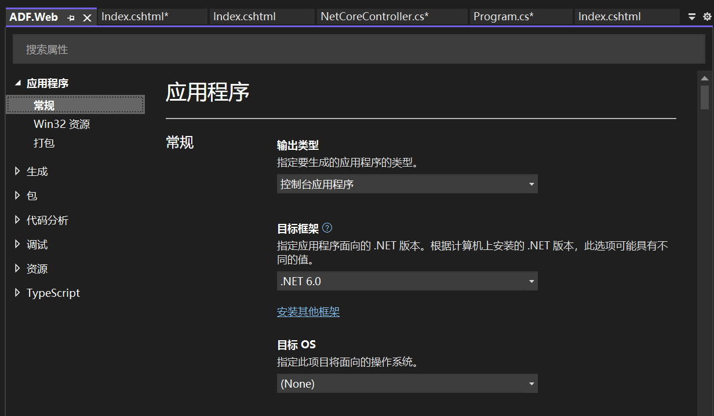
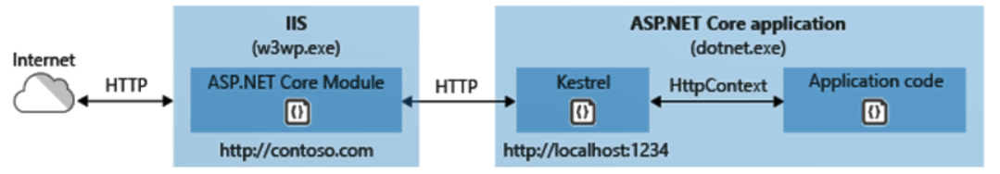
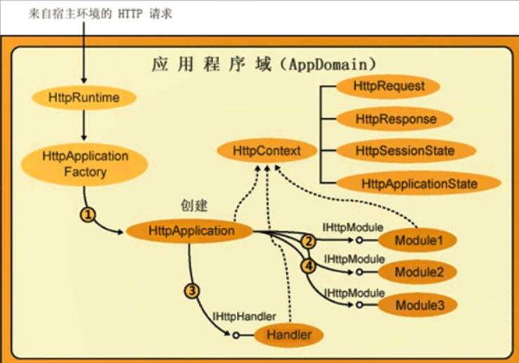
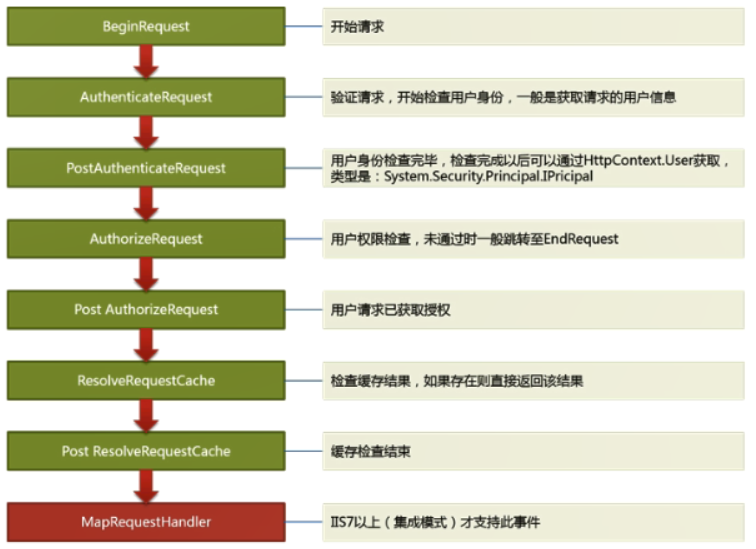
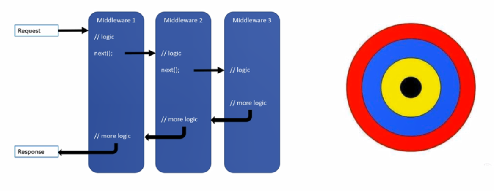

# .NET Core

##  与之前MVC开发的差别

1. View和Controller交互：ViewData，ViewBag，TempData，Session，Model

2. 接口声明使用最小化设计，然后通过扩展方法增加API功能，完成易用性扩展

   1. 例如Session：HttpContext.Session中获取对象实例
   2. 接口是ISession，提供精简的属性和API接口
   3. 扩展方法SessionExtensions，提供便捷功能。

3. 使用组件功能，需要添加中间件和服务实例

   使用Session时，需要注册服务实例，并使用Session中间件

4. 全家桶 VS 自选式，

   ASP.NET 是全家桶，所有组件功能都加载并提供，不管用不用。

   .NET Core是自选式，使用最精简的设计，自选功能。高效。

5. 内置日志和扩展

   nuget引用 log4net.AspNetCore 和 Microsoft.Extensions.Logging.Log4Net.AspNetCore

   添加log4net.Config配置文件

   ```C#
   builder.AddFilter("System", LogLevel.Warning);//过滤掉命名空间
   builder.AddFilter("Microsoft", LogLevel.Warning);
   builder.AddLog4Net();//使用log4net
   ```

6. 内置IOC

7. 启动

   Net Core的Web开发是使用控制台应用程序

   

   使用launchSettings中的配置，进行启动程序。

   配置中包含两种启动方式CommandName：IIS Express和命令行ADF.Web，启动的端口不一样。

   当前文件只为VS开发时使用，正式环境部署时无效。

8. 部署

   发布后部署，并在IIS配置的模块中，安装AspNetCoreModuleV2(负责监听和转发)，支持进程内托管模型，实现反向代理。安装Hosting Bundle.

   命令行部署，dotnet ADF.Web.dll --urls=http://*:5177 -- ip="127.0.0.1" --port=5177，需要拷贝静态资源，并传递命令行参数。 格式：**--参数名称=参数值**

   

9. Kestrel

   是精简高效的HttpServer，以包形式提供，自身不能单独运行，内部封装了对libuv的调用，作为IO底层，屏蔽各系统底层的差异。

   让.NET Core程序实现**跨平台**

   监听端口的Http请求，解析成HttpContext发送给.Net Core程序。

   ```C#
   builder.WebHost
       .UseKestrel(x => x.Listen(IPAddress.Loopback, 12344))
       .Configure(x => x.Run(async context => await context.Response.WriteAsync("Hello world")))
       .UseIIS().UseIISIntegration();
   ```

10. 生成bin文件夹和发布publish文件夹的区别

    IIS网站必须指定publish文件夹，而不能是bin文件夹的区别：bin下少一个web.config文件，文件中执行dotnet命令，启动dll。

## program.cs启动

主要配置及启动Kestrel服务器，并和MVC关联

1. 配置WebHost
2. 注册服务实例
3. 组装Http请求管道：Http请求处理的过程中，使用哪些中间件。

流程：浏览器发送的请求，被Kestrel监听并解析为HttpContext，进入请求管道中处理

## 管道

### 处理模型

本质：处理Http请求，j接收HttpRequest => 生成并返回HttpResponse

1. 接收Resquest时，经过HttpModules；返回Response时，也经过HttpModules.
2. HttpHandler处理响应的页面。



### 事件

基于事件驱动：请求和响应的每个步骤，都可以扩展动作，如AuthorizeRequest是权限检查前，Post AuthorizeRequest是权限验证后； 通过注册事件，完成动态扩展设计，所有请求会按顺序执行事件。



### 中间件

```C#
// Run方法的签名（IApplicationBuilder扩展方法)
public static void Run(this IApplicationBuilder app, RequestDelegate handler)
    
// RequestDelegate的签名
public delegate Task RequestDelegate(HttpContext context);

// 中间件处理HttpContext，里面有Response和Request
// 通过使用异步使其异步并等待以提高性能和可伸缩性。
app.Use(async (context, next) =>
{
    await context.Response.WriteAsync("1st Middleware begin");
    // next参数是用于调用序列中的下一个中间件的下一个
    await next();
    await context.Response.WriteAsync("1st Middleware end");
});
app.Use(async (context, next) =>
{
    await context.Response.WriteAsync("2st Middleware begin");
    await next();
    await context.Response.WriteAsync("2st Middleware end");
});

app.Run(async (context) => {
    await context.Response.WriteAsync("3nd Middleware");
});

// 权限认证
app.Use(async (context,next) =>
{
    if (context.Request.Query.ContainsKey("Name"))
    {
        await next.Invoke(c);
    }
    else
    {
        await context.Response.WriteAsync("No Authorization");
    }
});
```

**包含中间件Middleware的管道模型**



中间件源码  IApplicationBuilder

```C#
public RequestDelegate Build()
{
    RequestDelegate app = context =>
    {
        // If we reach the end of the pipeline, but we have an endpoint, then something unexpected has happened.
        // This could happen if user code sets an endpoint, but they forgot to add the UseEndpoint middleware.
        var endpoint = context.GetEndpoint();
        var endpointRequestDelegate = endpoint?.RequestDelegate;
        if (endpointRequestDelegate != null)
        {
            var message =
                $"The request reached the end of the pipeline without executing the endpoint: '{endpoint.DisplayName}'. " +
                $"Please register the EndpointMiddleware using '{nameof(IApplicationBuilder)}.UseEndpoints(...)' if using " +
                $"routing.";
            throw new InvalidOperationException(message);
        }

        context.Response.StatusCode = 404;
        return Task.CompletedTask;
    };

    // _components是一个middleware中间件的集合,
    // component中间件就是注册的委托 Func<RequestDelegate, RequestDelegate>
    foreach (var component in _components.Reverse())
    {
        app = component.Invoke(app);
    }

    return app;
}
```

1. build中默认返回404的处理事件。

2. 遍历中间件集合，执行注册的事件。

   使用责任链模式，最终生成一个嵌套的委托RequestDelegate，链的头部（内部指向下一项）

   中间件的方法参数包含app，不断调用中间件的注册方法包裹app，

3. 第一阶段是初始化，调用Build---得到RequestDelegate-middleware1(包含了next引用)--这就是管道
4. 然后等着请求来---Context--一层层调用，然后就俄罗斯套娃(revserse顺序舒服点)

### 图片防盗链

```c#
app.UseMiddleware<RefuseStealingMiddleWare>();

public class RefuseStealingMiddleWare
{
    private readonly RequestDelegate _next;

    public RefuseStealingMiddleWare(RequestDelegate next)
    {
        _next = next;
    }

    public async Task Invoke(HttpContext context)
    {
        string url = context.Request.Path.Value;
        if (!url.Contains(".jpg"))
        {
            await _next(context);//走正常流程
        }
        // Http请求头
        string urlReferrer = context.Request.Headers["Referer"];
        if (string.IsNullOrWhiteSpace(urlReferrer))//直接访问图片
        {
            await this.SetForbiddenImage(context);//返回404图片
        }
        else if (!urlReferrer.Contains("localhost"))//非当前域名
        {
            await this.SetForbiddenImage(context);//返回404图片
        }
        else
        {
            await _next(context);//走正常流程
        }
    }
    /// <summary>
    /// 设置拒绝图片
    /// </summary>
    /// <param name="context"></param>
    /// <returns></returns>
    private async Task SetForbiddenImage(HttpContext context)
    {
        string defaultImagePath = "wwwroot/image/Forbidden.jpg";
        string path = Path.Combine(Directory.GetCurrentDirectory(), defaultImagePath);

        FileStream fs = File.OpenRead(path);
        byte[] bytes = new byte[fs.Length];
        await fs.ReadAsync(bytes, 0, bytes.Length);
        await context.Response.Body.WriteAsync(bytes, 0, bytes.Length);
    }
}
```

## 环形编程

1. Filter：只能处理MVC流程中的操作
2. 中间件：任何请求到达的最外层，基于请求做筛选和过滤。不适合业务逻辑。
3. Autofac：可以深入到业务逻辑层做扩展

